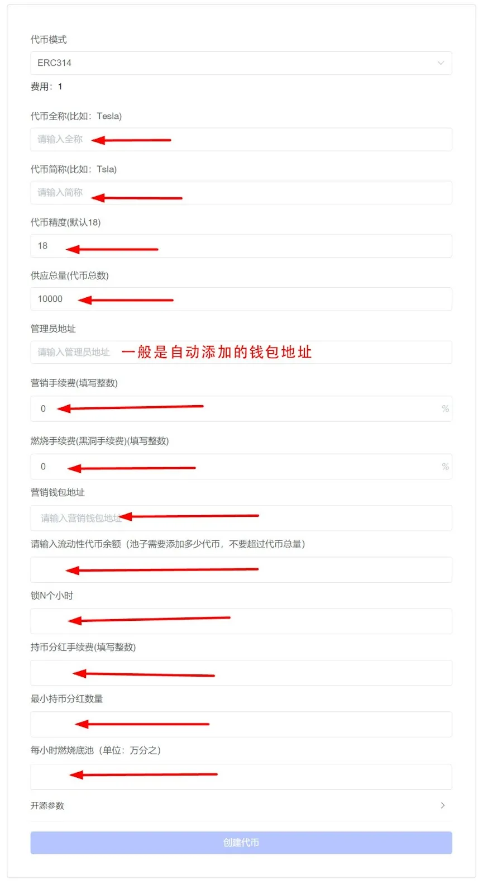

# GTokenTool上线ERC314一键发币模板：实现分红销毁底池功能

<figure><figcaption></figcaption></figure>

X314项目大火，让ERC314协议成为开发者和投资者们关注的焦点。ERC314协议是一个在以太坊区块链上建立的新提案，旨在为NFT提供更加标准化和我公司的实现方式。与现有的ERC-721和ERC-1155标准相比，ERC-314协议试图解决NFT的流动性和互操作性问题，同时提高交易速度并降低成本。

## 那我们要如何创建ERC314代币呢？这里以一键发币平台 GTokenTool 来做演示 

<figure><figcaption></figcaption></figure>

进入页面：[https://www.gtokentool.com/](https://www.gtokentool.com/)，先选择代币模式为 “ERC314”,然后输入代币信息，填写如下：

* **代币全称：** GTokenTool
* **代币缩写：** GT
* **代币精度：** 18（小数点后的金额）
* **供应总量：** 10000（代币数量）
* **营销佣金（%）：** 2（需为整数）
* **燃烧所得税（%）：** 2（需为整数）
* **营销钱包地址：** 0x89ed16F6BCb78d05d38E4765C10CF89e2a782D77
* **请输入流动性代币余额：** 2000（池子需要添加多少代币，不要超过代币总数）
* **锁N个小时：** 37025
* **持币分红手续费(%)：** 3（需为整数）
* **最小持币分红数量：** 1000
* **每小时燃烧底池（‰）：** 5

输入完成后，点击“**创建代币**”并支付服务费，就成功了！

发币流程非常简单，2分钟搞定！想了解更多可以加入平台社区：[https://t.me/gtokentool](https://t.me/gtokentool)
