# 8️⃣ 批量归集

## **准备事项**

1. 一台电脑或者一部手机
2. BSC 钱包（[小狐狸MetaMask钱包安装教程](../fu-zhu-xin-xi/metamask-installation.md)）
3. 要归集的代币合约地址以及对应的钱包地址

## 批量归集具体流程

### 1. 连接钱包

批量归集：[https://robotv2.gtokentool.com/#/collect](https://robotv2.gtokentool.com/#/collect)

进入页面后，选择币安链并点击连接钱包。这里我用测试网演示。

<figure>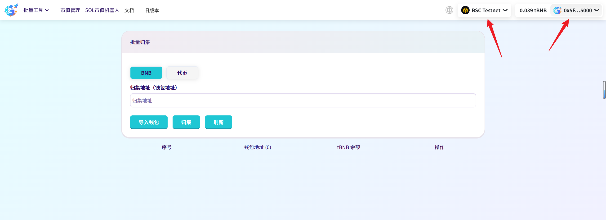<figcaption></figcaption></figure>

### 2. 归集BNB

选择归集BNB，输入归集钱包地址。

<figure>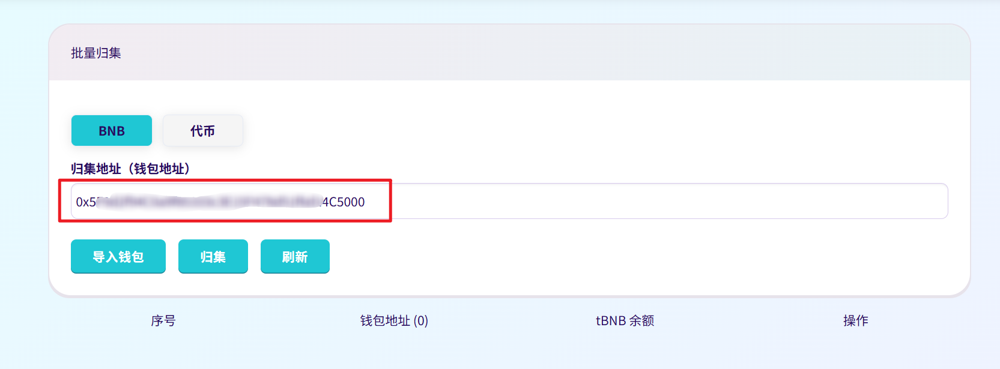<figcaption></figcaption></figure>

点击“`导入钱包`”，输入要归集的钱包私钥，一行一个。

<figure>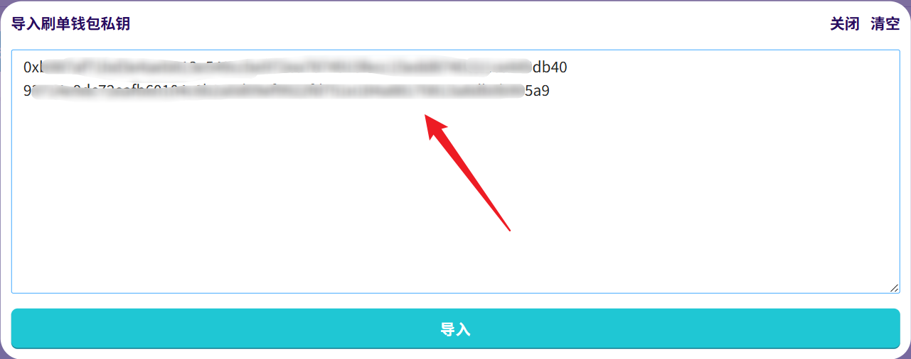<figcaption></figcaption></figure>

导入成功后，下面可以看到导入钱包的余额。

<figure>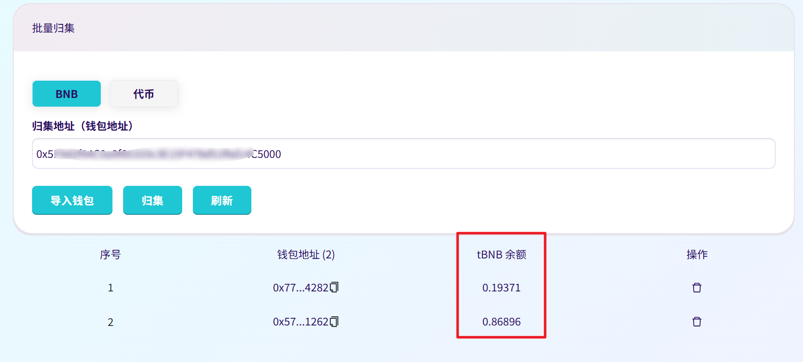<figcaption></figcaption></figure>

最后点击“`归集`”。

<figure>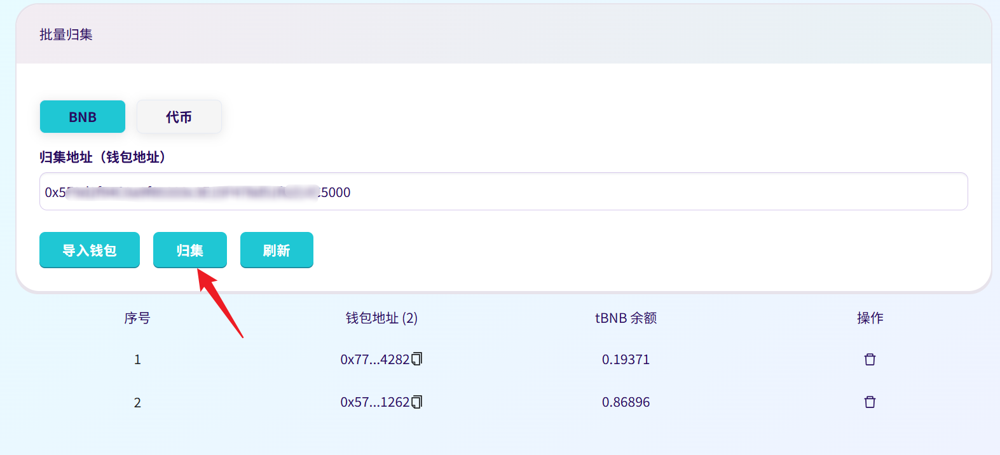<figcaption></figcaption></figure>

然后会弹出确认提示框，最后确认归集地址是否正确。点击“`Yes`”，继续交易。

<figure>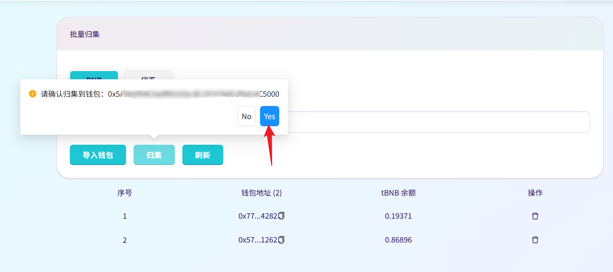<figcaption></figcaption></figure>

归集成功会弹出成功提示，点击“`刷新`”可以确认是否归集成功。

<figure>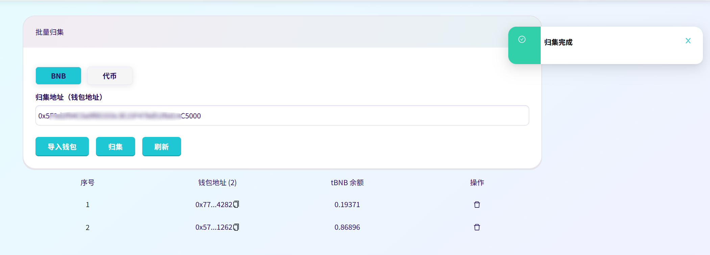<figcaption></figcaption></figure>

<figure>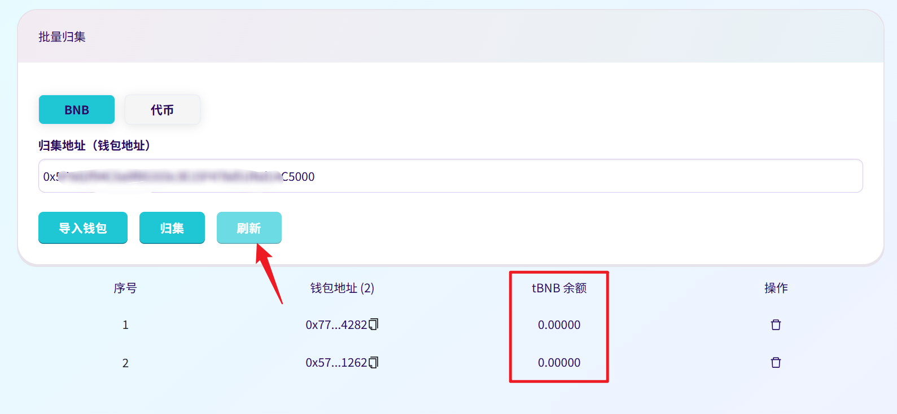<figcaption></figcaption></figure>

### 3. 归集代币

选择归集代币，输入代币地址和归集钱包地址。

<figure>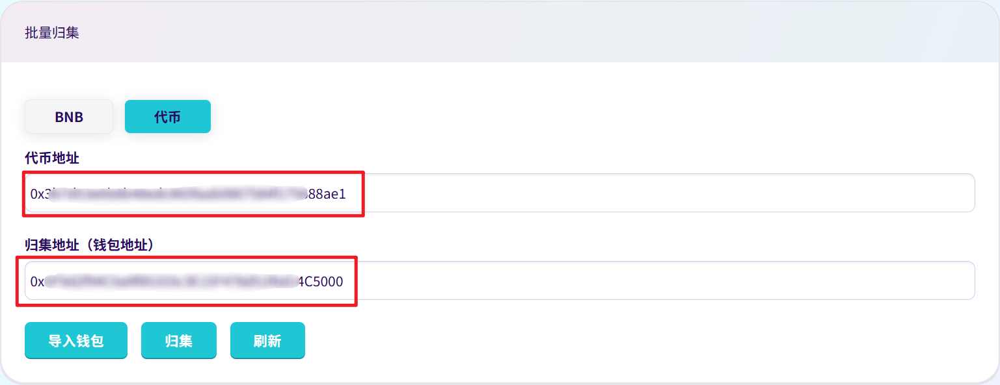<figcaption></figcaption></figure>

点击“`导入钱包`”，输入要归集的钱包私钥，一行一个。

<figure><figcaption></figcaption></figure>

导入成功后，下面可以看到导入钱包的余额以及代币余额。

<figure>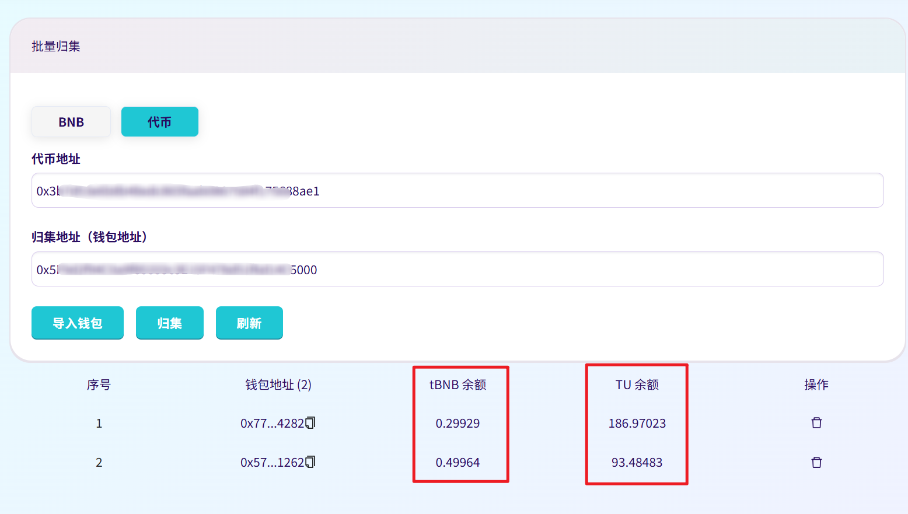<figcaption></figcaption></figure>

点击“`归集`”，点击之后会有弹框显示归集钱包地址，确认无误后点击“`Yes`”，继续交易。

<figure>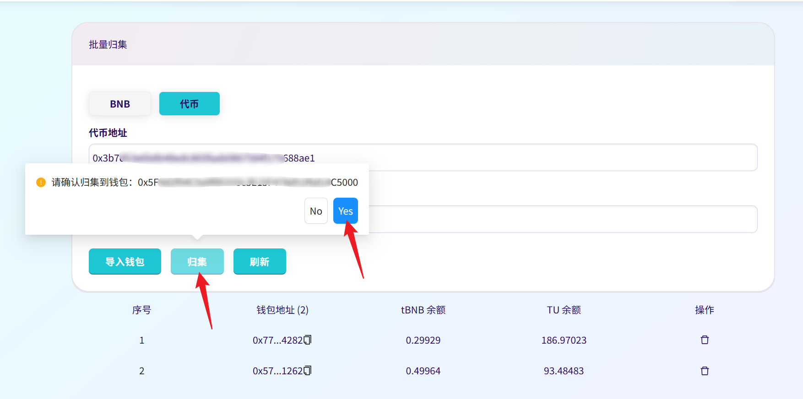<figcaption></figcaption></figure>

归集成功会弹出成功提示，点击“`刷新`”可以确认是否归集成功。

<figure>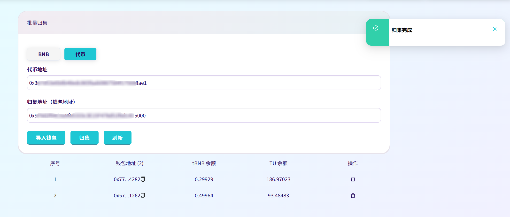<figcaption></figcaption></figure>

<figure>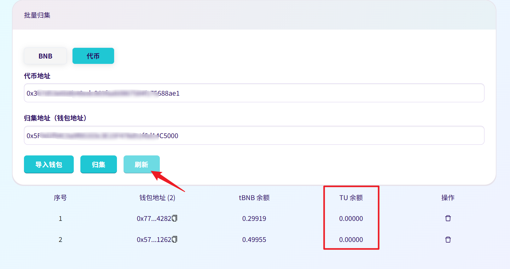<figcaption></figcaption></figure>

## 常见问题 FAQ

### Q: 批量归集支持哪些资产？

**A:** 支持归集 BSC 链上的 BNB，以及任意 BEP20 标准代币，单次只能选择一种资产进行归集。

### Q: 地址填错了资产能找回吗？

**A:** 链上交易不可逆，地址一旦提交上链无法撤回或篡改，使用前务必仔细核对接收地址。

### Q: 手续费是多少？

**A:** 批量归集是免费使用的，只需要支付Gas。因此，每个钱包需保留一些 BNB 用于支付 Gas，否则交易会失败。

如有不明白或者不清楚的地方，请加入官方电报群：[https://t.me/gtokentool](https://t.me/gtokentool)
