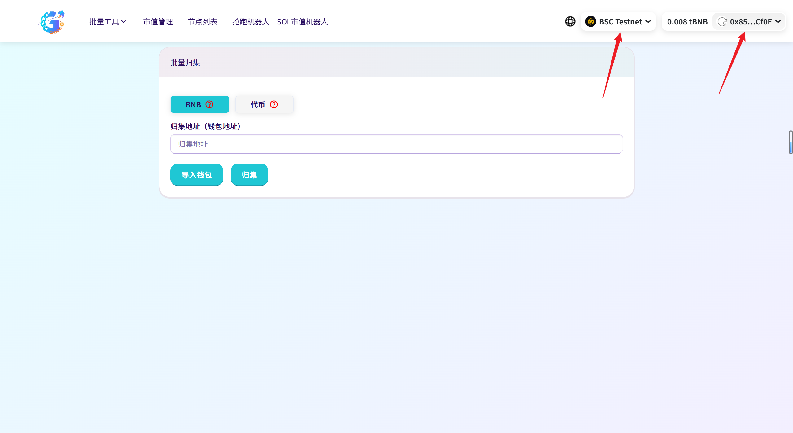
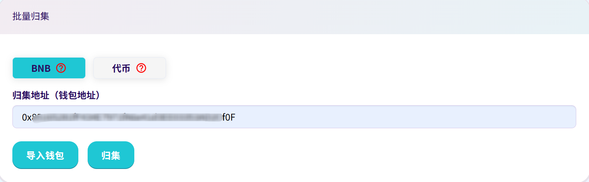
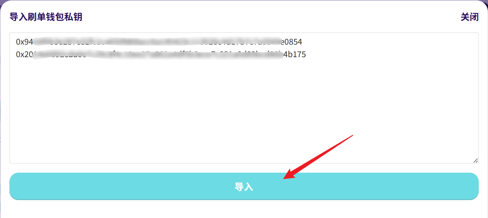
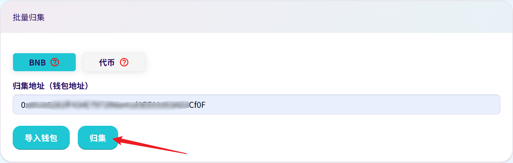
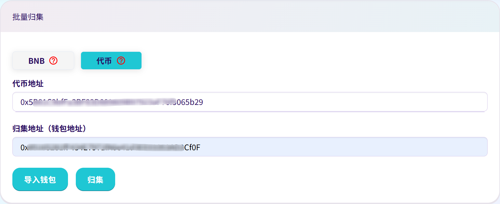
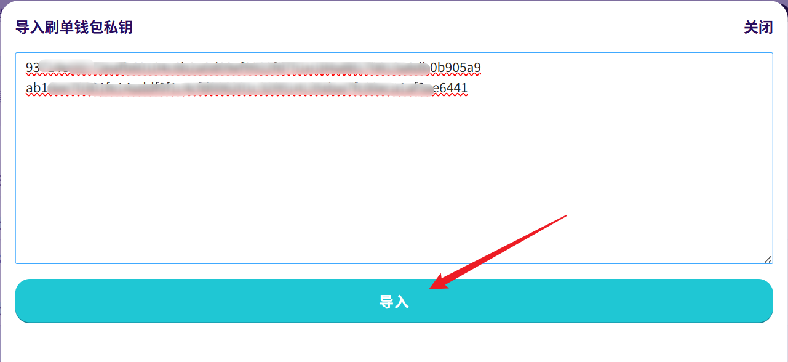
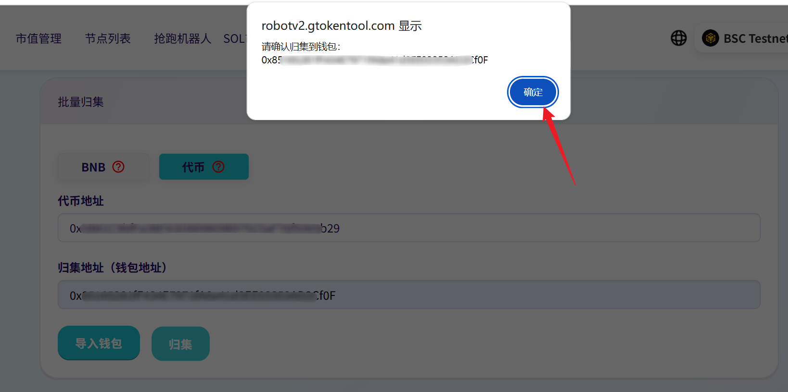

# 8️⃣ 批量归集

## **准备事项**

1. 一台电脑或者一部手机
2. BSC 钱包（[小狐狸MetaMask钱包安装教程](../fu-zhu-xin-xi/metamask-installation.md)）
3. 要查询的代币合约地址以及对应的钱包地址

## 批量归集具体流程

### 1. 连接钱包

批量归集：[https://robotv2.gtokentool.com/#/collect](https://robotv2.gtokentool.com/#/collect)

进入页面后，选择币安链并点击连接钱包。这里我用测试网演示。

<figure><figcaption></figcaption></figure>

### 2. 归集BNB

选择归集BNB，输入归集钱包地址。

<figure><figcaption></figcaption></figure>

点击“导入钱包”，输入要归集的钱包私钥，一行一个。

<figure><figcaption></figcaption></figure>

最后点击“归集”。

<figure><figcaption></figcaption></figure>

### 3. 归集代币

选择归集代币，输入代币地址和归集钱包地址。

<figure><figcaption></figcaption></figure>

点击“导入钱包”，输入要归集的钱包私钥，一行一个。

<figure><figcaption></figcaption></figure>

点击“归集”，点击之后会有弹框显示归集钱包地址，确认无误后点击“确认”，继续交易。

<figure><figcaption></figcaption></figure>

如有不明白或者不清楚的地方，请加入官方电报群：[https://t.me/gtokentool](https://t.me/gtokentool)
