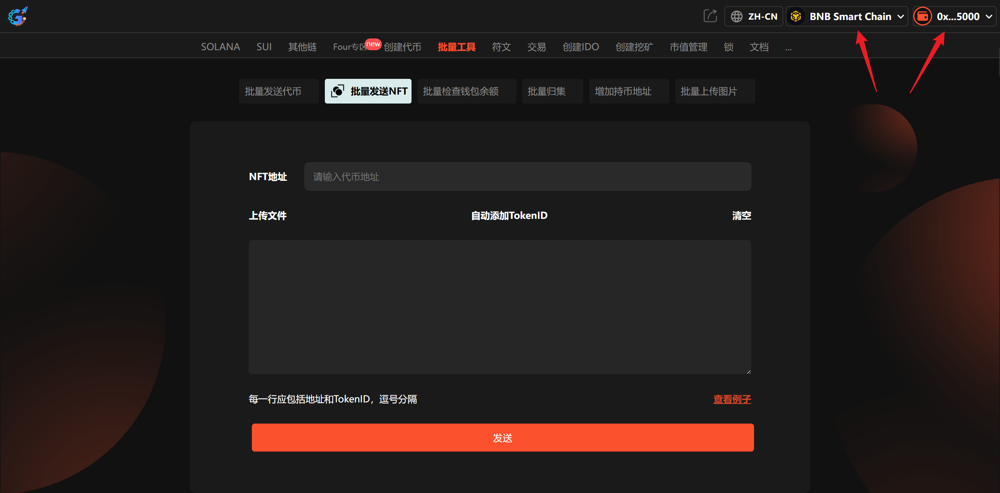
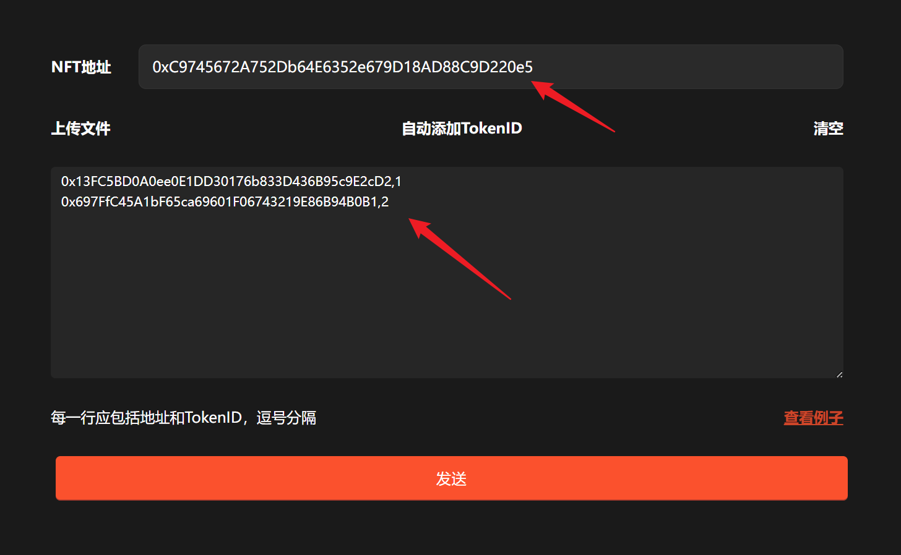

# 2️⃣ 批量发送NFT

**GTokenTool** 的 **批量发送NFT工具** 是一款高效的链上分发利器，旨在解决 NFT 大规模转账的繁琐操作。该工具支持**多地址一键导入、自动化批量执行、发送状态实时追踪**等特点。其优势在于大幅节省 Gas 费与操作时间，确保资产精准送达。特别适用于需进行空投营销、社群激励的 **NFT 项目方、数字艺术家及社区运营者**，是提升用户互动与品牌推广效率的高性能利器。

## 📌 核心摘要

* **功能定位：**&#x8BE5;工具是专为大规模 NFT 转账设计的链上分发引擎。通过在单笔交易中聚合多次转账逻辑，将繁琐的逐一发送过程简化为一键式自动化操作，是实现资产高效流通与大规模空投的核心工具。
* **功能特点：**
  * **多地址一键导入：**&#x652F;持通过 CSV 文件批量导入接收地址与代币 ID，告别手动输入的低效与出错风险，实现秒级数据同步。
  * **自动化批量执行：**&#x91C7;用先进的批处理合约技术，仅需一次签名授权即可完成成百上千次的 NFT 转移，大幅节省操作时间。
  * **发送状态实时追踪：**&#x63D0;供透明的链上状态反馈机制，用户可实时监控每一笔 NFT 的投递进度与结果，确保分发过程精准无误。
* **用户价值：**&#x5B83;不仅能够节省高达 90% 的 Gas 费用成本，更通过极简的操作流将复杂的空投运营变得“轻量化”。助力项目方在进行社群激励与品牌推广时，能以最低的财务与时间支出实现最高效的用户触达。
* **适用群体：**&#x9700;进行大规模空投营销的 **NFT 项目方**、进行粉丝回馈的 **数字艺术家**，以及负责社群激励管理的 **Web3 运营者**。

***

提示：请先安装小狐狸钱包插件，教程：[https://docs.gtokentool.com/fu-zhu-xin-xi/metamask-installation](https://docs.gtokentool.com/fu-zhu-xin-xi/metamask-installation)

## 批量发送NFT流程

### 第1步，连接钱包

进入页面：[https://gtokentool.com/sendernft ](https://gtokentool.com/sendernft)，点击右上角，连接小狐狸钱包，并切换到主网（这里以BSC测试网为例)。

完成后，会看到 “链名称” 和 您的“钱包地址” ，如下图：

<figure><figcaption>
连接钱包并选择公链
</figcaption></figure>

### 第2步，输入转账信息

假设我们给两个地址发送NFT，输入如下：

* NFT地址：0xC9745672A752Db64E6352e679D18AD88C9D220e5
* 收款地址和TokenID（逗号分隔）：
* 0x13FC5BD0A0ee0E1DD30176b833D436B95c9E2cD2,1
* 0x697FfC45A1bF65ca69601F06743219E86B94B0B1,2

<figure><figcaption>
输入转账信息
</figcaption></figure>

（注：不明白可以点击右下角 “查看例子”）

### 第3步，完成

输入完成后，确认无误再点击 “`发送`” 按钮。

弹出钱包后，在小狐狸上支付gas费（确认），就完成了。

## ❓常见问题 FAQ

### Q: 手续费怎么算？

**A:** 免费使用，只需支付 Gas。

### Q: 转错能撤回吗？

**A:** 链上交易不可撤回，核对后再发。

### Q: 发送失败会退回吗？

**A:** 失败 NFT 自动退回原钱包。

### 🤝 连接 GTokenTool 

* **💬 Telegram社群**：[点击加入官方群组](https://t.me/gtokentool)
* **🐦 Twitter (X)**：[关注我们获取最新动态](https://x.com/gtokentool)
* **📚 官方文档**：[查看 Gitbook 文档](https://docs.gtokentool.com/)
* **💻 开源代码**：[访问 GitHub 仓库](https://github.com/Gtokentool/docs/blob/master/SUMMARY.md)
* **📺 视频教程**：[订阅 YouTube 频道](https://www.youtube.com/@GTokenTool)

> ⚠️ 风险提示与免责声明
>
> GTokenTool 保留随时全权酌情因任何理由修改、变更或取消此公告的权利，无需事先通知。
>
> 以上信息内容仅供参考，GTokenTool 对本平台上的任何虚拟资产、产品或促销活动不做任何推荐或保证。虚拟资产的价格波动很大，投资交易虚拟资产将面临巨大风险。**请谨慎投资。**
