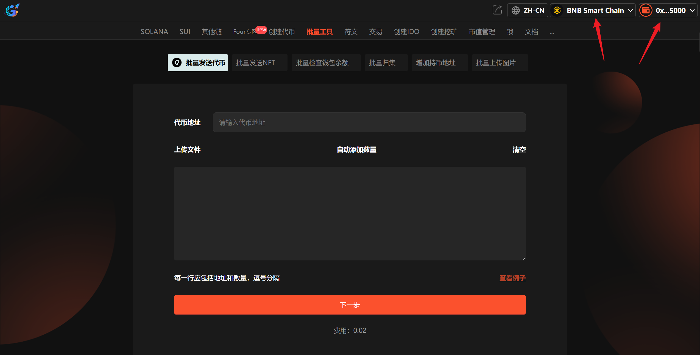
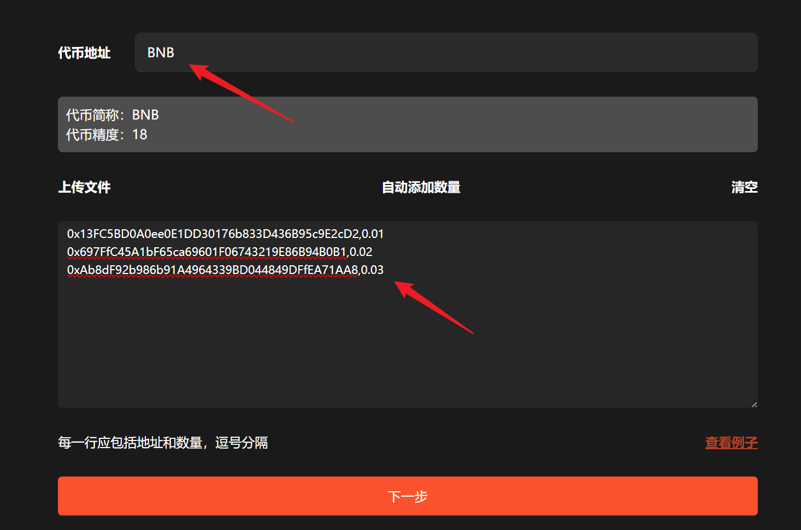
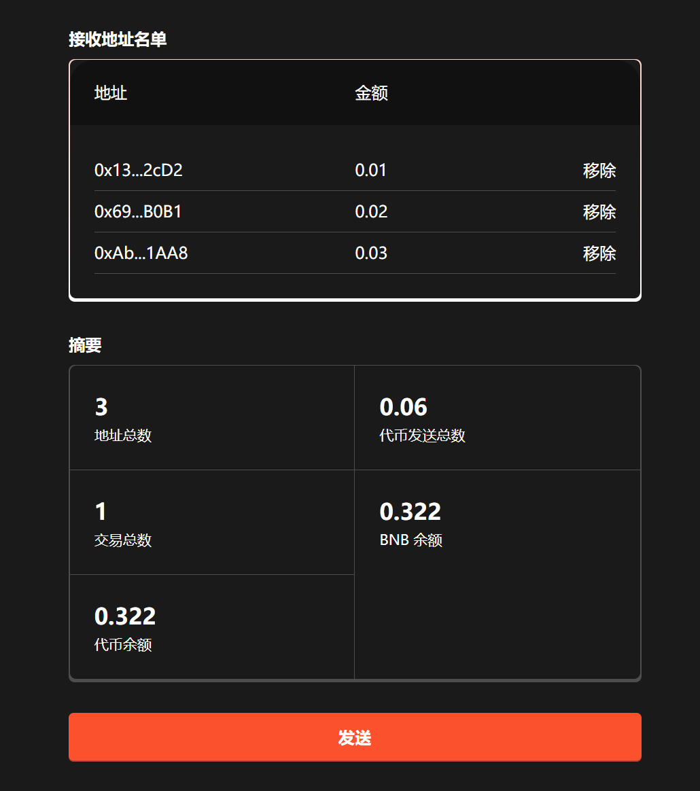

# 1️⃣ 批量转账-批量发送空投代币

## 批量转账工具介绍

GTokenTool多链批量转账工具，支持ETH、BSC、Base、Arbitrum等多条EVM公链，大大的简化了转账与空投流程，可以快速实现代币空投与转账等多种操作。

提示：请先安装小狐狸钱包插件，教程：[https://docs.gtokentool.com/fu-zhu-xin-xi/metamask-installation](https://docs.gtokentool.com/fu-zhu-xin-xi/metamask-installation)

## 注意事项 

* 收款地址和数量必须用英文逗号分隔。
* 推荐使用PC端操作，更加方便快捷。
* 如往交易所地址进行转账，请务必确认交易所是否支持合约转账，否则你的转账将无法到账。
* 为保证转账顺利，一次转账的地址数请勿超过100个。
* 支持大部分EVM公链，切换到哪个钱包，就自动在哪个链上转账。

## 批量转账工具使用流程

### 第1步，连接钱包

进入GTokenTool批量转账页面：[https://gtokentool.com/sendertoken](https://gtokentool.com/sendertoken)，点击右上角，连接小狐狸钱包，并切换到主网。

完成后，会看到 “链名称” 和 您的“钱包地址” ，如下图：

<figure><figcaption></figcaption></figure>

### 第2步，输入信息

假设我们给三个地址发送不同数量的代币，输入如下：

* 代币地址：BNB
* 收款地址和数量（逗号分隔）：
* 0x13FC5BD0A0ee0E1DD30176b833D436B95c9E2cD2,0.01
* 0x697FfC45A1bF65ca69601F06743219E86B94B0B1,0.02
* 0xAb8dF92b986b91A4964339BD044849DFfEA71AA8,0.03

<figure><figcaption></figcaption></figure>

（不明白可以点击右下角 “查看例子”）

### 第3步，完成

输入完成后，点击 “`下一步`” 按钮。

<figure><figcaption></figcaption></figure>

确认无误后，点击 “`发送`” 按钮，在小狐狸上支付gas费，就完成了。

（注：因为每个用户网络速度不同，支付gas费用时可能会延迟1、2秒，属正常现象。）

如有不明白或者不清楚的地方，请加入官方电报群：[https://t.me/gtokentool](https://t.me/gtokentool)
