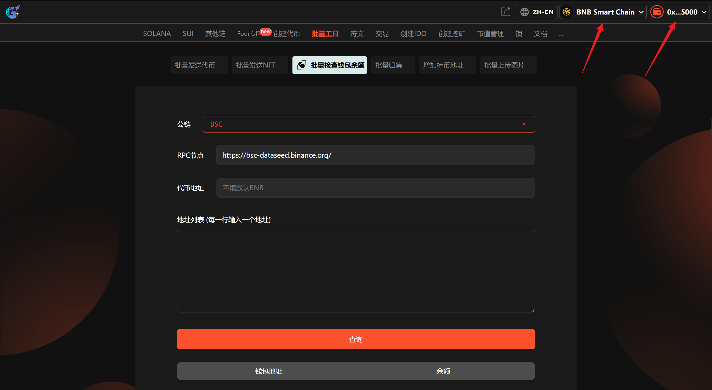
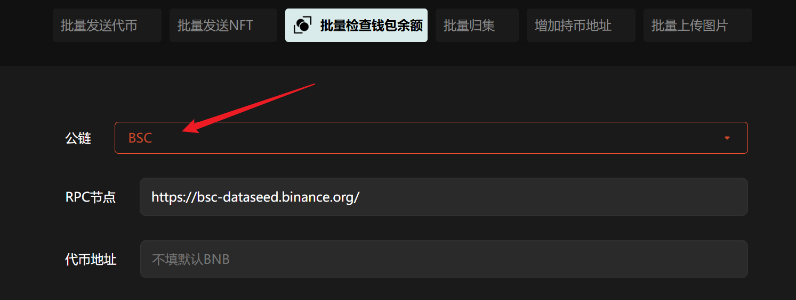
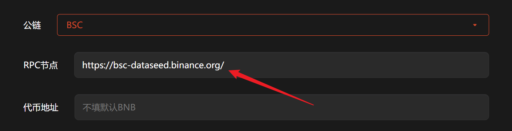
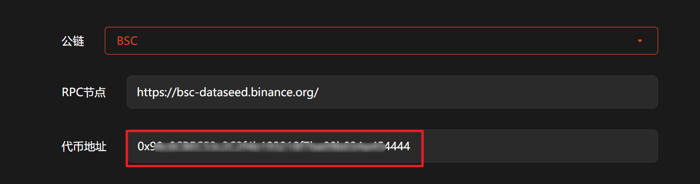
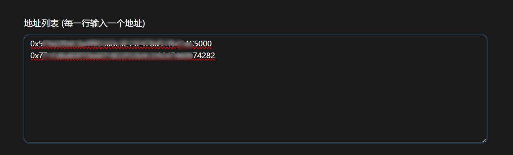
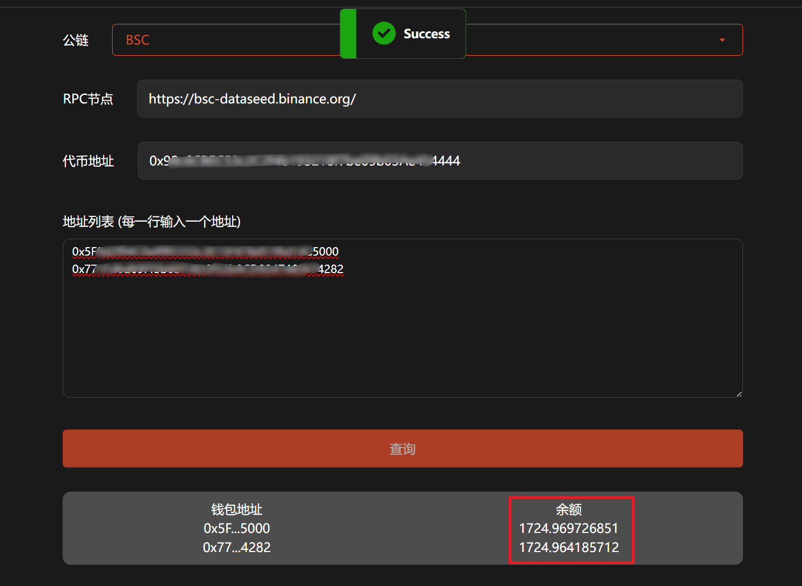

# 7️⃣ 批量检查钱包余额

## **准备事项**

1. 一台电脑或者一部手机
2. BSC 钱包（[小狐狸MetaMask钱包安装教程](../fu-zhu-xin-xi/metamask-installation.md)）
3. 要查询的代币合约地址以及对应的钱包地址

## 批量检查钱包余额具体流程

### 1. 连接钱包

批量检查钱包余额：[https://www.gtokentool.com/batchCheckBalance](https://www.gtokentool.com/batchCheckBalance)

进入页面后，选择币安链并点击连接钱包。

<figure><figcaption></figcaption></figure>

### 2. 选择公链

这里选择BSC，不同的链选择对应的公链。

<figure><figcaption></figcaption></figure>

### 3. 输入RPC节点

默认使用我们提供的节点，若有自己的节点可以自行更换。

<figure><figcaption></figcaption></figure>

### 4. 填写代币地址

输入要查询的代币地址，不填默认查询BNB余额。

<figure><figcaption></figcaption></figure>

### 5. 输入钱包地址

输入包含要查询代币的钱包地址，一行一个。

<figure><figcaption></figcaption></figure>

### 6. 点击“查询”

点击“查询”后，下方会显示对应钱包里的代币余额。

<figure><figcaption></figcaption></figure>

## 常见问题 FAQ

### Q: 批量查余额支持哪些资产？

**A:** 支持查询多条公链的代币余额。

### Q: 为什么有的地址显示余额为 0？

**A:** 该地址确实无余额，或代币合约未正确填写。

### Q: 需要消耗 Gas 或手续费吗？

**A:** 余额查询是链上只读操作，不消耗 Gas，不收费。

如有不明白或者不清楚的地方，请加入官方电报群：[https://t.me/gtokentool](https://t.me/gtokentool)
