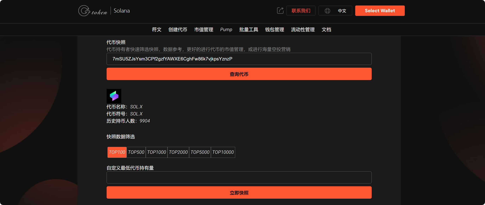
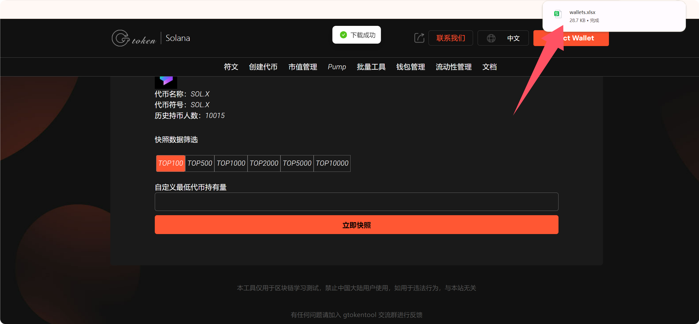
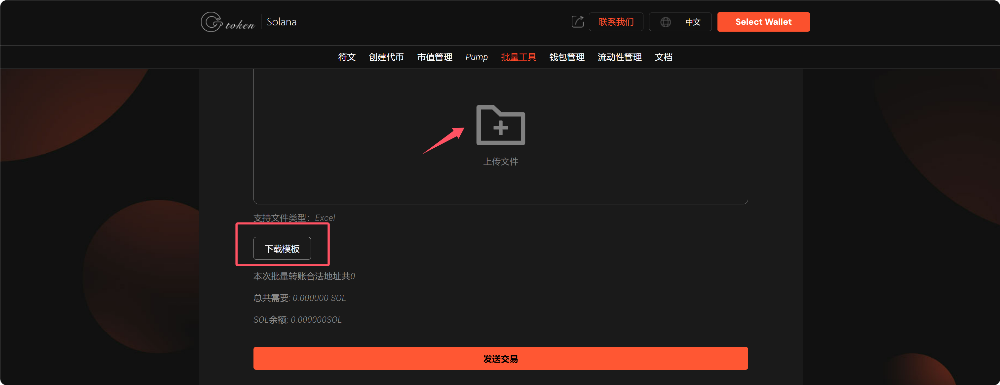

# 7️⃣ 代币快照使用教程

‌代币快照‌是指在区块链网络上的某个特定时间点，对所有账户的持币记录进行快照。这个过程通常发生在区块链的某个区块高度，记录下该时间点所有账户的代币持有情况。快照的主要目的是为了确保在特定时间点的代币分配和空投的公平性和透明性。



代币快照使用流程：

1、进入GTokenTool，找到代币快照工具，如下所示

代币快照工具：[https://sol.gtokentool.com/zh-cn/Snapshot](https://sol.gtokentool.com/zh-cn/Snapshot)

<figure><figcaption></figcaption></figure>

2、输入代币合约

<figure><figcaption></figcaption></figure>

3、点击“查询代币”，就可以看到这个代币的详细数据（可以进行快照数据筛选）

<figure><figcaption></figcaption></figure>

4、点击立即快照，下载数据，快照完成后，用户可以在页面上查看快照结果，并下载快照数据（如 CSV 文件）以备后续使用。

<figure><figcaption></figcaption></figure>

5、点击批量转账，下载模板，根据前面下载的数据，按照要求填写，选择上传文件，就可以批量转给用户

工具：[https://sol.gtokentool.com/zh-cn/batchTool/batchTransfer/SOL](https://sol.gtokentool.com/zh-cn/batchTool/batchTransfer/SOL)

<figure><figcaption></figcaption></figure>

<figure><figcaption></figcaption></figure>

导入数据后，就可以批量发送给用户。

如有不明白或者不清楚的地方，请加入官方电报群：[https://t.me/gtokentool](https://t.me/gtokentool)
