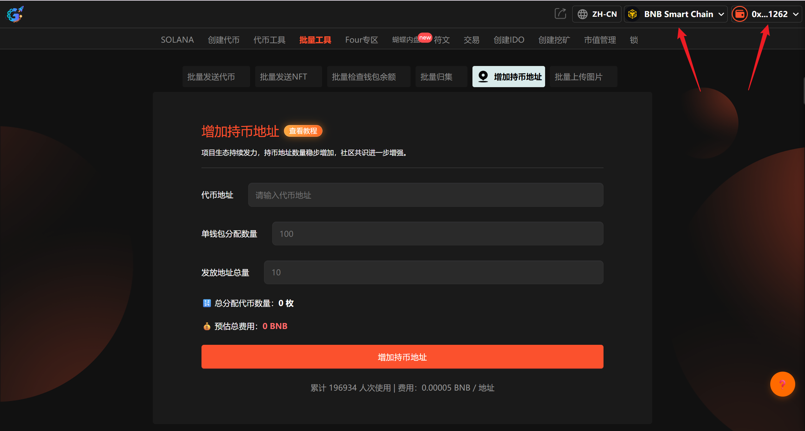
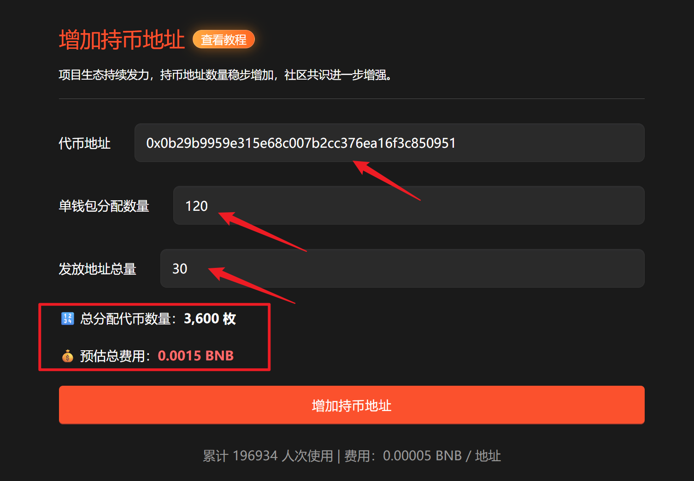

# 3️⃣ 批量增加持币地址

**GTokenTool** 的 **批量增加持币地址工具** 专为优化代币链上数据表现打造，旨在通过自动化分发提升项目链上持有人数。该工具支持**多钱包一键分发、小额随机转账、分发进度实时监控**等特点。其优势在于能快速美化持币数据，显著增强项目市场吸引力与公信力。特别适用于需进行数据运营、生态冷启动的 **Web3 项目方、市场推广团队及代币运营者**，是提升项目链上权重的高效管理神器。

## 📌 核心摘要

* **功能定位：**&#x8BE5;工具是专为代币数据运营设计的自动化分发引擎，通过高效的链上批量转账技术，助力项目方快速提升持币地址数（Holders），从而优化链上排名与市场表现。
* **功能特点：**
  * **多钱包一键分发：**&#x652F;持向海量目标地址同步派发代币，将原本繁琐的手动转账流程转化为秒级响应的自动化指令，大幅提升运营效率。
  * **小额随机转账：**&#x5185;置灵活的转账策略，支持自定义或随机金额分配，模拟真实持币分布，确保链上数据的自然性与美观度。
  * **分发进度实时监控：**&#x63D0;供可视化的任务看板，实时反馈转账成功率与链上确认状态，确保每一笔分发操作均精准、透明。
* **用户价值：**&#x901A;过快速提升持币地址这一核心指标，项目方能有效增强代币在行情软件（如 Dexscreener, DEXTools）上的曝光权重与公信力，显著降低生态冷启动难度，吸引更多潜在投资者的关注。
* **适用群体：**&#x9700;进行数据美化与冷启动的 **Web3 项目方**、负责流量增长的 **市场推广团队** 以及深耕资产管理的 **代币运营者**。

***

提示：请先安装小狐狸钱包插件，教程：[https://docs.gtokentool.com/fu-zhu-xin-xi/metamask-installation](https://docs.gtokentool.com/fu-zhu-xin-xi/metamask-installation)

## 增加持币地址流程

### 第1步，连接钱包

进入页面：[https://gtokentool.com/increaseAddr](https://gtokentool.com/increaseAddr)，点击右上角，连接小狐狸钱包，并切换到主网（这里以BSC测试网为例)。

完成后，会看到 “链名称” 和 您的“钱包地址” ，如下图：

<figure><figcaption>
连接钱包并选择公链
</figcaption></figure>

### 第2步，输入配置信息

假设我们增加20个持币地址，输入如下：

* 代币地址：0x0b29b9959e315e68c007b2cc376ea16f3c850951
* 单地址发放数量：120
* 总发放多少地址：30

输入完成后，下方会显示总分配代币数量和预估总费用。


若提示“增加持币地址失败”，请优先查看钱包中代币数量和BNB余额是否充足。


<figure><figcaption>
输入配置信息
</figcaption></figure>

### 第3步，完成

点击 “`增加持币地址`” 按钮，会弹出两次钱包确认，第一次授权代币支出上限，第二次确认交易。在小狐狸上支付gas费点击“`确认`”，就完成了。

（注：因为每个用户网络速度不同，支付gas费用时可能会延迟1、2秒，属正常现象。）

## ❓常见问题 FAQ

### Q: 批量加持币地址有什么用？

**A:** 快速增加代币持币地址数量，提升项目热度与排名。

### Q: 对代币有影响吗？

**A:** 无负面影响，不影响流通与价格。

### Q: 需要消耗代币吗？

**A:** 需要，会向每个地址转入少量代币。

### 🤝 连接 GTokenTool 

* **💬 Telegram社群**：[点击加入官方群组](https://t.me/gtokentool)
* **🐦 Twitter (X)**：[关注我们获取最新动态](https://x.com/gtokentool)
* **📚 官方文档**：[查看 Gitbook 文档](https://docs.gtokentool.com/)
* **💻 开源代码**：[访问 GitHub 仓库](https://github.com/Gtokentool/docs/blob/master/SUMMARY.md)
* **📺 视频教程**：[订阅 YouTube 频道](https://www.youtube.com/@GTokenTool)

> ⚠️ 风险提示与免责声明
>
> GTokenTool 保留随时全权酌情因任何理由修改、变更或取消此公告的权利，无需事先通知。
>
> 以上信息内容仅供参考，GTokenTool 对本平台上的任何虚拟资产、产品或促销活动不做任何推荐或保证。虚拟资产的价格波动很大，投资交易虚拟资产将面临巨大风险。**请谨慎投资。**
