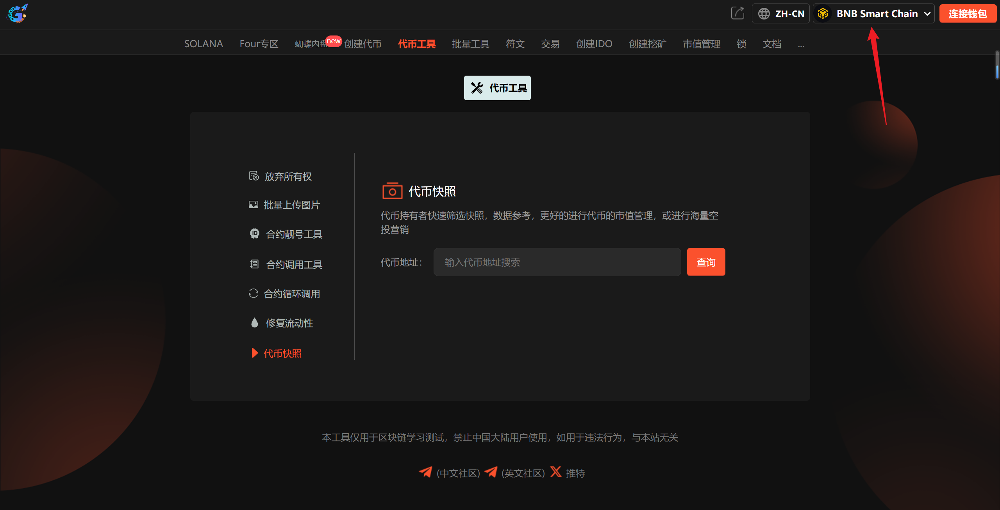

# 9️⃣ 代币快照

**GTokenTool代币快照工具**专为项目方、开发者及社区运营者打造，旨在特定区块高度精准提取持币地址及余额。该工具具备**高效稳定、操作简便、数据透明**等特点，支持一键导出链上明细。它是进行代币空投、白名单筛选、持币分红及社区治理投票的必备利器。

## 📌核心摘要

* **功能定位：一站式链上持币数据提取与核算中心**。作为专为项目方、开发者及社区运营者打造的数据专家，它是实现精准市值管理、海量空投营销与链上决策的关键数据桥梁。
* **主要用途：**&#x5728;特定区块高度精准抓取所有持币地址及余额数据，为项目复盘与激励执行提供权威支撑。
* **核心优势：**
  * **高效稳定：**&#x652F;持海量地址秒级解析与导出。
  * **操作简便：**&#x96F6;代码门槛，图形化界面一键完成。
  * **数据透明：**&#x94FE;上数据直连，确保结果实时、真实且无遗漏。
* **适用群体：**&#x9700;进行代币空投、白名单筛选、持币分红及社区治理投票的项目方与运营团队。

## 代币快照流程 

### 1. 连接主网 

进入[代币快照](https://www.gtokentool.com/tool?current=6)页面，选择 Main 网络节点，无需连接钱包。

<figure><figcaption>
选择公链
</figcaption></figure>

### 2. 输入代币地址

<figure><figcaption>
输入代币地址
</figcaption></figure>

### 3. 点击“查询”

点击“`查询`”后，会显示代币的简称以及历史持币人数。

<figure><figcaption>
点击查询
</figcaption></figure>

### 4. 快照数据筛选

<figure><figcaption>
快照数据筛选
</figcaption></figure>

### 5. 点击“立即快照”

点击后会下载筛选好的数据的EXCEL文件。

## ❓常见问题 FAQ

### Q: 代币快照是什么功能？

**A:** 在指定区块高度对所有持币地址进行余额截图，用于空投、分红、白名单统计等。

### Q: 快照支持哪些代币？

**A:** 支持 BSC 链上所有标准 BEP20 代币，输入合约地址即可快照。

### Q: 快照需要授权或消耗 Gas 吗？

**A:** 不需要，属于链上只读查询，不转账、不上链，无任何手续费。

### Q: 快照结果准确吗？

**A:** 数据直接读取链上区块信息，结果准确，可与 BscScan 核对。

### Q: 快照结果可以导出吗？

**A:** 支持导出 Excel 表格，包含钱包地址、钱包余额、持仓数量等明细。

### 🤝 连接 GTokenTool 

* **💬 Telegram社群**：[点击加入官方群组](https://t.me/gtokentool)
* **🐦 Twitter (X)**：[关注我们获取最新动态](https://x.com/gtokentool)
* **📚 官方文档**：[查看 Gitbook 文档](https://docs.gtokentool.com/)
* **💻 开源代码**：[访问 GitHub 仓库](https://github.com/Gtokentool/docs/blob/master/SUMMARY.md)
* **📺 视频教程**：[订阅 YouTube 频道](https://www.youtube.com/@GTokenTool)

> ⚠️ 风险提示与免责声明
>
> GTokenTool 保留随时全权酌情因任何理由修改、变更或取消此公告的权利，无需事先通知。
>
> 以上信息内容仅供参考，GTokenTool 对本平台上的任何虚拟资产、产品或促销活动不做任何推荐或保证。虚拟资产的价格波动很大，投资交易虚拟资产将面临巨大风险。**请谨慎投资。**
