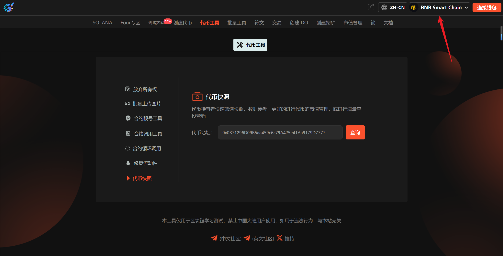
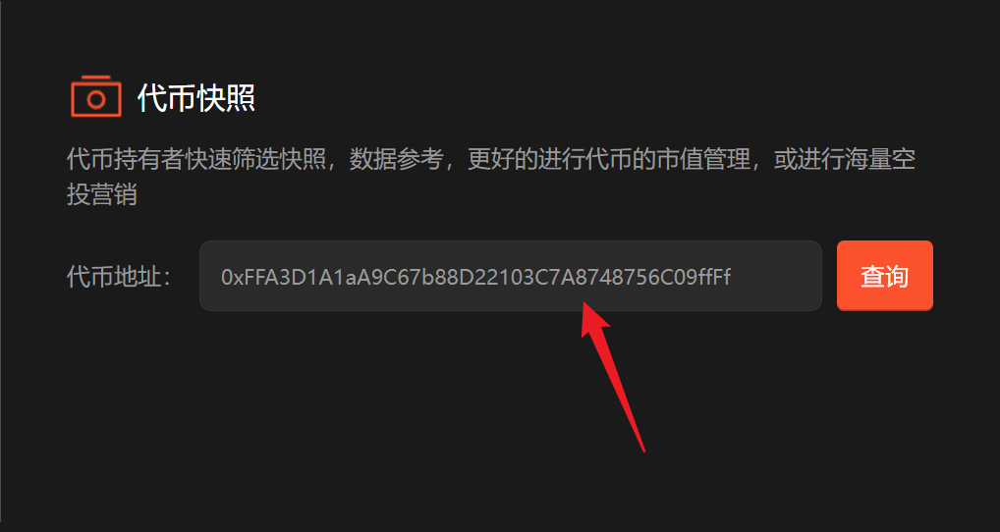
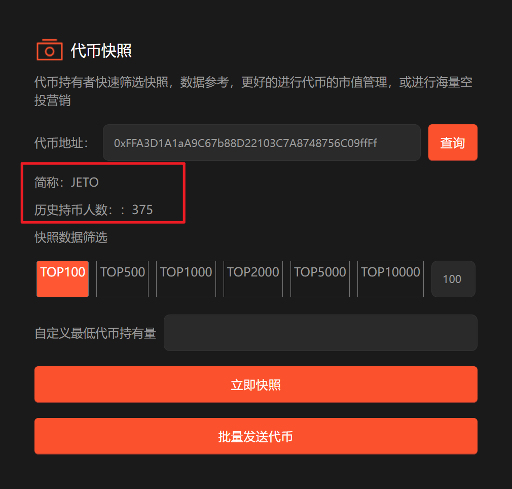
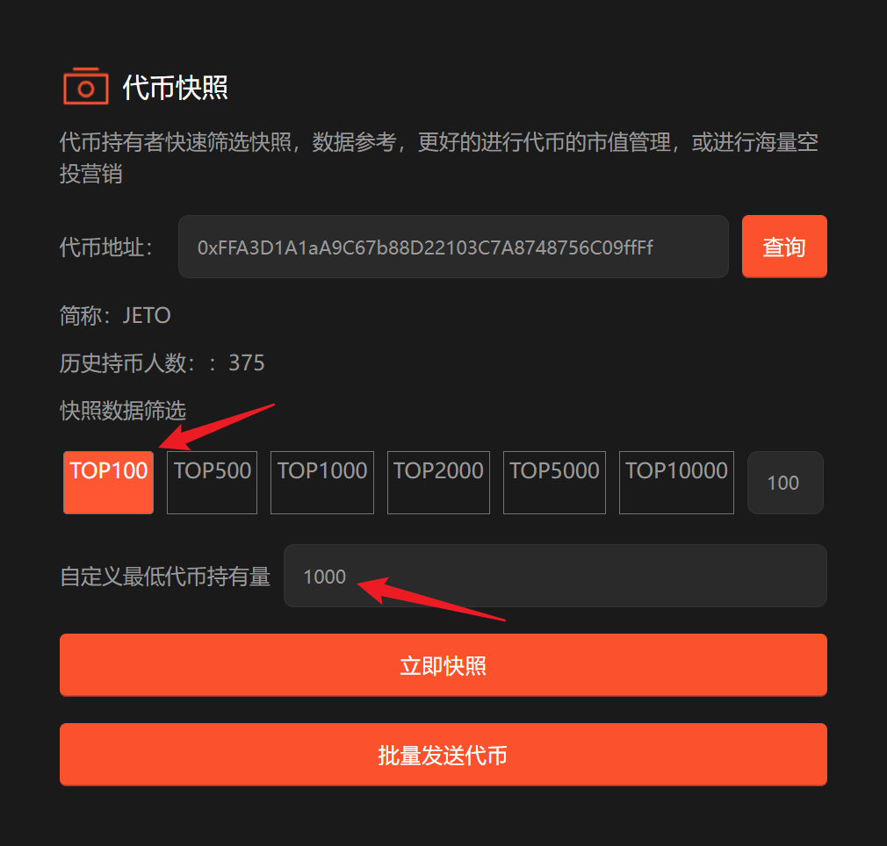

# 9️⃣ 代币快照

## 代币快照流程 

### 1. 连接主网 

进入[代币快照](https://www.gtokentool.com/tool?current=6)页面，选择 Main 网络节点，无需连接钱包。

<figure><figcaption></figcaption></figure>

### 2. 输入代币地址

<figure><figcaption></figcaption></figure>

### 3. 点击“查询”

点击“`查询`”后，会显示代币的简称以及历史持币人数。

<figure><figcaption></figcaption></figure>

### 4. 快照数据筛选

<figure><figcaption></figcaption></figure>

### 5. 点击“立即快照”

点击后会下载筛选好的数据的EXCEL文件。

如有不明白或者不清楚的地方，请加入官方电报群：[https://t.me/gtokentool](https://t.me/gtokentool)
