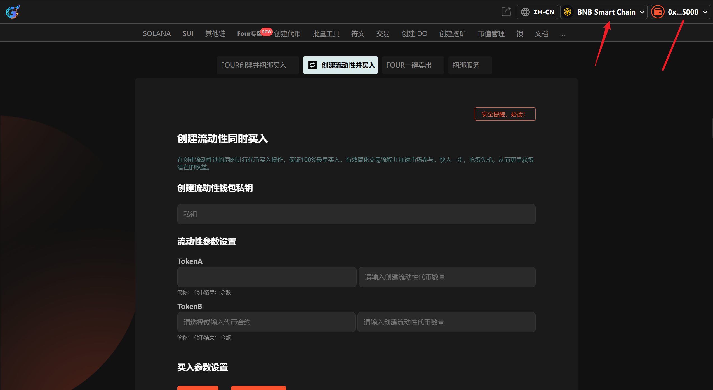
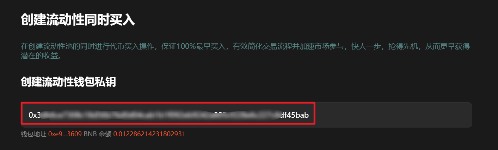
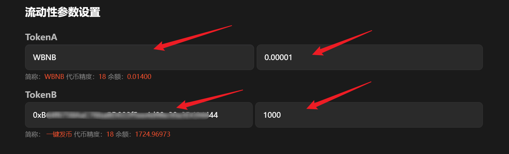
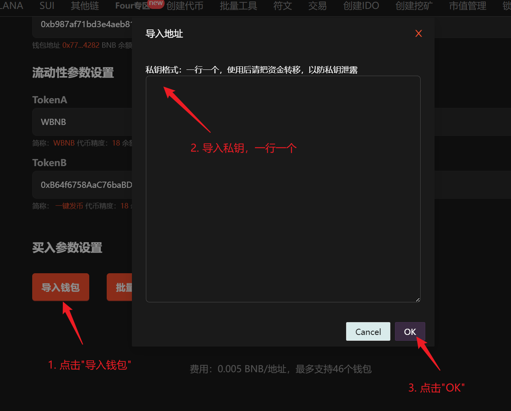
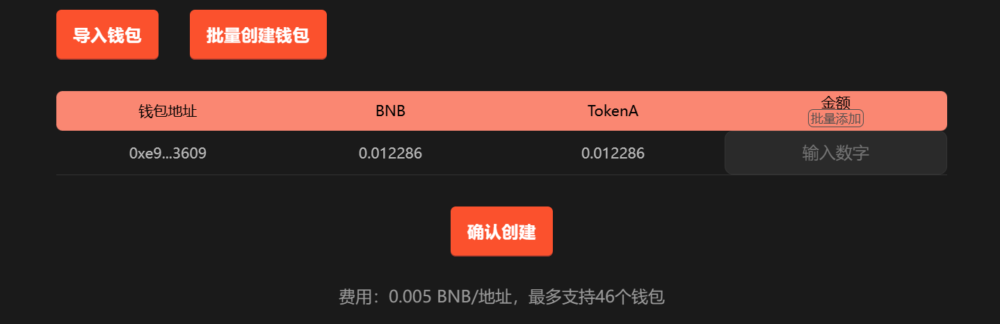
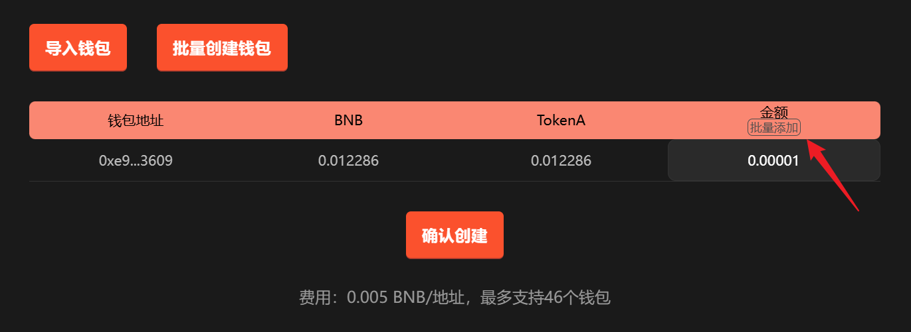
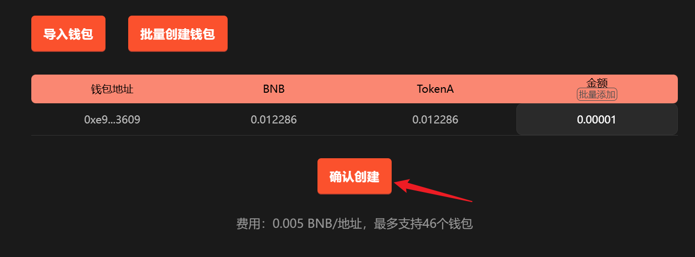

# 币安链（BSC）创建流动性并100%提前买入

## **准备事项**

1. 一台电脑或者一部手机
2. BSC 钱包（[小狐狸MetaMask钱包安装教程](../fu-zhu-xin-xi/metamask-installation.md)）
3. 钱包最少准备 0.031 BNB
4. 要买入的地址私钥和一些 BNB

## 创建流动性并买入步骤

### 第1步，连接钱包

进入页面：[https://www.gtokentool.com/createLiquidityAndBuy](https://www.gtokentool.com/createLiquidityAndBuy)，点击右上角，连接小狐狸钱包，并切换到主网。

完成后，会看到 “链名称” 和 您的“钱包地址” ，如下图：

<figure><figcaption></figcaption></figure>

### 第2步，输入钱包私钥

输入钱包私钥后，下面会显示钱包地址和 BNB 余额。

<figure><figcaption></figcaption></figure>

### 第3步，填写流动性参数

选择 TokenA 和 TokenB 后，下面会显示代币简称、代币精度以及余额。

然后填写要加入流动性的金额。

<figure><figcaption></figcaption></figure>

### 第4步，导入小号钱包私钥

<figure><figcaption></figcaption></figure>

<figure><figcaption></figcaption></figure>

### 第5步，填写购买金额

可单独设置，也可批量添加。

<figure><figcaption></figcaption></figure>

### 第6步，点击“创建”

<figure><figcaption></figcaption></figure>

## 常见问题 FAQ

### Q: 为什么创建流动性并捆绑买入会失败？

**A:** 请确认钱包内底池代币余额是否充足，以覆盖加池，捆绑买入所需资金及 Gas 费用。

### Q: 加池的代币数量和比例有要求吗？

**A:** 没有强制限制。你可以根据代币经济模型、预期初始价格及市值目标灵活调整加池数量与比例。

如有不明白或者不清楚的地方，请加入官方电报群：[**https://t.me/gtokentool**](https://t.me/gtokentool)
