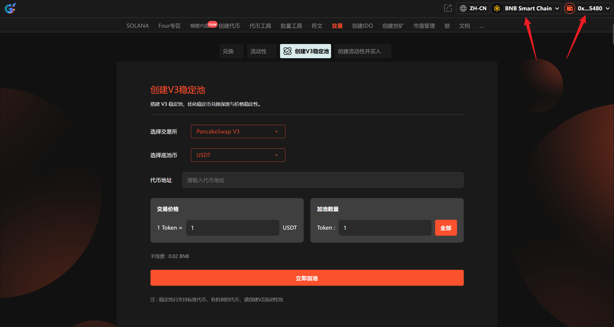
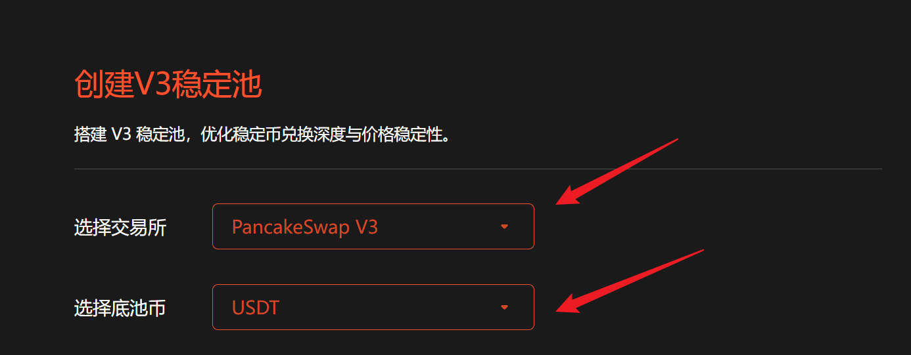
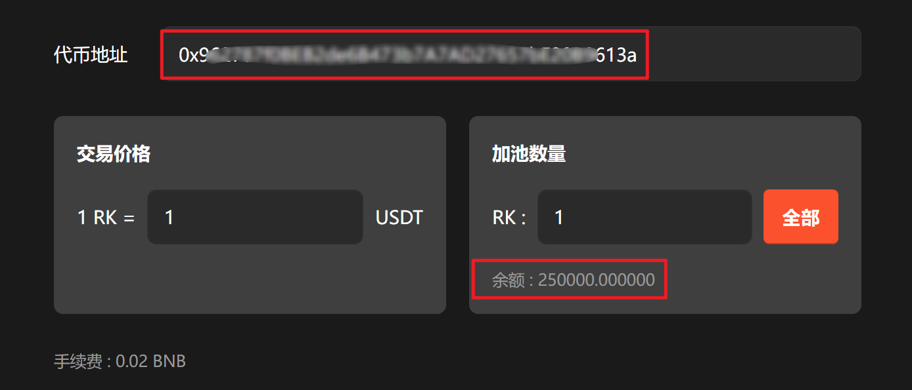
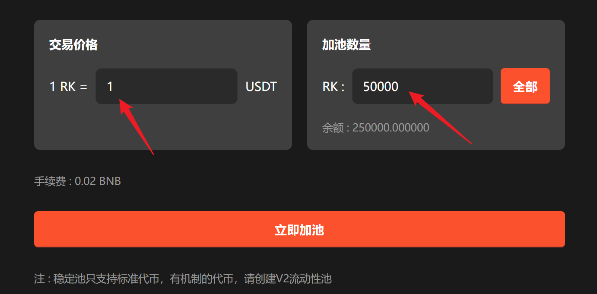
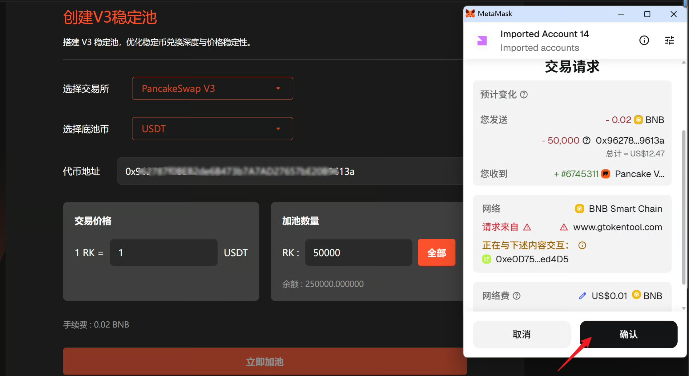

# 创建 V3 稳定池教程

**GTokenTool** 的 **创建 V3 稳定池工具** 专为稳定币及同质化资产对设计，支持建立极窄价格区间的集中流动性池。该工具具备**自定义费率梯度、精准区间管理、高资本效率**等特点。其优势在于能显著降低大额交易滑点，通过高频手续费捕获提升 LP 收益。它特别适用于需要深度流动性支撑的 **稳定币项目方、资深流动性管理团队及专业市商**，是构建稳健交易生态的核心利器。

## 📌 核心摘要

* **功能定位：**&#x4E13;为**稳定币及同质化资产对（如 USDT/USDC）**&#x6253;造的高效流动性构建引擎。通过 PancakeSwap V3 的集中流动性技术，在极窄的价格区间内聚集资金，提供深度的交易环境。
* **技术特性：**
  * **精准区间管理：**&#x652F;持用户自定义流动性供应的价格范围。通过将资金集中在 1:1 附近的有效区间，极大提升了单位资金的利用率。
  * **自定义费率梯度：**&#x63D0;供灵活的手续费率设置选项，允许项目方根据市场竞争情况与资产属性，选择最匹配的收益模型。
  * **高资本效率架构：**&#x76F8;比传统 V2 模式，V3 稳定池能以更少的资金实现更优的交易深度，有效抑制价格偏离。
* **用户价值：**&#x901A;过**极具针对性的流动性优化**，显著降低了大额兑换时的滑点损失。在保障价格稳定性的同时，助力 LP（流动性提供者）通过高频次的手续费捕获获得更丰厚的资金回报。
* **适用群体：**&#x9700;维持币价高度稳定的 **稳定币项目方**、追求极致资本效率的 **资深流动性管理团队**，以及通过专业策略获利的 **专业做市商**。

## **准备事项** 

1. 一台电脑或者一部手机
2. BSC 钱包（[小狐狸MetaMask钱包安装教程](https://docs.gtokentool.com/fu-zhu-xin-xi/metamask-installation)）
3. 钱包最少准备 0.021 BNB
4. 要创建流动性的代币地址

## 创建 V3 稳定池具体流程

### 1. 连接钱包

进入[创建 V3 稳定池](https://www.gtokentool.com/stableSwap)页面，右上角点击`连接钱包`并选择 BSC 主网。

<figure><figcaption>
连接钱包并选择BSC链
</figcaption></figure>

### 2.  选择DEX并选择底池代币

<figure><figcaption>
选择DEX并选择底池代币
</figcaption></figure>

### 3. 输入代币地址

输入代币地址后，下面会显示代币简称以及代币余额。


**注 :** 稳定池只支持标准代币，有机制的代币，请创建V2流动性池。


<figure><figcaption>
输入代币地址
</figcaption></figure>

### 4. 输入交易价格和加池数量

<figure><figcaption>
输入交易价格和加池数量
</figcaption></figure>

### 5. 点击“立即加池”

首次交易需要授权，弹出钱包后点击确认。交易成功后弹出成功提示。

<figure><figcaption>
钱包确认
</figcaption></figure>

## ❓常见问题 FAQ

### Q: 什么是 V3 单币稳定池？

**A:** PancakeSwap V3 专为稳定币设计，可**只存一种币**做市，窄价格区间、低滑点、低无常损失。

### Q: 只能稳定币用吗？

**A:** 是的，适合 USDT/USDC 等 1:1 锚定资产，波动币不适用。

### Q: 建池要双币吗？

**A:** 不用，可**单币存入**，系统自动配比。

### Q: 池子安全吗？

**A:** 合约安全；风险主要看项目方是否锁仓、放弃权限。

### 🤝 连接 GTokenTool 

* **💬 Telegram社群**：[点击加入官方群组](https://t.me/gtokentool)
* **🐦 Twitter (X)**：[关注我们获取最新动态](https://x.com/gtokentool)
* **📚 官方文档**：[查看 Gitbook 文档](https://docs.gtokentool.com/)
* **💻 开源代码**：[访问 GitHub 仓库](https://github.com/Gtokentool/docs/blob/master/SUMMARY.md)
* **📺 视频教程**：[订阅 YouTube 频道](https://www.youtube.com/@GTokenTool)

> ⚠️ 风险提示与免责声明
>
> GTokenTool 保留随时全权酌情因任何理由修改、变更或取消此公告的权利，无需事先通知。
>
> 以上信息内容仅供参考，GTokenTool 对本平台上的任何虚拟资产、产品或促销活动不做任何推荐或保证。虚拟资产的价格波动很大，投资交易虚拟资产将面临巨大风险。**请谨慎投资。**
