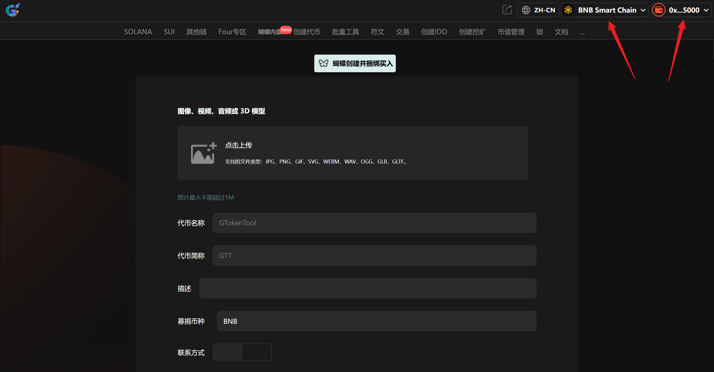
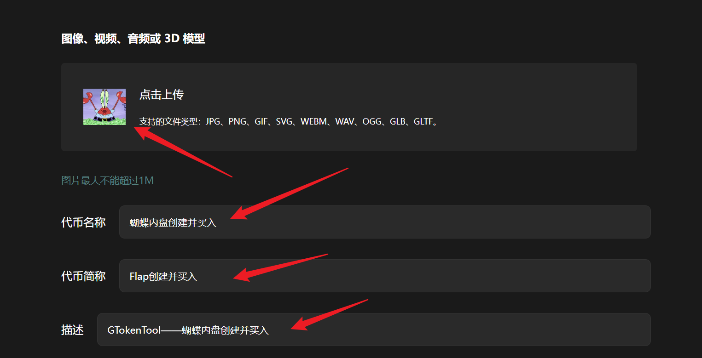
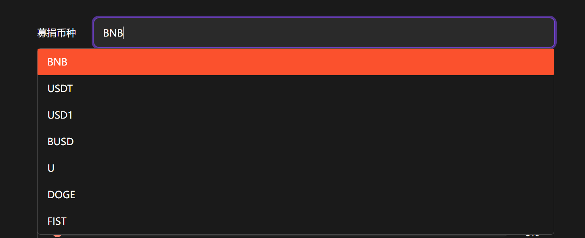
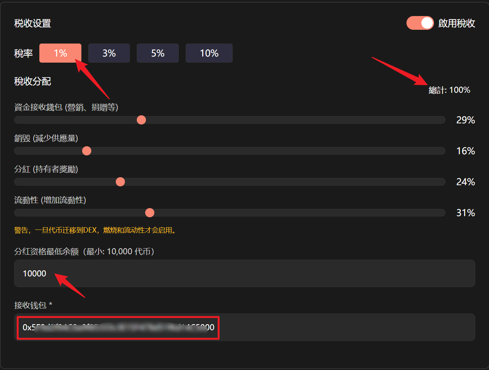
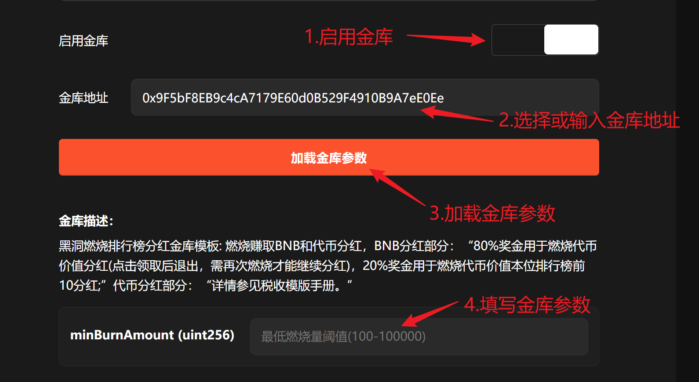
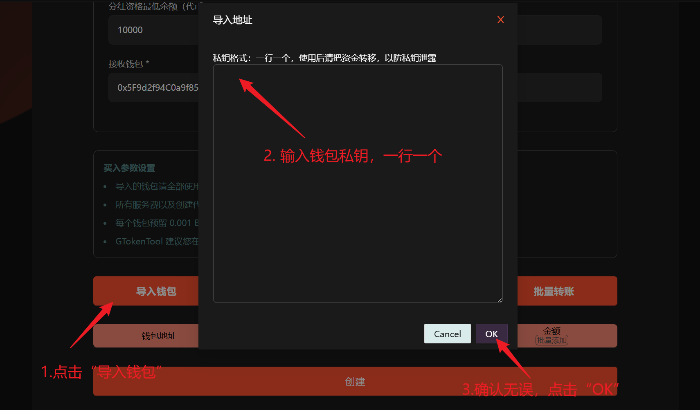
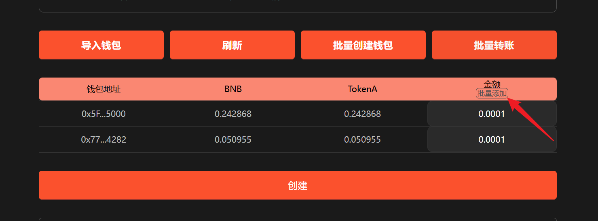
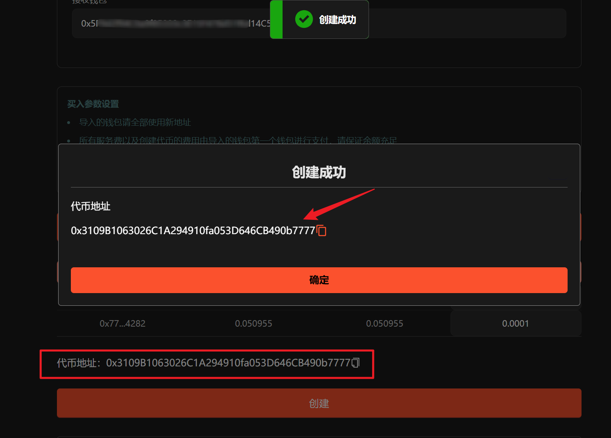
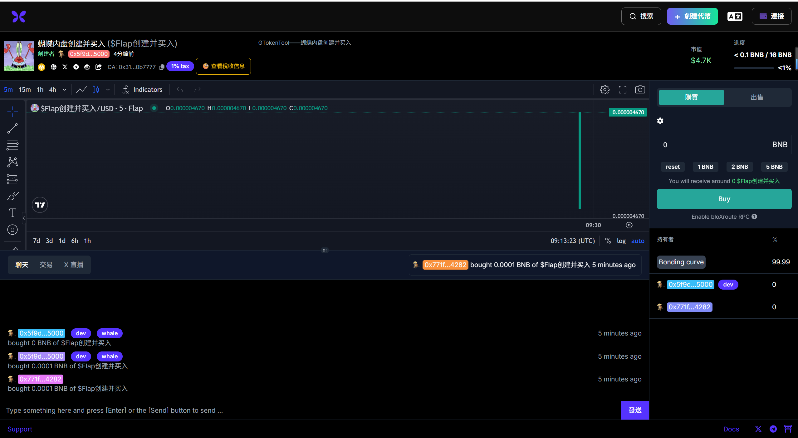

# Flap创建代币并捆绑买入教程

**GTokenTool** 的 **Flap创建代币并捆绑买入** 工具专为 Flap 生态设计，支持发币与初始吸筹同步完成。该工具具备**原子级捆绑交易、多地址自动买入、防机器人狙击**等特点。其优势在于确保项目方在零区块锁定底仓，优化持筹分布并降低启动成本。它特别适用于追求开盘绝对掌控、需快速构建市场热度的 **Web3 初创团队及资深模因币玩家**，是安全、高效启动项目的进阶利器。

### 📌 核心摘要

* **功能定位：**&#x4E13;为 **币安 Flap 内盘** 生态定制的“**发币+吸筹**”一体化进阶工具。支持在创建代币的瞬间同步完成多地址买入，锁定项目启动初期的绝对价格优势。
* **技术特性：**
  * **原子级捆绑交易：**&#x901A;过将发币与买入操作封装在同一区块执行，确保项目方 100% 获得最早买入权，彻底消除手动操作的时间差。
  * **多地址自动买入：**&#x652F;持一键配置多个钱包地址协同进场。在锁定底仓的同时，能够科学分布筹码，构建更健康的持币比例。
  * **智能防机器人狙击：**&#x5185;置原生防夹机制，有效拦截外部狙击机器人抢筹，保障项目方对初始筹码的掌控力。
* **用户价值：**&#x901A;过**流程极简化**的设计，让普通用户也能像专业团队一样掌控开盘。在“快人一步”建立成本优势的同时，大幅降低了开盘阶段的运营成本与筹码流失风险。
* **适用群体：**&#x8FFD;求开盘极致掌控、需快速构建市场热度的 **Web3 初创团队**，以及致力于深耕 Flap 生态、追求长效收益的**资深模因币（Meme）玩家**。


**Flap 创建代币并买入 | 简化交易流程 | 抢得交易先机｜全网最低费用**

币安Flap内盘创建代币的同时进行代币买入操作，有效简化交易流程并加速市场参与，快人一步，抢得先机，从而更早获得潜在的收益。

[立即体验>>>](https://www.gtokentool.com/flap)


## 📺视频教程



## **准备事项**

1. 一台电脑或者一部手机
2. BSC 钱包（[小狐狸MetaMask钱包安装教程](../fu-zhu-xin-xi/metamask-installation.md)）
3. 钱包最少准备 0.031 BNB
4. 要买入的地址私钥和一些 BNB

## **Flap创建并捆绑买入步骤**

### 第1步，连接钱包

进入页面：[https://www.gtokentool.com/flap](https://www.gtokentool.com/flap)，点击右上角，连接[小狐狸钱包](../fu-zhu-xin-xi/metamask-installation.md)，并切换到币安链主网。完成后，会看到 “链名称” 和 您的“钱包地址” ，如下图：

<figure><figcaption>
连接钱包并选择网络
</figcaption></figure>

### 第2步，填写信息并上传图片

假设我们创建一个代币名称为"蝴蝶内盘创建并买入"的代币，填写信息如下：

**Logo：**&#x56FE;片最大不能超过1M

**代币名称：**&#x8774;蝶内盘创建并买入

**代币简称：**&#x46;lap创建并买入

**描述：**&#x47;TokenTool——蝴蝶内盘创建并买入

<figure><figcaption>
填写信息并上传图片
</figcaption></figure>

### 第3步，选择募捐币种

这里我选择BNB，也可以选择其他的币种（USDT、USD1、BUSD、U、DOGE、FIST）。

<figure><figcaption>
选择募捐币种
</figcaption></figure>

### 第4步，添加联系方式（可选）

<figure><figcaption>
添加联系方式
</figcaption></figure>

### 第5步，税收设置（可选）

税收分配总计要为100%，可设置分红资格最低余额（最小：10000 代币）以及接收钱包。

<figure><figcaption>
税收设置
</figcaption></figure>

### 第6步，启用金库（可选）

已提供常用金库地址选择，也可自行输入金库地址。输入金库地址后，请点击“`加载金库参数`”并填写金库参数。

<figure><figcaption>
启用金库
</figcaption></figure>

### 第7步，导入钱包

手动复制填写，一行一个。


**买入参数设置**

* 导入的钱包请全部使用新地址。
* 所有服务费以及创建代币的费用由导入的钱包第一个钱包进行支付，请保证余额充足。
* 每个钱包预留 0.001 BNB 作为买入 Gas。
* <mark style="color:red;">建议您在使用涉及私钥的功能后，及时更换钱包。</mark>


<figure><figcaption>
导入钱包
</figcaption></figure>

### 第8步，设置买入金额

可单独设置，也可批量添加。

<figure><figcaption>
设置买入金额
</figcaption></figure>

### 第9步，点击“创建”

点击“`创建`”，等待一会。创建成功后，会有弹窗显示代币地址。下方也会显示代币地址，可点击下方的代币地址查看代币信息。

<figure><figcaption>
创建成功提示
</figcaption></figure>

<figure><figcaption>
Flap官网代币页面
</figcaption></figure>

这样Flap创建并捆绑买入整个流程就结束了，后面大家就可以自行操作啦！

## ❓常见问题 FAQ

### Q: 这个功能是怎么收费的？

**A:** 全网最低费用，阶梯收费低至0.005 BNB/每地址。10个以下地址0.03 BNB/每地址，10个钱包以上仅需0.005 BNB/每地址。

### Q: Flap的发盘初始价格是多少？

**A:** Flap的发盘初始价格大约为 0.00001 BNB.

### Q: 内盘买入和外盘买入的区别是什么？

**A:** 内盘是在 bonding curve 上预买入；外盘是在毕业后于 PancakeSwap 上买入。

### 🤝 连接 GTokenTool 

* **💬 Telegram社群**：[点击加入官方群组](https://t.me/gtokentool)
* **🐦 Twitter (X)**：[关注我们获取最新动态](https://x.com/gtokentool)
* **📚 官方文档**：[查看 Gitbook 文档](https://docs.gtokentool.com/)
* **💻 开源代码**：[访问 GitHub 仓库](https://github.com/Gtokentool/docs/blob/master/SUMMARY.md)
* **📺 视频教程**：[订阅 YouTube 频道](https://www.youtube.com/@GTokenTool)

> ⚠️ 风险提示与免责声明
>
> GTokenTool 保留随时全权酌情因任何理由修改、变更或取消此公告的权利，无需事先通知。
>
> 以上信息内容仅供参考，GTokenTool 对本平台上的任何虚拟资产、产品或促销活动不做任何推荐或保证。虚拟资产的价格波动很大，投资交易虚拟资产将面临巨大风险。**请谨慎投资。**
