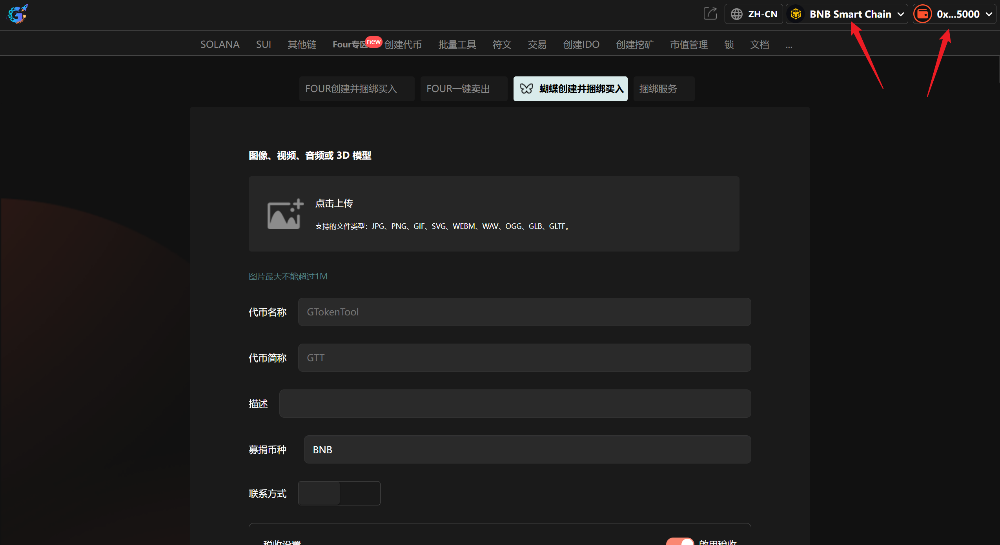
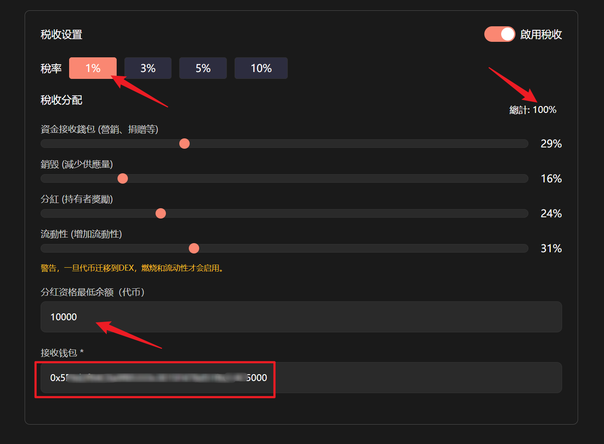

# Flap创建代币并捆绑买入教程


**Flap 创建代币并买入 | 简化交易流程 | 抢得交易先机｜全网最低费用**

币安Flap内盘创建代币的同时进行代币买入操作，有效简化交易流程并加速市场参与，快人一步，抢得先机，从而更早获得潜在的收益。

[立即体验>>>](https://www.gtokentool.com/flap)


## **准备事项**

1. 一台电脑或者一部手机
2. BSC 钱包（[小狐狸MetaMask钱包安装教程](../fu-zhu-xin-xi/metamask-installation.md)）
3. 钱包最少准备 0.031 BNB
4. 要买入的地址私钥和一些 BNB

## **Flap创建并捆绑买入步骤**

### 第1步，连接钱包

进入页面：[https://www.gtokentool.com/flap](https://www.gtokentool.com/flap)，点击右上角，连接[小狐狸钱包](../fu-zhu-xin-xi/metamask-installation.md)，并切换到币安链主网。完成后，会看到 “链名称” 和 您的“钱包地址” ，如下图：

<figure><figcaption></figcaption></figure>

### 第2步，填写信息并上传图片

假设我们创建一个代币名称为"蝴蝶内盘创建并买入"的代币，填写信息如下：

Logo：图片最大不能超过1M

代币名称：蝴蝶内盘创建并买入

代币简称：Flap创建并买入

描述：GTokenTool——蝴蝶内盘创建并买入

<figure><figcaption></figcaption></figure>

### 第3步，选择募捐币种

这里我选择BNB，也可以选择其他的币种（USDT、USD1、BUSD、U、DOGE、FIST）。

<figure><figcaption></figcaption></figure>

### 第4步，添加联系方式（选填）

<figure><figcaption></figcaption></figure>

### 第5步，税收设置（选填）

税收分配总计要为100%，可设置分红最低余额以及接收钱包。

<figure><figcaption></figcaption></figure>

### 第6步，导入钱包

手动复制填写，一行一个。


**买入参数设置**

* 导入的钱包请全部使用新地址。
* 所有服务费以及创建代币的费用由导入的钱包第一个钱包进行支付，请保证余额充足。
* 每个钱包预留 0.001 BNB 作为买入 Gas。
* <mark style="color:red;">建议您在使用涉及私钥的功能后，及时更换钱包。</mark>


<figure><figcaption></figcaption></figure>

### 第7步，设置买入金额

可单独设置，也可批量添加。

<figure><figcaption></figcaption></figure>

### 第8步，点击“创建”

点击“`创建`”，等待一会。创建成功后，会有弹窗显示代币地址。下方也会显示代币地址，可点击下方的代币地址查看代币信息。

<figure><figcaption></figcaption></figure>

<figure><figcaption></figcaption></figure>

这样Flap创建并捆绑买入整个流程就结束了，后面大家就可以自行操作啦！

## 常见问题：

### 1.这个功能是怎么收费的？

全网最低费用，阶梯收费低至0.005 BNB/每地址。10个以下地址0.03 BNB/每地址，10个钱包以上仅需0.005 BNB/每地址。

如有不明白或者不清楚的地方，请加入官方电报群：[https://t.me/gtokentool](https://t.me/gtokentool)
