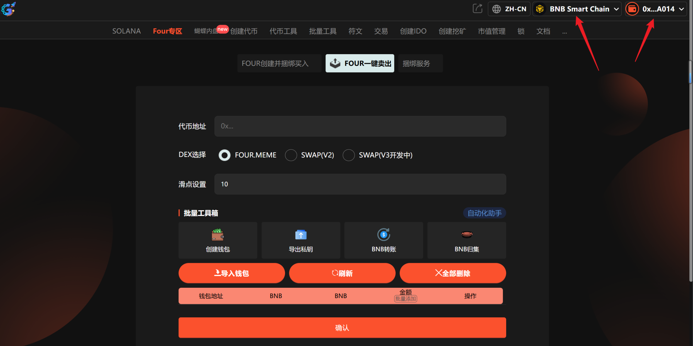
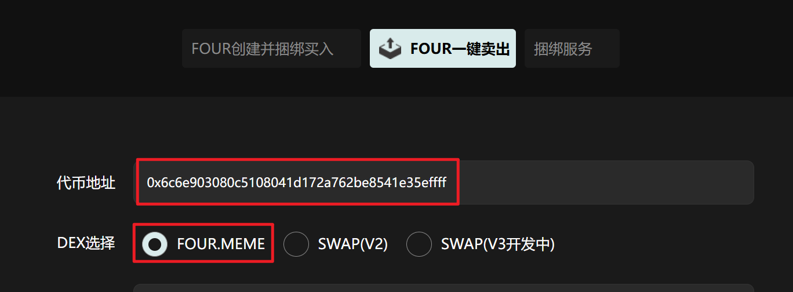
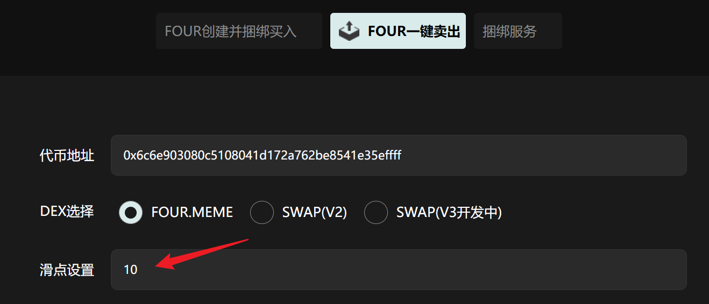
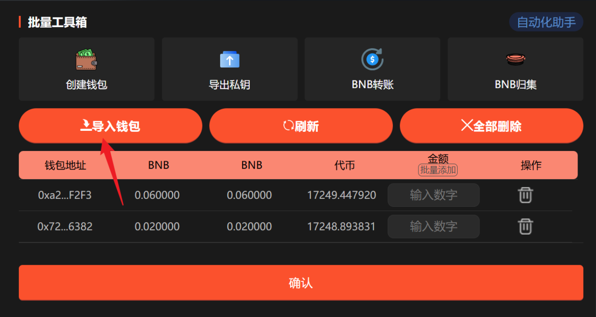
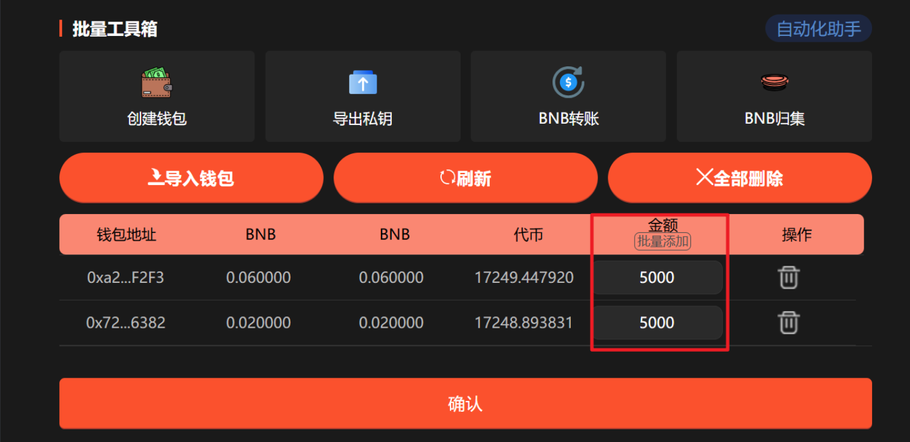
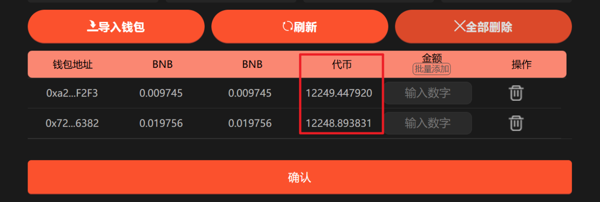

# FOUR一键卖出教程

**GTokenTool** 的 **FOUR一键卖出工具** 专为 FourMeme 生态设计，旨在协助用户实现资产的极速清仓。该工具具备**全币种覆盖、毫秒级响应、一键授权卖出**等特点。其优势在于能彻底告别手动操作的延迟，在波动剧烈的市场中锁定利润或及时止损。它特别适用于追求极致操作时效的 **Web3 活跃交易员、Meme 玩家及项目运营团队**，是玩家在复杂链上博弈中立于不败之地的必备效率利器。

## 📌 核心摘要

* **功能定位：**&#x4E13;为 **FourMeme** 玩家打造的**资产极速止盈止损引擎**。支持通过多个钱包地址同步执行卖出指令，实现大额持仓的平稳、快速退出。
* **技术特性：**
  * **多地址同步抛售：**&#x652F;持一键控制多个关联地址同步卖出，有效分散交易压力，规避单笔大额交易对币价造成的剧烈冲击（Price Impact）。
  * **毫秒级响应机制：**&#x9488;对波动剧烈的 Meme 市场优化，提供极速的链上交互响应，确保在目标价位精准执行。
  * **自定义卖出配置：**&#x652F;持自主设定卖出数量与比例，助力用户灵活实施分批止盈或全量清仓策略。
* **用户价值：**&#x5F7B;底终结了手动逐个切换钱包、重复授权卖出的低效模式。通过**自动化、捆绑式**的操作，助您在分秒必争的行情波动中锁住利润，显著提升交易成功率。
* **适用群体：**&#x8FFD;求极致操作时效的 **Web3 活跃交易员**、深度参与 FourMeme 生态的 **Meme 玩家**，以及需管理多个持仓地址的**项目运营团队**。

## **准备事项** 

1. 一台电脑或者一部手机
2. BSC 钱包（[小狐狸MetaMask钱包安装教程](https://docs.gtokentool.com/fu-zhu-xin-xi/metamask-installation)）
3. 要交易的代币地址
4. 要卖出代币的钱包私钥和充足的BNB

## FOUR一键卖出具体流程

### 1. 连接钱包

进入页面：[https://www.gtokentool.com/FourSell](https://www.gtokentool.com/FourSell)，点击右上角，连接[小狐狸钱包](https://docs.gtokentool.com/fu-zhu-xin-xi/metamask-installation)，并切换到币安链主网。完成后，会看到 “链名称” 和 您的“钱包地址” ，如下图：

<figure><figcaption>
连接钱包并选择BSC链
</figcaption></figure>

### 2. 输入代币地址

输入代币地址后，选择对应的DEX，否则可能导致交易失败。

<figure><figcaption>
输入代币地址并选择对应的DEX
</figcaption></figure>

### 3. 设置滑点

<figure><figcaption>
设置滑点
</figcaption></figure>

### 4. 导入钱包

导入钱包后请刷新钱包，以获取最新的钱包余额以及代币余额。


**注意：**<mark style="color:$success;">全部费用由导入的第一个钱包支付。</mark>全网最低费用，阶梯收费低至0.005 BNB/地址。10个以下地址0.008 BNB/地址，10个钱包以上0.005 BNB/地址。


<figure><figcaption>
导入钱包
</figcaption></figure>

### 5. 设置卖出数量

可手动输入也可批量添加。

<figure><figcaption>
设置卖出数量
</figcaption></figure>

### 6. 点击“确认”

点击“`确认`”后，交易成功会弹出成功提示。你也可以点击`刷新`，获取钱包最新代币余额。

<figure><figcaption>
确认交易
</figcaption></figure>

## ❓常见问题 FAQ

### Q: 什么是多地址捆绑卖出？

**A:** 指多个钱包同时卖出同一代币，以批量执行交易，提高交易成功率与速度。

### Q: 为什么卖出地址的BNB余额必须大于 0.001？

**A:** 每个钱包至少保留 0.001 BNB 以上余额，以确保足够支付交易 Gas 费用。

### Q: 代币地址输入错误怎么办？

**A:** 请在执行前确认代币合约地址正确无误。

### Q: 是否支持自定义卖出金额？

**A:** 支持。你可以为不同钱包单独设定卖出金额，也可以统一设定同样的卖出数额。

### 🤝 连接 GTokenTool 

* **💬 Telegram社群**：[点击加入官方群组](https://t.me/gtokentool)
* **🐦 Twitter (X)**：[关注我们获取最新动态](https://x.com/gtokentool)
* **📚 官方文档**：[查看 Gitbook 文档](https://docs.gtokentool.com/)
* **💻 开源代码**：[访问 GitHub 仓库](https://github.com/Gtokentool/docs/blob/master/SUMMARY.md)
* **📺 视频教程**：[订阅 YouTube 频道](https://www.youtube.com/@GTokenTool)

> ⚠️ 风险提示与免责声明
>
> GTokenTool 保留随时全权酌情因任何理由修改、变更或取消此公告的权利，无需事先通知。
>
> 以上信息内容仅供参考，GTokenTool 对本平台上的任何虚拟资产、产品或促销活动不做任何推荐或保证。虚拟资产的价格波动很大，投资交易虚拟资产将面临巨大风险。**请谨慎投资。**
