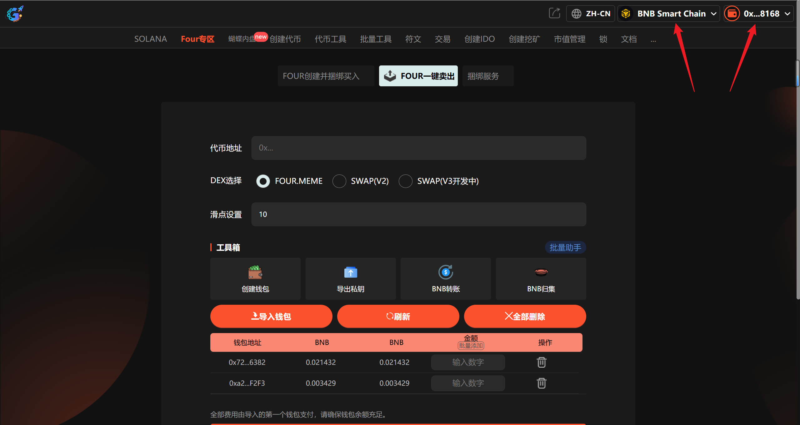
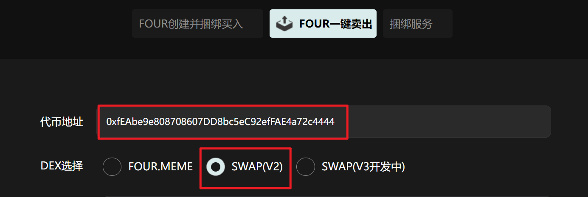
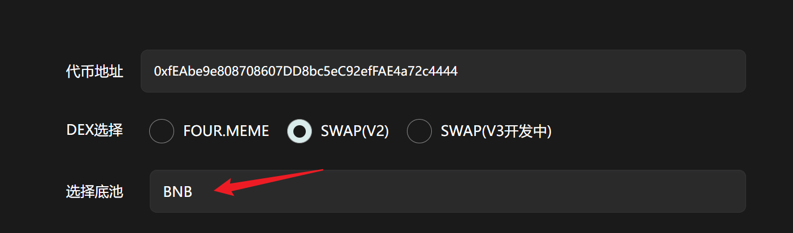
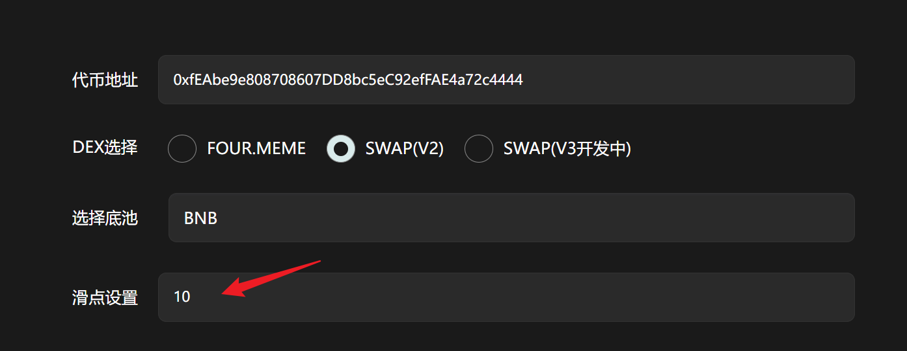
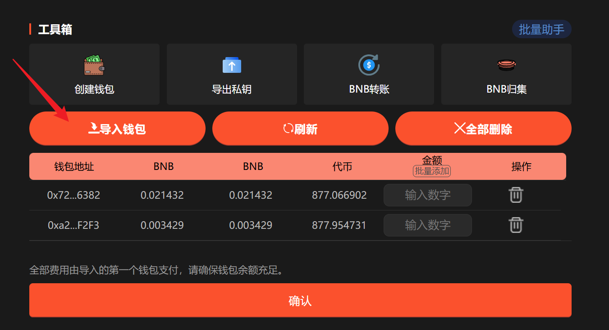
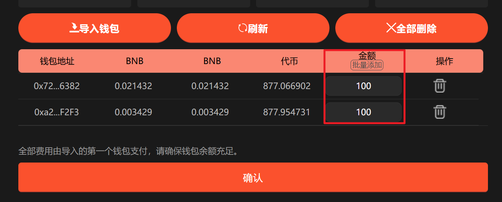
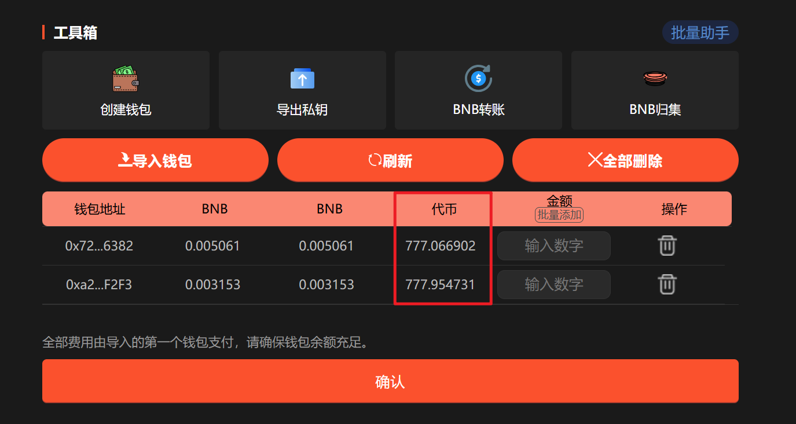

# PancakeSwap V2一键卖出教程

## **准备事项** 

1. 一台电脑或者一部手机
2. BSC 钱包（[小狐狸MetaMask钱包安装教程](https://docs.gtokentool.com/fu-zhu-xin-xi/metamask-installation)）
3. 要交易的代币地址
4. 要卖出代币的钱包私钥和充足的BNB

## PancakeSwap V2一键卖出具体流程

### 1. 连接钱包

进入页面：[https://www.gtokentool.com/FourSell](https://www.gtokentool.com/FourSell)，点击右上角，连接[小狐狸钱包](https://docs.gtokentool.com/fu-zhu-xin-xi/metamask-installation)，并切换到币安链主网。完成后，会看到 “链名称” 和 您的“钱包地址” ，如下图：

<figure><figcaption></figcaption></figure>

### 2. 输入代币地址

输入代币地址后，选择对应的DEX，否则可能导致交易失败。

<figure><figcaption></figcaption></figure>

### 3. 选择对应的底池代币

可选择已提供的代币，也可自行输入底池代币地址。

<figure><figcaption></figcaption></figure>

### 4. 设置滑点

<figure><figcaption></figcaption></figure>

### 5. 导入钱包

导入钱包后请刷新钱包，以获取最新的钱包余额以及代币余额。


**注意：**<mark style="color:$success;">全部费用由导入的第一个钱包支付。</mark>全网最低费用，阶梯收费低至0.005 BNB/地址。10个以下地址0.008 BNB/地址，10个钱包以上0.005 BNB/地址。


<figure><figcaption></figcaption></figure>

### 6. 设置卖出数量

可手动输入也可批量添加。

<figure><figcaption></figcaption></figure>

### 7. 点击“确认”

点击“`确认`”后，交易成功会弹出成功提示。你也可以点击`刷新`，获取钱包最新代币余额。

<figure><figcaption></figcaption></figure>

## 常见问题 FAQ

### Q: 什么是多地址捆绑卖出？

**A:** 指多个钱包同时卖出同一代币，以批量执行交易，提高交易成功率与速度。

### Q: 为什么卖出地址的BNB余额必须大于 0.001？

**A:** 每个钱包至少保留 0.001 BNB 以上余额，以确保足够支付交易 Gas 费用。

### Q: 代币地址输入错误怎么办？

**A:** 请在执行前确认代币合约地址正确无误。

### Q: 是否支持自定义卖出金额？

**A:** 支持。你可以为不同钱包单独设定卖出金额，也可以统一设定同样的卖出数额。

如有不明白或者不清楚的地方，请加入官方电报群：[https://t.me/gtokentool](https://t.me/gtokentool)
