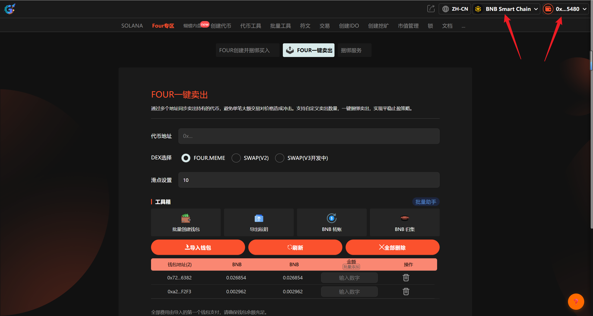
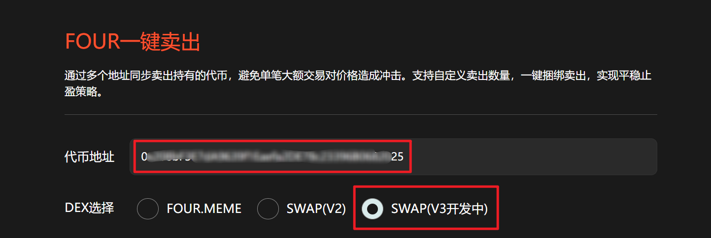
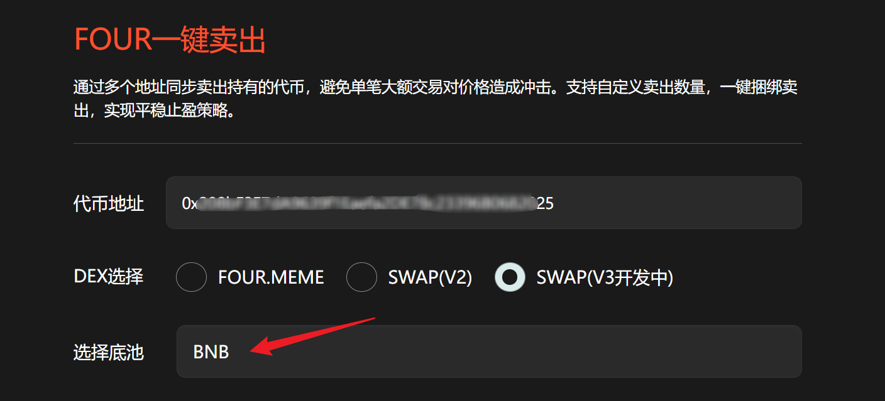
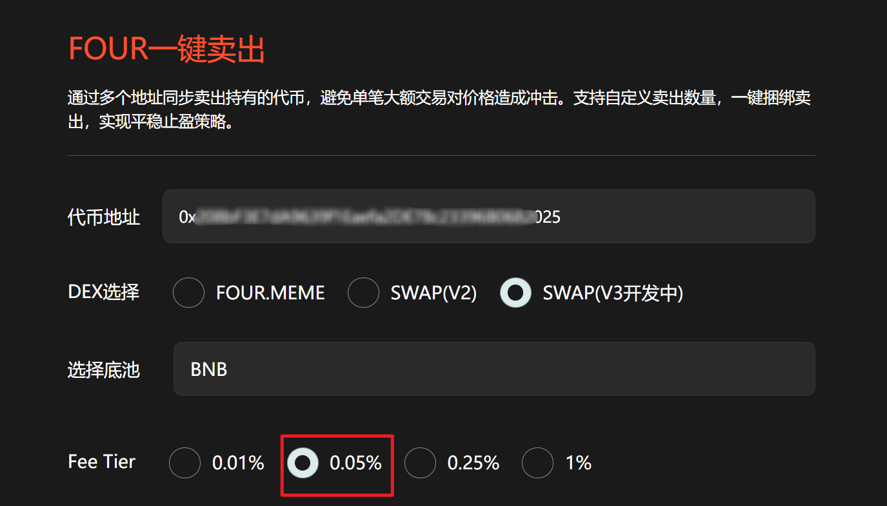
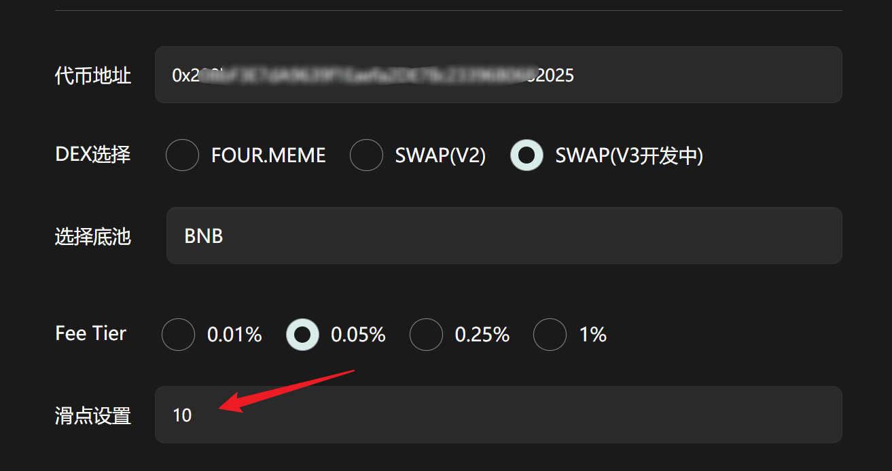
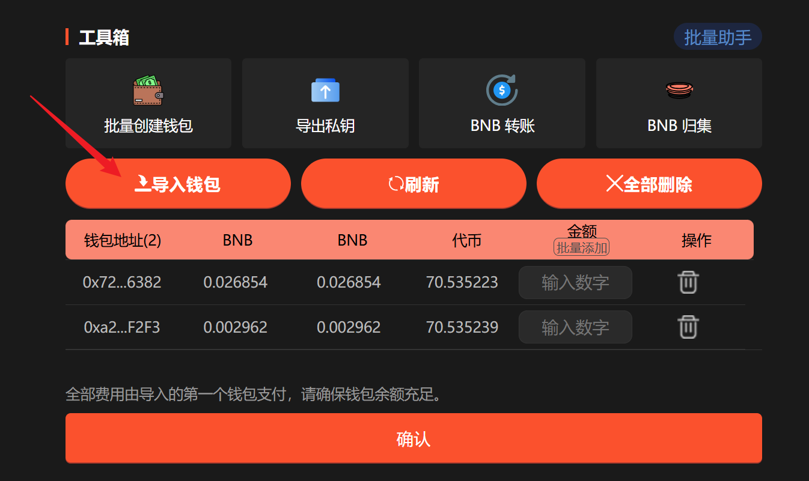
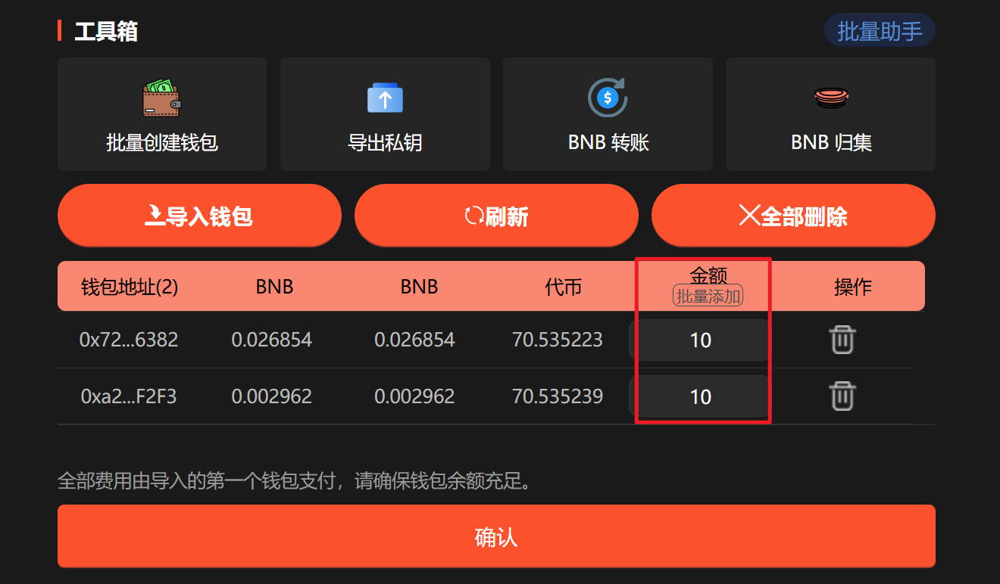
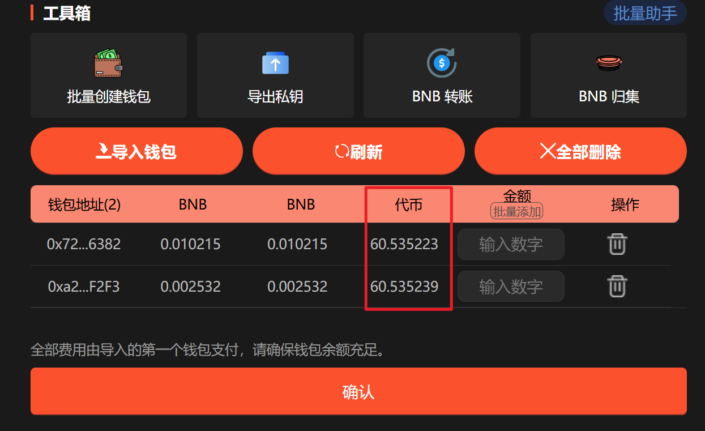

# PancakeSwap V3一键卖出教程

**GTokenTool** 的 **PancakeSwap V3一键卖出工具** 专为 BSC 高阶玩家设计，支持 V3 协议资产的秒级清仓。该工具具备**智能头寸识别、多地址同步抛售、极速链上交互**等特点。其优势在于能高效处理 V3 集中流动性资产，在剧烈波动中精准锁利。它特别适用于追求极致效率的 **Web3 交易员、专业模因币玩家及项目团队**，是管理 V3 持仓、实现快速止盈的必备神器。

## 📌 核心摘要

* **功能定位：**&#x4E13;为 **BSC (币安智能链)** 高阶玩家打造的 **V3 协议资产极速清仓引擎**。支持对 PancakeSwap V3 集中流动性头寸及代币进行批量、同步的卖出操作。
* **技术特性：**
  * **智能头寸识别：**&#x6DF1;度适配 V3 协议底层逻辑，能够自动识别并解析钱包内的 V3 流动性头寸，告别手动查找的繁琐流程。
  * **多地址同步抛售：**&#x652F;持一键操控多个钱包地址同步执行卖出指令。通过分散交易流量，有效平滑大额操作对价格造成的负面冲击（Price Impact）。
  * **极速链上交互：**&#x4F18;化合约调用路径，实现毫秒级的链上响应。确保在价格瞬息万变的市场环境中，能够以极高的成功率锁定目标价位。
* **用户价值：**&#x9488;对 V3 协议操作复杂、流动性集中的特点，提供了**自动化、捆绑式**的止盈止损方案。助您在面临行情波动时，能彻底消除手动操作的延迟风险，实现资产的快速安全撤离与利润锁定。
* **适用群体：**&#x8FFD;求极致交易时效与操作效率的 **Web3 专业交易员**、深度参与 V3 生态的 **专业模因币（Meme）玩家**，以及需要高效管理多地址持仓的**项目运营团队**。

## **准备事项** 

1. 一台电脑或者一部手机
2. BSC 钱包（[小狐狸MetaMask钱包安装教程](https://docs.gtokentool.com/fu-zhu-xin-xi/metamask-installation)）
3. 要交易的代币地址
4. 要卖出代币的钱包私钥和充足的BNB

## PancakeSwap V3一键卖出具体流程

### 1. 连接钱包

进入页面：[https://www.gtokentool.com/FourSell](https://www.gtokentool.com/FourSell)，点击右上角，连接[小狐狸钱包](https://docs.gtokentool.com/fu-zhu-xin-xi/metamask-installation)，并切换到币安链主网。完成后，会看到 “链名称” 和 您的“钱包地址” ，如下图：

<figure><figcaption>
连接钱包并选择BSC链
</figcaption></figure>

### 2. 输入代币地址

输入代币地址后，选择对应的DEX，否则可能导致交易失败。

<figure><figcaption>
输入代币地址并选择对应DEX
</figcaption></figure>

### 3. 选择对应的底池代币

可选择已提供的代币，也可自行输入底池代币地址。

<figure><figcaption>
选择对应的底池
</figcaption></figure>

### 4. 选择对应池子费率

<figure><figcaption>
选择对应池子费率
</figcaption></figure>

### 5. 设置滑点

<figure><figcaption>
设置滑点
</figcaption></figure>

### 6. 导入钱包

导入钱包后请刷新钱包，以获取最新的钱包余额以及代币余额。


**注意：**<mark style="color:$success;">全部费用由导入的第一个钱包支付。</mark>全网最低费用，阶梯收费低至0.005 BNB/地址。10个以下地址0.008 BNB/地址，10个钱包以上0.005 BNB/地址。


<figure><figcaption>
导入钱包
</figcaption></figure>

### 7. 设置卖出数量

可手动输入也可批量添加。

<figure><figcaption>
设置卖出数量
</figcaption></figure>

### 8. 点击“确认”

点击“`确认`”后，交易成功会弹出成功提示。你也可以点击`刷新`，获取钱包最新代币余额。

<figure><figcaption></figcaption></figure>

## ❓常见问题 FAQ

### Q: 什么是多地址捆绑卖出？

**A:** 指多个钱包同时卖出同一代币，以批量执行交易，提高交易成功率与速度。

### Q: 为什么卖出地址的BNB余额必须大于 0.001？

**A:** 每个钱包至少保留 0.001 BNB 以上余额，以确保足够支付交易 Gas 费用。

### Q: 代币地址输入错误怎么办？

**A:** 请在执行前确认代币合约地址正确无误。

### Q: 是否支持自定义卖出金额？

**A:** 支持。你可以为不同钱包单独设定卖出金额，也可以统一设定同样的卖出数额。

### 🤝 连接 GTokenTool 

* **💬 Telegram社群**：[点击加入官方群组](https://t.me/gtokentool)
* **🐦 Twitter (X)**：[关注我们获取最新动态](https://x.com/gtokentool)
* **📚 官方文档**：[查看 Gitbook 文档](https://docs.gtokentool.com/)
* **💻 开源代码**：[访问 GitHub 仓库](https://github.com/Gtokentool/docs/blob/master/SUMMARY.md)
* **📺 视频教程**：[订阅 YouTube 频道](https://www.youtube.com/@GTokenTool)

> ⚠️ 风险提示与免责声明
>
> GTokenTool 保留随时全权酌情因任何理由修改、变更或取消此公告的权利，无需事先通知。
>
> 以上信息内容仅供参考，GTokenTool 对本平台上的任何虚拟资产、产品或促销活动不做任何推荐或保证。虚拟资产的价格波动很大，投资交易虚拟资产将面临巨大风险。**请谨慎投资。**
