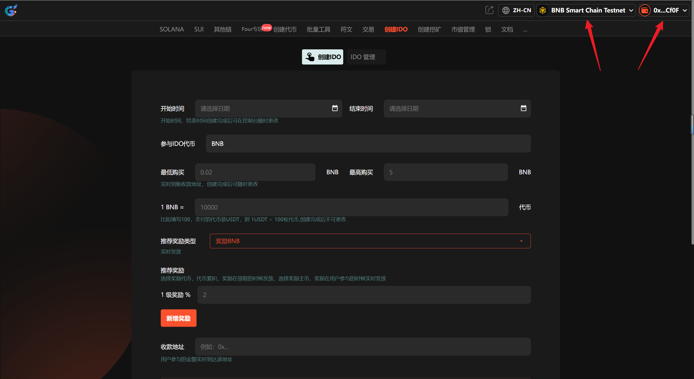
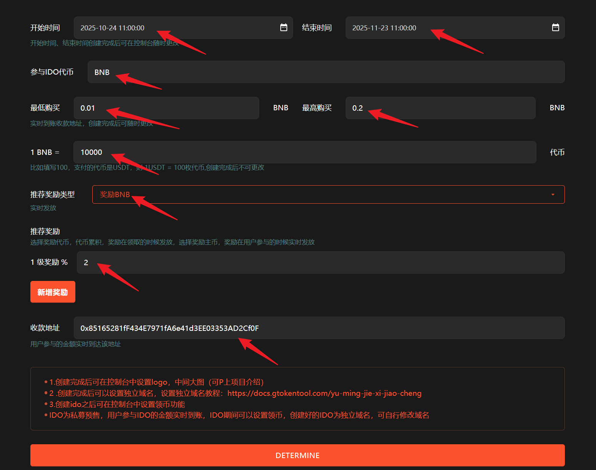

# 2️⃣ 创建IDO

**GTokenTool** 的 **BSC创建IDO工具** 专为初创项目设计，提供去中心化预售一键部署方案。该工具支持**参数高度自定义、资金自动化结算、白名单限额控制**等功能。其优势在于零代码门槛、合约安全透明，能大幅降低融资成本并加速社区共识。它特别适用于寻求公开募资的 **Web3 初创团队、社区治理项目及模因币运营者**，是高效开启项目首发的理想选择。

## 📌 核心摘要

* **功能定位：**&#x8BE5;工具是专为 BSC 生态打造的去中心化募资部署引擎，通过将代币公募、白名单控制及流动性同步注入等复杂功能封装为一键式图形界面，实现了从代币发行到公开预售的无缝衔接。
* **技术特性：**
  * **高度自定义参数：**&#x652F;持自主设定募资限额、兑换比例及参与门槛，精准匹配项目方的资金筹集需求。
  * **自动化安全结算：**&#x5185;置资金自动化结算逻辑，确保募资完成后资产分发与流动性管理的透明性与时效性。
* **用户价值：**&#x5B83;消除了项目启动初期的技术开发瓶颈，让运营团队在零代码基础上即可完成合规、透明的链上融资，在极速构建社区共识的同时显著降低了项目首发的获客与时间成本。
* **适用群体：**&#x5BFB;求高效公开募资的 **Web3 初创团队**、深耕资产创新的 **社区治理项目** 以及需快速启动首发的 **模因币（Meme）运营者**。

## 📺视频教程



## 1、介绍

IDO指的是代币的首次发行。运用所有用户的资源和注意力来推动项目的发展，侧重通过社区参与和贡献来分发代币，而不是直接募集资金。在IDO中，项目方会发起一些悬赏任务，所有用户可以通过自己的时间和技能来完成这些任务，以此获得项目方发放的代币奖励。

## 2、操作步骤

提示：请先安装小狐狸钱包插件，教程：[https://docs.gtokentool.com/fu-zhu-xin-xi/metamask-installation](https://docs.gtokentool.com/fu-zhu-xin-xi/metamask-installation)

### (1) 连接钱包

进入创建页面：[https://www.gtokentool.com/idov2](https://www.gtokentool.com/idov2)，点击右上角，连接小狐狸钱包，并切换到主网（这里以BSC测试网为例)。

完成后，会看到您的 “链名称” 和 “钱包地址” ，如下图：

<figure><figcaption>
连接钱包并选择BSC链
</figcaption></figure>

### (2) 输入IDO信息

假设我们创建一个为期30天的IDO， 填写如下：

* **开始时间：**&#x32;025-10-24 11:00:00
* **结束时间：**&#x32;025-11-23 11:00:00
* **参与IDO代币：**&#x42;NB
* **最低购买BNB 数量：**&#x30;.01
* **最高购买BNB 数量：**&#x30;.2
* 1 BNB = 10000  代币
* **推荐奖励类型：**&#x5956;励BNB
* **推广奖励--->**&#x31; 级奖励 %：2
* **收款地址：**&#x30;x85165281fF434E7971fA6e41d3EE03353AD2Cf0F

<figure><figcaption>
输入IDO信息
</figcaption></figure>

输入完成后，点击“`确定`”。

### (3) 完成

点击 “`确认创建`” ，在小狐狸钱包上支付gas费，就完成了。

<figure><figcaption>
确认创建
</figcaption></figure>

## ❓常见问题 FAQ

### Q: 用户参与 IDO 的金额是实时到账我的收款地址吗？

**A:** 是的，用户参与 IDO 的金额会**实时上链到你的收款地址**，交易确认后立即到账。

### Q: 用户可以实时领取代币吗？

**A:** 设置好后就能领取，可以实时领取，也可以等你想用户领取的时候再由控制台设置。

### Q: 我可以更换 IDO 域名吗？

**A:** 可以的，您可以在 godaddy 购买域名，并按要求解析域名，如果不会，可以向管理员购买域名，价格为50刀一年。

### Q: 我可以自定义开始结束时间吗？

**A:** 可以的，创建好后控制台可自由设置。

### Q: 兑换比例可以修改吗？

**A:** 不行，兑换比例创建好后就不能修改了，如有需求，可以重新创建一个 IDO。

### Q: 奖励主币和奖励代币，都是什么时候发放的呢？

**A:** 选择奖励代币，代币与用户自身购买的累加，在用户领取代币的时候一起领取，如果选择奖励主币，奖励在用户参与的时候实时发放。

### Q: 我想在 IDO 网站上添加我的项目资料应该怎么做？

**A:** IDO中可以自定义图片，您可以在配置中间大图的时候P上您的项目资料。

### Q: 平台收取2%手续费，是什么时候收取的呢？

**A:** 用户付款的时候实时收取。

#### 🤝 连接 GTokenTool 

* **💬 Telegram社群**：[点击加入官方群组](https://t.me/gtokentool)
* **🐦 Twitter (X)**：[关注我们获取最新动态](https://x.com/gtokentool)
* **📚 官方文档**：[查看 Gitbook 文档](https://docs.gtokentool.com/)
* **💻 开源代码**：[访问 GitHub 仓库](https://github.com/Gtokentool/docs/blob/master/SUMMARY.md)
* **📺 视频教程**：[订阅 YouTube 频道](https://www.youtube.com/@GTokenTool)

> ⚠️ 风险提示与免责声明
>
> GTokenTool 保留随时全权酌情因任何理由修改、变更或取消此公告的权利，无需事先通知。
>
> 以上信息内容仅供参考，GTokenTool 对本平台上的任何虚拟资产、产品或促销活动不做任何推荐或保证。虚拟资产的价格波动很大，投资交易虚拟资产将面临巨大风险。**请谨慎投资。**
