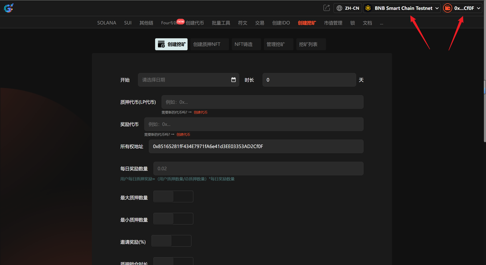
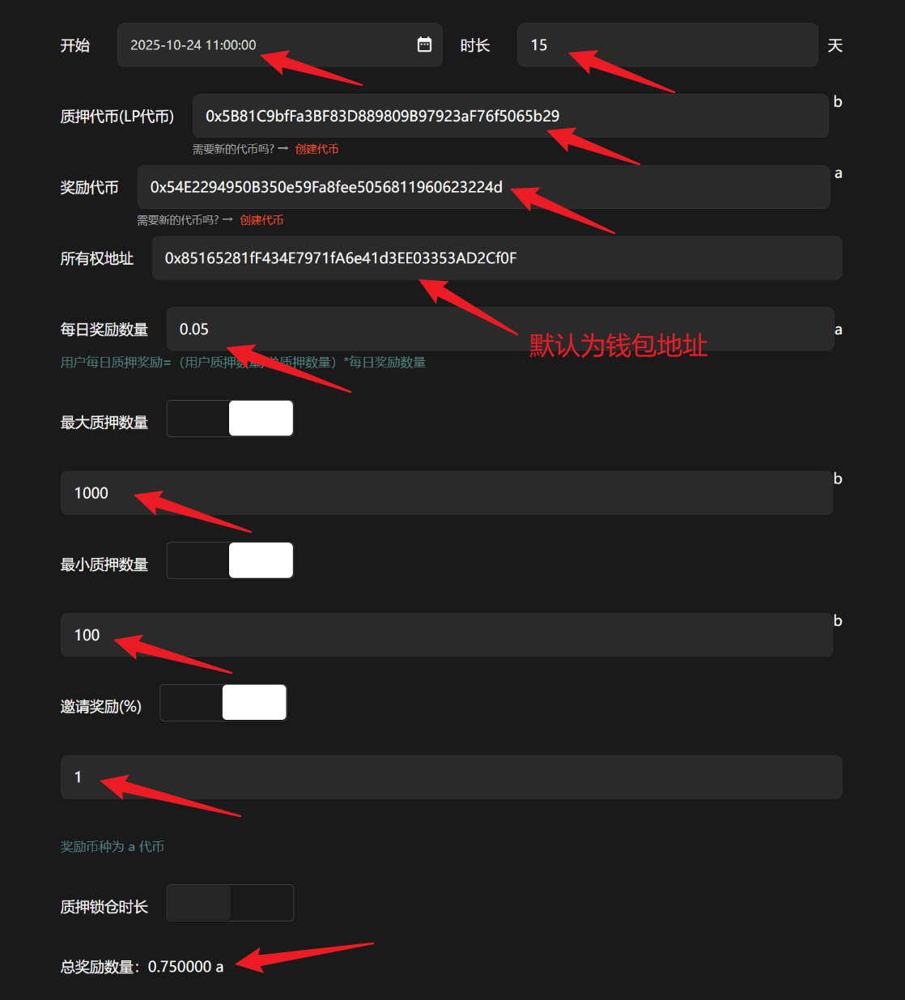

# 3️⃣ 创建质押挖矿

## 视频教程



## 1、介绍

质押挖矿指的是用户将其所持有的数字货币质押在某个项目中，以此换取新的数字货币作为收益。类似于银行存款，用户通过质押获得利息。在质押挖矿中，用户可以获得新的代币或保留原有代币并获得收益，整个过程不消耗能源，且原代币可以赎回。

## 2、操作步骤

提示：请先安装小狐狸钱包插件，教程：[https://docs.gtokentool.com/fu-zhu-xin-xi/metamask-installation](https://docs.gtokentool.com/fu-zhu-xin-xi/metamask-installation)

### (1) 连接钱包

进入创建页面：[https://www.gtokentool.com/mining](https://www.gtokentool.com/mining)，点击右上角，连接小狐狸钱包，并切换到主网（这里以BSC测试网为例)。

完成后，会看到您的 “链名称” 和 “钱包地址” ，如下图：

<figure><figcaption></figcaption></figure>

### (2) 输入信息

假设我们创建一个15天的质押挖矿，填写如下：

* 开始：2024-10-24 11:00:00
* 时长：15
* 质押代币(LP代币)：0x5B81C9bfFa3BF83D889809B97923aF76f5065b29
* 奖励代币：0x54E2294950B350e59Fa8fee5056811960623224d
* 所有权地址：默认为钱包地址
* 每日奖励数量：0.05
* 最大质押数量：1000
* 最小质押数量：100
* 邀请奖励(%)：1

输入完成后，点击 “`确认创建`” 按钮。

<figure><figcaption></figcaption></figure>

### (3) 完成

点击 “`确认创建`” ，在小狐狸钱包上支付gas费，就完成了。

<figure><figcaption></figcaption></figure>

（注意：因为每个用户网络速度不同，支付gas费用时可能会延迟1、2秒，属正常现象。）

<figure><figcaption></figcaption></figure>

如有不明白或者不清楚的地方，请加入官方电报群：[https://t.me/gtokentool](https://t.me/gtokentool)
