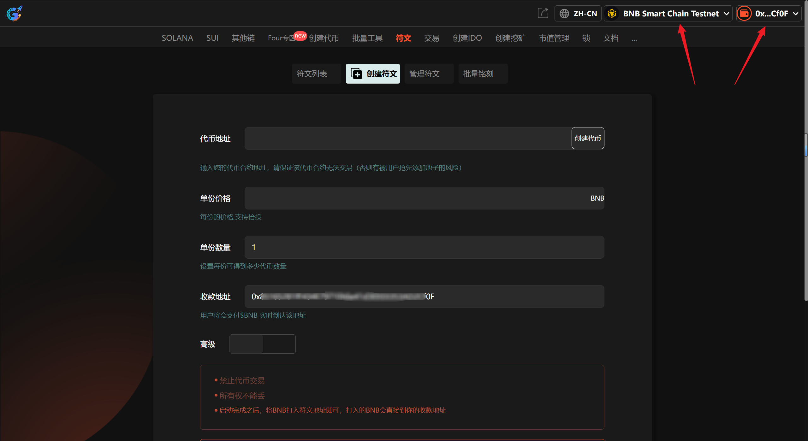
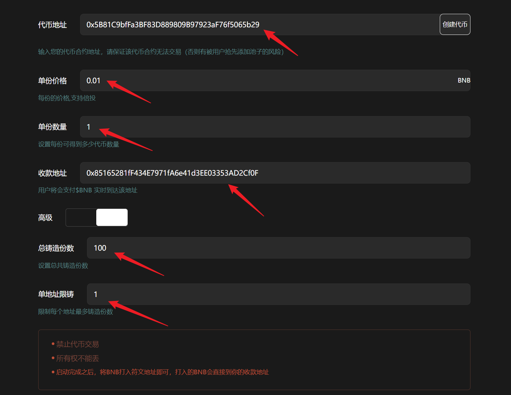

# 1️⃣ 创建符文

## 创建符文视频教程



## 1、介绍

符文是最新的协议，在铭文铸造的基础上，我们实现了向合约地址转账即可实时获得Token的协议，简化用户操作。

## 2、操作步骤

提示：请先安装小狐狸钱包插件，教程：[https://docs.gtokentool.com/fu-zhu-xin-xi/metamask-installation](https://docs.gtokentool.com/fu-zhu-xin-xi/metamask-installation)

### (1) 连接钱包

进入创建页面：[https://www.gtokentool.com/createInscription](https://www.gtokentool.com/createInscription)，点击右上角，连接小狐狸钱包，并切换到主网（这里以BSC测试网为例)。

完成后，会看到您的 “链名称” 和 “钱包地址” ，如下图：

<figure><figcaption></figcaption></figure>

### (2) 输入信息

假设我们创建一个符文，填写如下：

* **代币地址：**&#x30;x5B81C9bfFa3BF83D889809B97923aF76f5065b29
* **单份价格：**&#x30;.01
* **单份数量：**&#x31;
* **收款地址：**&#x30;x85165281fF434E7971fA6e41d3EE03353AD2Cf0F
* **总铸造份数：**&#x31;00
* **单地址限铸：**&#x31;

<figure><figcaption></figcaption></figure>

输入完成后，点击 “`确认创建`” 按钮。

### (3) 完成

点击 “`确认创建`” ，在小狐狸钱包上支付gas费，就完成了。

（注：因为每个用户网络速度不同，支付gas费用时可能会延迟1、2秒，属正常现象。）

<figure><figcaption></figcaption></figure>

## 常见问题 FAQ

### Q: 什么是 BSC 符文？

**A:** 基于 BSC 的铭文类代币标准，类似 BRC-20，通过链上交易铭刻发行。

### Q: 单地址能铸多少？

**A:** 可设置单地址 mint 上限，防止抢购。

### Q: 创建后能改参数吗？

**A:** 不能，需谨慎设置总量、单价、上限。

### Q: 创建失败怎么办？

**A:** 检查钱包 BNB 余额、Gas、参数合规，重试或提高 Gas。

如有不明白或者不清楚的地方，请加入官方电报群：[https://t.me/gtokentool](https://t.me/gtokentool)
