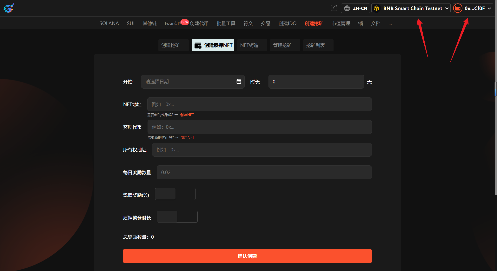
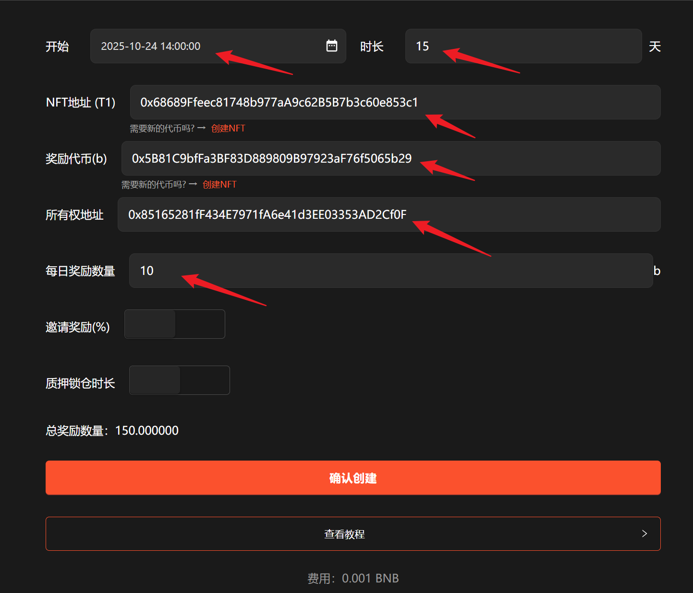

# 5️⃣ 创建质押NFT挖矿

## 创建质押NFT挖矿视频教程



## 1、介绍

质押NFT挖矿指的是用户将其所持有的NFT质押在某个项目中，以此换取新的数字货币作为收益。类似于银行存款，用户通过质押获得利息。在质押NFT挖矿中，用户可以获得新的代币或保留原有NFT并获得收益，整个过程不消耗能源，且原NFT可以赎回。

## 2、操作步骤

提示：请先安装小狐狸钱包插件，教程：[https://docs.gtokentool.com/fu-zhu-xin-xi/metamask-installation](https://docs.gtokentool.com/fu-zhu-xin-xi/metamask-installation)

### (1) 连接钱包

进入创建页面：[https://www.gtokentool.com/pledgeNFT](https://www.gtokentool.com/pledgeNFT)，点击右上角，连接小狐狸钱包，并切换到主网（这里以BSC测试网为例)。

完成后，会看到您的 “链名称” 和 “钱包地址” ，如下图：

<figure><figcaption></figcaption></figure>

### (2) 输入信息

假设我们创建一个15天的质押挖矿，填写如下：

* **开始时间：**&#x32;025-10-24 14:00:00
* **时长：**&#x31;5（天）
* **质押NFT：**&#x30;x68689Ffeec81748b977aA9c62B5B7b3c60e853c1
* **奖励代币：**&#x30;x5B81C9bfFa3BF83D889809B97923aF76f5065b29
* **每日奖励数量：**&#x31;0

<figure><figcaption></figcaption></figure>

输入完成后，点击 “`确认创建`” 按钮。

### (3) 完成

点击 “`确认创建`” ，在小狐狸钱包上支付gas费，就完成了。

<figure><figcaption></figcaption></figure>

（注意：因为每个用户网络速度不同，支付gas费用时可能会延迟1、2秒，属正常现象。）

## 常见问题 FAQ

### Q: 什么是质押 NFT 挖矿？

**A:** 质押指定 NFT 获得收益，无需锁币。

### Q: 收益是什么代币？

**A:** 可自定义 BNB、USDT 或项目代币。

### Q: 质押后多久开始计息？

**A:** 上链确认后立即计息。

### Q: 质押有锁仓吗？

**A:** 可自定义锁仓时间。

如有不明白或者不清楚的地方，请加入官方电报群：[https://t.me/gtokentool](https://t.me/gtokentool)
