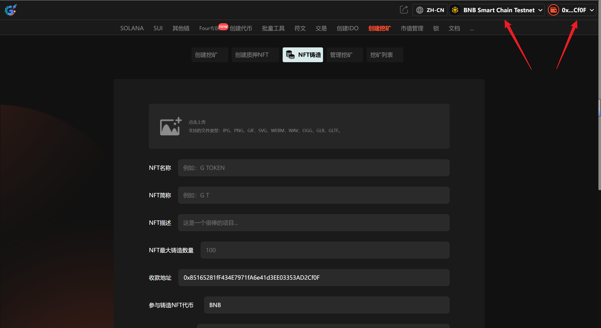
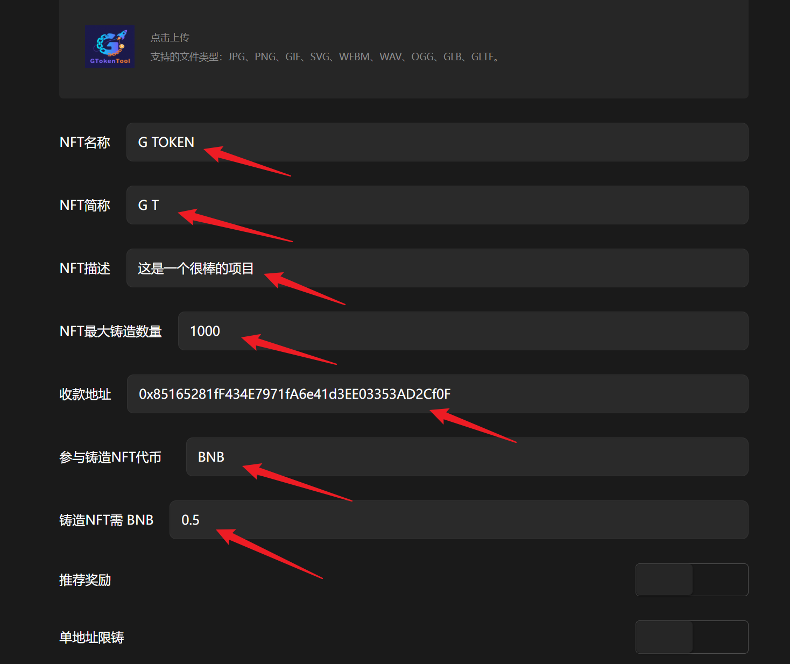

# 4️⃣ NFT铸造

## 1、介绍

NFT铸造指的是在区块链网络上初始创建一个非同质化代币的过程。铸造过程可以将艺术品、音乐、视频等数字资产转化为NFT，这些资产在区块链上被给予唯一标识，实现了从传统数字文件向数字资产的转变。NFTs不仅限于艺术品，还包括游戏、收藏品、虚拟资产等多种形式，扩展了数字内容版权保护和交易的可能性。

## 2、操作步骤

提示：请先安装小狐狸钱包插件，教程：[https://docs.gtokentool.com/fu-zhu-xin-xi/metamask-installation](https://docs.gtokentool.com/fu-zhu-xin-xi/metamask-installation)

### (1) 连接钱包

进入创建页面：[https://www.gtokentool.com/tokencreatenft](https://www.gtokentool.com/tokencreatenft)，点击右上角，连接小狐狸钱包，并切换到主网（这里以BSC测试网为例)。

完成后，会看到您的 “链名称” 和 “钱包地址” ，如下图：

<figure><figcaption></figcaption></figure>

### (2) 输入信息

假设我们创建一个叫“G TOKEN”的NFT铸造，填写如下：

* NFT名称：G TOKEN
* NFT简称：G T
* NFT描述：这是一个很棒的项目
* NFT最大铸造数量：1000
* 参与铸造NFT代币：TBNB
* 铸造NFT需 BNB：0.5

<figure><figcaption></figcaption></figure>

输入完成后，点击 “`提交`” 按钮。

### (3) 完成

点击 “`确认创建`” ，在小狐狸钱包上支付gas费，就完成了。

（注意：因为每个用户网络速度不同，支付gas费用时可能会延迟1、2秒，属正常现象。）

<figure><figcaption></figcaption></figure>

如有不明白或者不清楚的地方，请加入官方电报群：[https://t.me/gtokentool](https://t.me/gtokentool)
