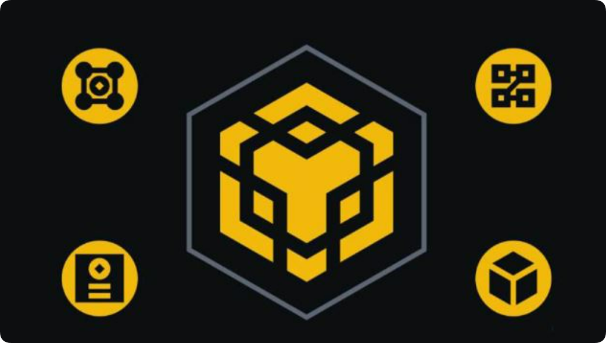

# BSC地址和BNB地址一样吗？BSC链是什么？

BSC和BNB是币安生态上的重要组成部分，很多人对这两个概念容易混淆。BSC(币安智能链)是一个与以太坊兼容的区块链，支持智能合约和去中心化应用(DApps)。它使用的代币标准是BEP-20。Binance Chain是币安的原始区块链，用于快速转账和交易，主要支持BNB和BEP-2代币。粗略介绍可能大家还搞不清楚BSC地址和BNB地址一样吗？这个问题，就资料分析来看，BSC地址和BNB地址并不一样。下面[GTokenTool](https://www.gtokentool.com)为大家详细说说。

<figure><figcaption></figcaption></figure>

## BSC地址和BNB地址一样吗？

BSC地址和BNB地址不一样，但格式是相似的。BSC地址和BNB地址使用相同的地址格式。两者的地址都是以“0x”开头，后面跟随一串40位的十六进制字符，类似于以太坊(Ethereum)的地址格式。这是因为BSC是与以太坊兼容的区块链，采用的是同样的地址生成方式。

BSC是一个支持智能合约的区块链，类似于以太坊，通常用于去中心化应用(DApps)和代币交易(如BEP-20代币)。BNB地址指的是在币安链(Binance Chain)上的地址，主要用于转移BNB以及BEP-2标准的代币。尽管它们的地址格式相同，但一个地址在BSC上和在Binance Chain上的应用是不同的，需要对应使用正确的网络来进行交易。

当你使用BSC时，通常使用的是BEP-20标准的代币。BSC支持去中心化金融(DeFi)、智能合约以及各类DApp。币安链上的代币通常是BEP-2标准的代币，适用于较为简单的转账和交易场景，尤其是币安交易所中的BNB转账。

使用MetaMask、Trust Wallet等钱包时，必须选择对应的网络(BSC或Binance Chain)来确保交易在正确的链上进行。比如在MetaMask中，BSC需要选择“币安智能链”网络，而Binance Chain则需要通过其他工具(如币安链钱包)进行操作。

## BSC链是什么？

BSC链于2020年创建，旨在解决BNB Beacon Chain的限制问题。BSC链提供各种Web3工具和去中心化应用程序(DApp)。该高性能区块链支持智能合约，可供开发人员用于创建各种类型的服务和应用程序，包括区块链游戏、治理和投票系统、去中心化金融(DeFi)等。

BNB Smart Chain通过权益证明(PoS)共识算法，实现了约3秒的出块时间。具体而言，该链采用权威权益证明(PoSA)机制，参与者质押BNB即可成为验证者。

验证者验证交易区块，并从中获得部分交易手续费作为奖励。请注意，与许多协议不同，BNB不具有通胀特性，因此新铸造的BNB没有区块补贴。实际上，由于币安团队定期销毁代币，因此BNB供应量在逐渐降低。

BNB Smart Chain采用BEP-20作为主要的代币标准，该代币与其竞争对手以太坊使用相同的函数。BEP-20是代币的蓝图，定义了代币发行和功能的重要参数和规则。BEP-20旨在成为BNB Smart Chain的技术规范，支持开发人员创建各种数字资产，包括NFT、稳定币、效用代币等。BNB Smart Chain上的区块链交易需要支付小额BNB作为燃料费。与以太坊区块链的ETH类似，燃料费即为验证者确认交易并保护网络安全的奖励。

以上全部内容就是对BSC地址和BNB地址一样吗这一问题的解答，BSC和BNB地址的格式是一样的，但它们运行在不同的网络上，用途和代币标准不同。投资者可以通过币安交易所或其他跨链工具将BNB在Binance Chain和BSC之间跨链转移。需要提醒的是，当从一个钱包或交易所转出BNB时，确保选择了正确的网络。如果网络选择错误，可能会导致资金无法找回。因此在使用时，务必确保自己所选择正确的网络，以避免转账失败或资产丢失。

如有不明白或者不清楚的地方，请加入官方电报群：[https://t.me/gtokentool](https://t.me/gtokentool)
