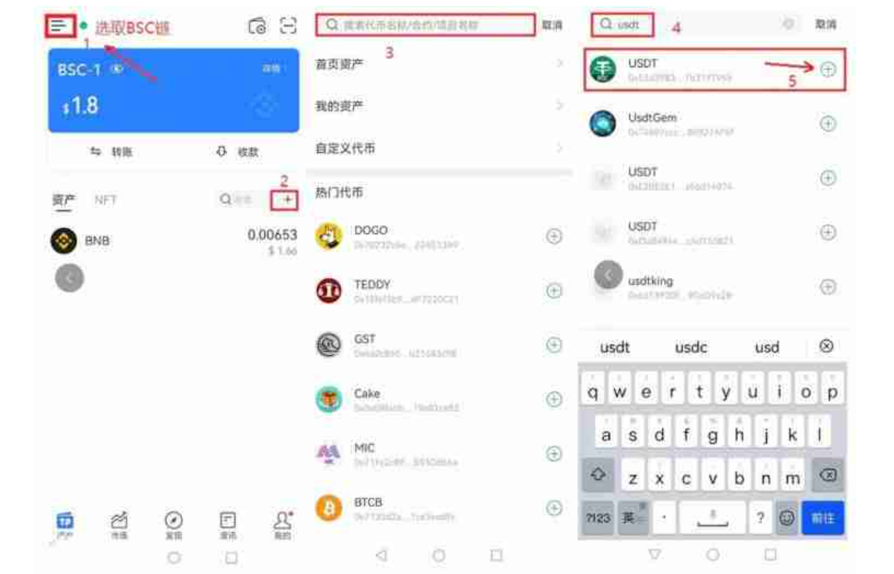

# 代币合约地址如何获取？代币合约地址获取方法一览

其实从本质上来说的话，大家所熟悉的代币合约就是一个映射着账户地址以及余额的智能合约，一般来说，账户的余额是由合约的创建者来定义的，并且所有的智能合约都有自己对应的一串代码，而这个代码就是今天要为大家介绍的合约地址了。有的投资者会将合约地址和钱包地址混淆，钱包地址是个人用户使用以太坊钱包生成的外部账户，而合约地址是合约账户的地址。很多投资者现在还不知道这个代币合约地址如何获取？下面就让[GTokenTool](https://docs.gtokentool.com)为大家介绍这个代币合约地址获取的方法。

## 代币合约地址如何获取？

TP钱包也是我们常用的钱包之一，使用TP钱包就能查看代币合约，下面小编将为各位投资者详细介绍：

1、本教程以BSC链上USDT为例，根据图片提示，选取BSC链，点击“+”，搜索币种USDT，点击USDT右侧的“+”

<figure><figcaption></figcaption></figure>

2、点击资产中的USDT，进入Token详情，点击项目详情，即可找到USDT的合约地址

<figure><figcaption></figcaption></figure>

## 代币合约地址有什么用？

它的生成过程本质上是计算一个随机数。简单举个例子，通过抛硬币将正面向上计为0，反面向上计为1，连续抛256次，就随机得到一个256位的二进制数字。这个数字就是私钥。这个随机性有多随机呢?全世界的人随便怎么抛，被抛出两个相同的256位二进制数字的概率无限接近零，就是不可能出现相同。

比特币地址就是个人的比特币账户，相当于你的银行卡卡号，任何人都可以通过你的比特币地址给你转账比特币。红框位置就是比特币地址。登录我的比特币包钱就可以看到。

**通常情况下以太坊的账户主要有两种钱包地址和合约地址：**

1、第一种是个人用户使用以太坊钱包生成的外部账户，也就是钱包地址，它是由公钥和私钥组成；

2、第二种是合约账户，用的是Solidity程序语言，是由一组代码(合约的函数)和数据(合约的状态)组成的，比方说在以太坊上发ERC20的币的同时就代表着创建了一个合约账户，也就是合约地址。而这种情况下生成的地址也就是合约地址，无私钥。合约是一个在以太坊区块链上的一个特殊地址。

希望通过上面这篇代币合约地址获取方法一览，大家能够了解这个代币合约地址如何获取。通过上文的了解，大家也知道了，这个代币合约地址指的是由—组数据和代码组成，一般个人用户能够利用以太坊钱包创建的外部账户，而合约账户是一种智能合约，包含用户账户地址及其余额映射，合约账户在以太坊区块链上的一个特殊地址上，且没有私钥。了解代币合约地址获取方法还是很重要的，大家在进行一些交易或是提现操作时，难免会用到这个信息。

如有不明白或者不清楚的地方，请加入官方电报群：[**https://t.me/gtokentool**](https://t.me/gtokentool)
