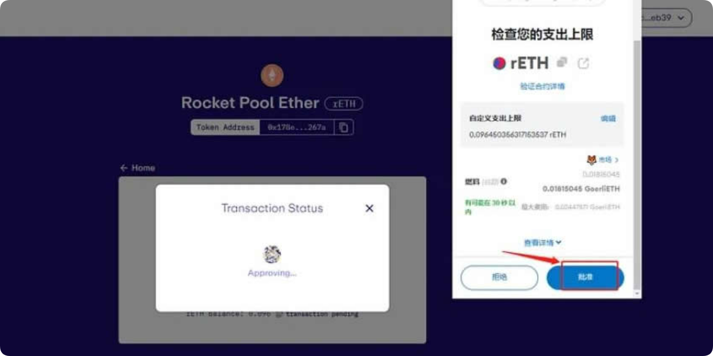

# EigenLayer空投如何获得？EigenLayer空投交互教程

Eigenlayer空投的集成引入了一种新颖的范例，简化了建立去中心化信任的过程，使协议能够利用以太坊的安全基础设施，而无需与建立和维护完整的验证器集相关的复杂性。另外随着质押者承担与参与网络相关的大幅削减风险，eigenlayer提供了更高的质押奖励，这也是投资者想要参与eigenlayer空投的重要原因之一，但还有很多新手并不了解eigenlayer空投怎么获得？就目前来说参与eigenlayer空投还是比较复杂的，接下来[**GTokenTool**](https://www.gtokentool.com)为大家详细说说eigenlayer交互教程。

## EigenLayer空投怎么获得？

EigenLayer空投还是比较麻烦的，参与Eigenlayer交互前需要有GoerliETH，如果没有那么可以通过Alchemy和Paradigm两个渠道获取，如果有GoerliETH，那就可以直接进入rETH和stETH的兑换。下文是教程详解：

1. 进RocketPoolGoerli测试网，点击「ConnectWallet」连接钱包。需要注意的是，目前EigenLayer测试网的流动性重质押仅支持rETH和stETH，因此我们还需要将GoerliETH兑换成rETH、stETH。

<figure><figcaption></figcaption></figure>

2. 点亮上方圆形图标后，选择你需要连接的钱包

<figure><figcaption></figcaption></figure>

3. 输入需要兑换的ETH数量，点击下方「Stake」

<figure><figcaption></figcaption></figure>

4. 钱包确认签名

<figure><figcaption></figcaption></figure>

5. 交易完成后，可以点击「Add rETH to Metamask」将rETH显示在钱包中

<figure><figcaption></figcaption></figure>

6. stETH合约地址：0x1643E812aE58766192Cf7D2Cf9567dF2C37e9B7F。在钱包中点击「发送」

<figure><figcaption></figcaption></figure>

7. 将上面的合约地址复制粘贴到空白框处

<figure><figcaption></figcaption></figure>

8. 输入需要兑换的Goerli ETH的数量，点击上方「警告」中的「我理解」，等到下方「下一步」亮起后点击

<figure><figcaption></figcaption></figure>

9. 交易完成后回到资产页面，点击下方「添加资产」

<figure><figcaption></figcaption></figure>

10. 将上方的合约地址复制粘贴到空白框内，待下方「添加自定义代币」亮起后点击就可将stETH显示到钱包内

<figure><figcaption></figcaption></figure>

11. 进EigenLayerGoerli测试网，右上角连接钱包

<figure><figcaption></figcaption></figure>

12. rETH质押：点击「Rocket Pool Ether」

<figure><figcaption></figcaption></figure>

13. 输入需要rETH质押数量，也可点击后方的Max将刚兑换的所有rETH全部质押，点击后方「Next」

<figure><figcaption></figcaption></figure>

14. 在钱包端同样输入或「Max」rETH使用数量，点击「下一步」

<figure><figcaption></figcaption></figure>

15. 继续点击「批准」

<figure><figcaption></figcaption></figure>

16. 钱包「确认」交易

<figure><figcaption></figcaption></figure>

17. stETH质押：点击「Home」回到初始页面

<figure><figcaption></figcaption></figure>

18. 点击「Lido Staked Ether」

<figure><figcaption></figcaption></figure>

19. 同样输入stETH质押数量，点击「Next」

<figure><figcaption></figcaption></figure>

20. 钱包端输入stETH使用数量，点击「下一步」，等待钱包端继续签名确认交易即可

<figure><figcaption></figcaption></figure>

21. 在存款页面，点击「Unstake」，输入需要提取的资产数量，点击「Next」，等待钱包确认交易即可

<figure><figcaption></figcaption></figure>

如有不明白或者不清楚的地方，请加入官方电报群：[**https://t.me/gtokentool**](https://t.me/gtokentool)
