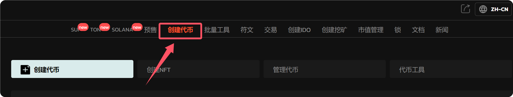

# GTokenTool一键发币，创建Ape标准代币教程

ApeChain及其官方跨链桥已于近期上线，提供了ETH、APE等代币跨链转账的便捷服务。此项服务通过自动收益模式（Automatic Yield Mode）为用户提供收益，在每个区块内，用户可以不经过复杂的操作来增加代币财富，这种简化的操作无疑符合了当下用户对便捷性的需求。

ApeCoin的这一创新措施，激发了市场热情，导致其价格从0.75美元飙升至1.73美元，现时报价为1.47美元。这一现象也触发了整个市场的交易波动。根据Coinglass的数据显示，过去24小时内全网APE合约爆仓金额达到1614万美元，显示出市场参与者对APE代币的高杠杆交易热情。

## Ape代币创建教程

1.访问GTokenTool一键发币平台官网（[https://www.gtokentool.com](https://www.gtokentool.com) ）；

<figure><figcaption></figcaption></figure>

2.鼠标移到右上角选择“APECHAIN”,连接钱包，用小狐狸钱包([安装教程](https://docs.gtokentool.com/fu-zhu-xin-xi/xiao-hu-li-qian-bao-an-zhuang-jiao-cheng))，连接，切换网络，到此钱包已经连接好了；

<figure><figcaption></figcaption></figure>

<figure><figcaption></figcaption></figure>

3.在网站导航栏上，靠左边，找到“创建代币”，填写相应的信息；

<figure><figcaption></figcaption></figure>

<figure><figcaption></figcaption></figure>

* 代币模式：标准代币
* 代币全称：GTokenTool
* 代币简称：GT
* 代币精度：18
* 总供应量：1000000
* 代币源码中添加项目联系方式：需要的话就开启

4.信息填写完成后，点击“创建”按钮后，点击“确认创建”；

<figure><figcaption></figcaption></figure>

5.点击确认

<figure><figcaption></figcaption></figure>

6.添加代币

<figure><figcaption></figcaption></figure>

7.到此ape代币创建完成

<figure><figcaption></figcaption></figure>

7.到此ape代币创建完成；

<figure><figcaption></figcaption></figure>

8.复制创建的代币地址

<figure><figcaption></figcaption></figure>

9.点击左侧的导航-流动性管理-添加添动性

<figure><figcaption></figcaption></figure>

10.导入之前复制的代币地址

<figure><figcaption></figcaption></figure>

11.选择我了解

<figure><figcaption></figcaption></figure>

12.导入

<figure><figcaption></figcaption></figure>

13.填写最大数值后，点击批准

<figure><figcaption></figcaption></figure>

14.点击创建流动性并提供代币

<figure><figcaption></figcaption></figure>

15.等待15秒，确认

<figure><figcaption></figcaption></figure>

16.到此流动性添加完成。

<figure><figcaption></figcaption></figure>

如有不明白或者不清楚的地方，请加入官方电报群：[https://t.me/gtokentool](https://t.me/gtokentool)
