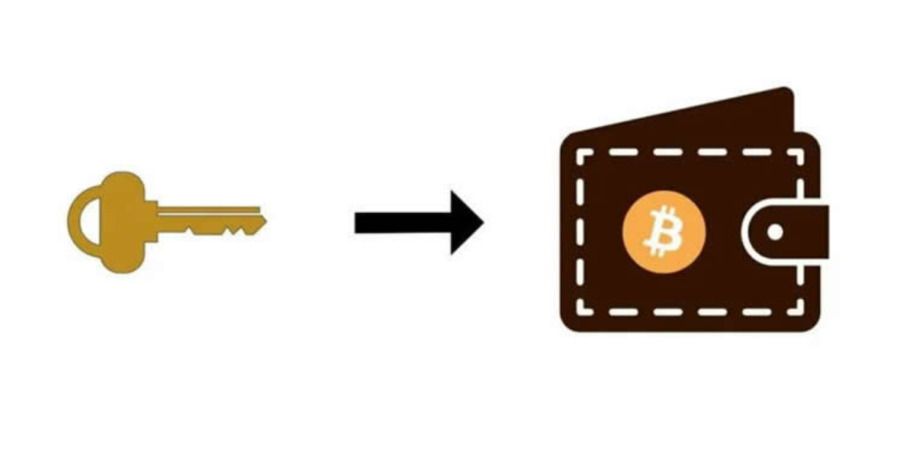

# 冷钱包忘记密码怎么办？冷钱包的密码可以找回吗？

在数字货币市场领域中，人们使用钱包掌管和管理自己的资产是常见的方式。因为加密钱包的核心在于帮助用户安全、方便地管理和使用私钥。但有的时候在使用钱包时也会遇到一些问题，尤其是关于密码问题。可能有的人还不能够理解密码的重要性，当他们密码丢失时就会无措，那么冷钱包忘记密码怎么办？首先还是要努力回想密码，其次再有一些其他方式去辅助，接下来[**GTokenTool**](https://www.gtokentool.com)给大家详细说一下冷钱包的密码可以找回吗？

<figure><figcaption></figcaption></figure>

## 冷钱包忘记密码怎么办？

冷钱包是一种存储加密货币的硬件设备或纸质钱包，通常不与互联网连接，以提高安全性。如果忘记了冷钱包的密码，以下是一些可能的解决方法：

### 1、回想密码

首先，尝试仔细回想密码或任何可能与密码相关的信息。有时候，可能只是暂时忘记了密码，通过回忆可能会找回来。

### 2、密码提示

检查是否设置了密码提示。密码提示通常是在创建冷钱包时提供的一个提示，可帮助记起密码的一部分或关键信息。

### 3、密码重置选项

某些冷钱包可能提供了密码重置选项。这通常需要提供一些额外的信息或通过设备上的特定流程来进行密码重置。请查看冷钱包的官方文档或支持资源，以了解是否有这样的选项。

### 4、联系冷钱包制造商或支持团队

如果无法通过以上方法找回密码，可以尝试联系冷钱包的制造商或官方支持团队。他们可能能够提供更多帮助，包括可能的密码重置方法。

### 5、专业帮助

如果您拥有的加密货币数量很大，并且无法找回密码，可能需要寻求专业的密码恢复服务。这些服务通常会收取费用，但它们可能有更高的成功率，不过还是要谨慎选择，以免被骗。

## 冷钱包的密码可以找回吗？

冷钱包的密码忘记是没法找回的，因为它是去中心化的。如果能记得曾经使用过的密码或者可能使用过的密码，可以使用穷举法来暴力破解。

冷钱包的密码通常是由用户自己设置和管理的，因为冷钱包的安全性和私密性是用户自己的责任。一般情况下，冷钱包的密码不可以被找回，因为冷钱包通常是离线设备，没有与任何中心化服务或机构连接，也没有“忘记密码”选项。这意味着如果忘记了冷钱包的密码，通常情况下是无法通过重置密码或找回密码的方式来访问其中的资产的。

保持冷钱包的密码和助记词的安全性至关重要，如果忘记了冷钱包的密码，唯一的办法可能是尝试使用密码提示或回想密码。如果这些方法都无法帮助找回密码，那么可能需要寻求专业的密码恢复服务，尽管这通常会涉及高昂的费用，而且成功并不保证。

以上全部内容就是对冷钱包忘记密码怎么办以及冷钱包的密码可以找回吗两个问题的解答，希望通过以上内容可以帮助大家更好的了解到冷钱包密码的重要性。在使用冷钱包时，请务必妥善保管密码、助记词和私钥等关键信息，以确保您能够随时访问和管理您的加密货币资产，同时也要避免忘记密码或失去这些重要信息，如果私钥丢失，钱包方无法帮用户找回私钥，丢失的资金也无法追回。

如有不明白或者不清楚的地方，请加入官方电报群：[**https://t.me/gtokentool**](https://t.me/gtokentool)
