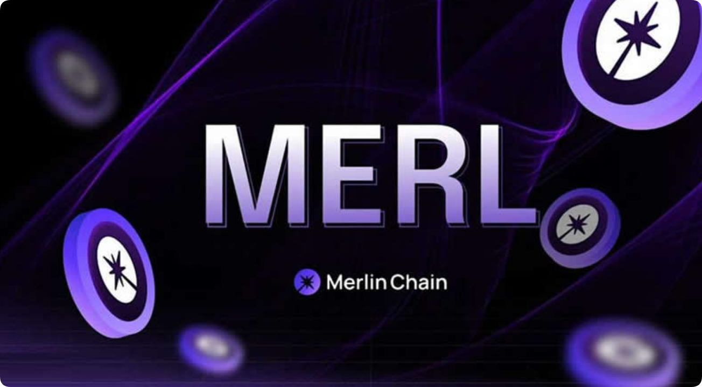

# 梅林链代币买卖交易教程?一文读懂

梅林链凭借自身繁荣生态、坚实社区和技术安全获得合规交易所的认可，极有可能撕开加密货币向更广泛的主流用户渗透的口子。随着代币merl币的上线可是将这个可能推动向前，merl上线不仅是对梅林链项目本身具有重要影响，更是对比特币生态、甚至整个币圈web3都很重要。作为投资者来说在关注着梅林链代币怎么购买？其实购买梅林链代币还是比较简单的，主要就是在上线的okx、gate.io、huobi、mexc、kucoin等18个交易所内进行。下面[GTokenTool](https://www.gtokentool.com)为大家详细说说merl币买入交易教程。

<figure><figcaption></figcaption></figure>

## 梅林链代币怎么购买？

梅林链代币购买还是比较简单的，主要就是在上线的OKX、Gate.io、Huobi、MEXC、KuCoin等18个交易所内进行，下文就是在OKX交易所购买梅林链代币MERL的详细教程：

1. 打开欧易OKX交易所官网(点此注册)，在首页输入邮箱，点击“注册”

<figure><figcaption></figcaption></figure>

2. 向右滑动滑块，完成拼图进行验证，然后输入邮箱收到的验证码，验证码有效时间为10分钟

<figure><figcaption></figcaption></figure>

3. 而后输入手机号，点击“立即验证”

<figure><figcaption></figcaption></figure>

4. 输入手机收到的六位数字验证码，有效时间同样为10分钟

<figure><figcaption></figcaption></figure>

5. 选择居住国家/地区，勾选服务条款、《风险与合规披露》及隐私政策与声明

<figure><figcaption></figcaption></figure>

6、创建密码需要符合长度为 8-32 个字符、1 个小写字母、1 个大写字母、1 个数字、1 个符号，如：!@ # $ %等条件

<figure><figcaption></figcaption></figure>

7. 登录账号后，找到首页的“用户中心”图标，进入身份认证页面

<figure><figcaption></figcaption></figure>

8. 可根据不同需求进行不同等级认证(注意：视频认证需在APP上进行操作)

<figure><figcaption></figcaption></figure>

9. 进行交易前需要拥有USDT，可在C2C买币进行交易，根据需求选择合适商家，点击“购买”，而后根据提示进行付款、等待商家放币(若是长时间没有收到币种，可联系客服进行处理)

<figure><figcaption></figcaption></figure>

10. 点击首页的“交易”——“币币”进入交易页面

<figure><figcaption></figcaption></figure>

11. 在搜索框输入MERL，选择MERL/USDT交易对，可以看到MERL实时行情

<figure><figcaption></figcaption></figure>

12. 输入买入MERL数量，点击买入MERL就可以了

<figure><figcaption></figcaption></figure>

如有不明白或者不清楚的地方，请加入官方电报群：[**https://t.me/gtokentool**](https://t.me/gtokentool)
