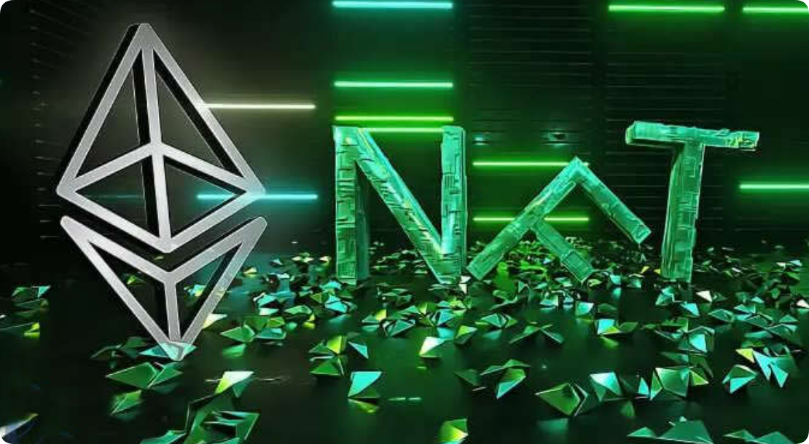

# NFT市场是什么意思？NFT市场的特点

说起NFT市场，现在它依靠着自身不可复制以及不可分割的特点已经成为了当下互联网中的一个新风口。NFT之所以能够在今天崛起，很大程度上的原因都是因为现在基础设施的健全以及创作群体发展的蓬勃。我们知道NFT的主要功能就是保护版权，以及将资产数字化，它还在当前非常火热的元宇宙中扮演着非常重要的角色。现在在中国NFT的整体发展还是比较的谨慎的，很多投资者还不了解这个NFT市场是什么意思？下面[**GTokenTool**](https://www.gtokentool.com)带大家一文秒懂NFT市场。

<figure><figcaption></figcaption></figure>

## NFT市场是什么意思？

不可替代的代币是独一无二的独一无二的数字资产，可以像真实物品一样买卖，但它们在现实世界中并不存在。例如，如果你购买了一只狗的NFT，那只狗只存在于数字世界中。每个NFT交易都会附有该交易的记录。

NFT类似于比特币等加密货币。让它与众不同的是你不能用一个NFT交换另一个。当您购买它时，该NFT是您的，并且是您自己的。

由于每个NFT都有谁买卖它的记录，因此您可以证明它属于您。即使有人截取了图像，该NFT也是您的财产。艺术品、图像、模因、服装以及任何您可以创建数字版本的NFT市场。人们会拿走这些数字物品并将它们标记化。

代币化后，每个NFT都会分配一个区块链。区块链会记录所有购买或出售NFT的人，就像数字分类账一样。数百台计算机维护这些记录，以防止任何人从其他人那里窃取NFT。

有人会将NFT投放市场。然后你可以从卖家那里购买，然后你就拥有那个NFT。交易的价值取决于买卖双方。

## NFT市场的特点

交易市场平台需要在用户所在的地方出现。尽管以太坊是NFTs最大的生态系统，但[**Solana**](https://sol.gtokentool.com)也有一个活跃的NFT社区，Polygon的社区也在增长。NFT市场的主要特点如下所示：

1、全球NFT投融项目数量节节攀升，共有331个项目实现融资，总金额约51亿美元。其中大部分为种子轮与战略投资，说明产业整体发展仍处于早期阶段。

2、收藏品与艺术品占据NFT市场主流，大约70%的成交量由收藏品产生，艺术品占据了高价榜，这体现了目前NFT以收藏与赏玩功能为主，其核心功能尚未得到释放。

3、NFT项目生命周期偏短，绝大部分项目交易热度无法维持48小时。根据多个项目的微观交易数据发现，超九成项目破发或归零，即使是热门项目的交易活跃度也依赖于宣发渠道与新闻造势。

4、加密货币市场深度影响NFT市场且可能存在巨鲸控盘。六月开始随着加密货币价格的暴涨，国际NFT市场也随之水涨船高。在越来越多活跃于“币圈”的用户下场NFT之后，NFT市场整体走势与加密货币市场保持高度同步，且10%的巨鲸用户就能控制超过90%的交易量。

5、与传统金融市场相比存在诸多额外风险点。NFT与数字藏品暂时还没有一套完善的价值评估体系，且良莠不齐。此外，目前元宇宙等相关产业仍未实现技术突破，据大多数NFT项目没有实现项目规划的技术路线。更加重要的是，多数国家和地区没有为NFT与数字藏品建立完善的监管体系，灰黑产业层出不穷。

上文中的内容就是对于NFT市场是什么意思这一问题的具体阐述想，希望大家能够一文秒懂NFT市场。其实大家展望未来，NFT市场的整体价值应该不会在持续的大幅度上升了，发展到今天，NFT市场的表现也确实是如此，现在平均每周的NFT交易额只是略高于2021年第四季度。因为投资者们对于投机和对收藏品的兴趣在慢慢的降低，所以全球的社区也会慢慢的减少，不过现在全球的NFT市场的市值还是很高的，并且其中还有一些资产的价值是在不断的增加的。

如有不明白或者不清楚的地方，请加入官方电报群：[https://t.me/gtokentool](https://t.me/gtokentool)
