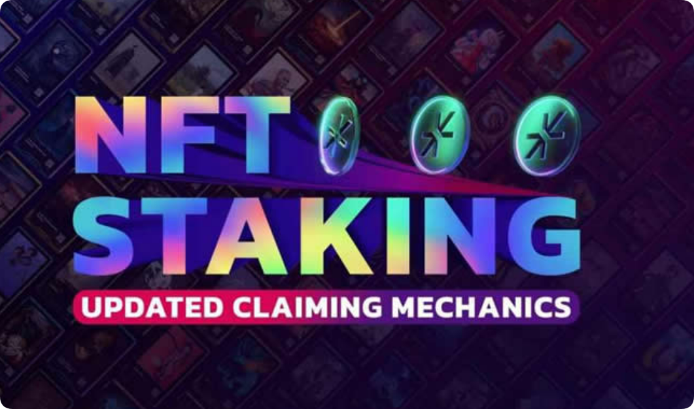

# NFT质押怎么玩？NFT质押玩法介绍

如果我们将NFT称为加密资产，那么NFT可以被放置在一个为其保管和治理而运作的平台中。质押允许用户通过参与保护网络来锁定他们的代币，并作为保护网络的回报，用户获得奖励。将NFT代币作为资产抵押，有可能为用户创造一种被动收入形式。NFT股权为NFT创造了流动性和效用，奖励的获得取决于各种因素，例如资产开发特许权使用费等被动收入的能力。很多投资者都想要详细的了解这个NFT质押怎么玩？下面[**GTokenToo**](https://www.gtokentool.com)l为大家介绍一下这个NFT质押的玩法。

<figure><figcaption></figcaption></figure>

## NFT质押怎么玩？

由于NFT是代币化的资产，因此质押它们的工作方式与质押加密货币完全相同。质押NFT的概念可能仍然相对较新颖，但NFT持有者对此抱有非常大的期望，因为NFT独一无二的特征使其持有者对出售犹豫不决。

质押奖励因平台而异。但是，大多数提供质押奖励的平台倾向于每天或每周支付。此外，许多质押平台还支持分散的自治组织(DAOs)。通过将这些资产锁定到DAO池(也称为NFT质押池)中，NFT持有者可以参与平台的治理。通常，提案是通过这个池子投票的。DAO还可以允许您自己提出建议。

由于区块链游戏在NFT市场中占很大比例，因此您可以找到机会将NFT押在Axie Infinity(AXS)，The Sandbox(SAND)和Splinterlands(SPS)等游戏中获取NFT。作为游戏赚取游戏的玩家，您可以获得NFT和加密货币。然后可以免费获得NFT并进行抵押。

[NFT质押](https://docs.gtokentool.com/ming-xing-chan-pin/chuang-jian-zhi-ya-nft-wa-kuang)是一种在加密货币领域赚取被动收入的方式。持有者可以将NFT资产锁定在去中心化金融(DeFi)平台，无需出售自己的NFT收藏品，通过质押NFT来获得奖励。这种玩法依赖于权益证明(PoS)机制来奖励参与者，获得的奖励依据年收益率(APY)和质押NFT的数量计算。

NFT质押的具体玩法如下：用户首先需要将NFT锁定在一个智能合约中，作为参与挖矿的凭证。通过质押NFT，用户可以获得相应的挖矿奖励，如平台[代币](https://docs.gtokentool.com/chuang-jian-dai-bi/nft-fen-hong-dai-bi)、数字藏品等。不同的数字藏品平台有不同的规则和要求，但基本机制大致相同。用户可以通过质押NFT来提升游戏角色的技能，赚取额外奖励，或者在某些游戏元宇宙中提升游戏角色的技能，并赚取额外奖励。

NFT质押的运作原理基于权益证明(PoS)机制。用户锁定NFT后，获得的奖励将依据年收益率(APY)和质押NFT的数量计算。由于NFT整体供应量通常较低，质押收益较为可观。这种玩法不仅超越了数字艺术收藏的意义，还为NFT带来了全新的用例，如提升游戏角色技能、赚取额外奖励等。

## NFT质押的未来

NFT正在获得应有的关注。然而，这项技术一直在发展，而且还有更多的未来。同样，他们的进步足以通过NFT质押平台的增长来提升组织。此外，如果将来对其进行改进，NFT质押平台将得到增强，并具有更多有价值的功能。由于其独特的吸引用户和利用NFT域的能力，NFT质押平台拥有光明的未来。

NFT和DeFi(去中心化金融)协议的结合提供了NFT质押的力量。在想知道如何使用NFT赚钱的同时，这是考虑的有效方法之一。质押是指将数字资产组合成DeFi协议智能合约以产生收益。许多平台允许您使用任何NFT，而其他平台则需要您为原生NFT付费才能获得Staking代币奖励。

NFT Staking平台开发是世界需要的一个重要方面。然而，质押NFT允许玩家从他们未使用的NFT收藏中赚钱。同时，NFT质押为NFT引入了以前从未考虑过的新用例。现在说还为时过早，但几乎肯定会出现新的NFT质押机会。不仅适用于NFT收藏家，还适用于Play-to-Earn游戏行业和其他基于区块链的行业。在顶级平台开发公司的帮助下开始开发你的NFT质押平台。

通过上面这篇NFT质押玩法介绍，相信大家都能够快速的掌握NFT质押怎么玩。NFT质押基本上是关于在加密货币钱包中持有NFT代币，这意味着支持区块链网络的安全性和运营。权益证明链通过权益机制生成和验证新块。验证者通过锁定他们的代币来参与质押，以便协议可以以预定的时间间隔随机选择它们以形成一个块。质押更多的参与者更有可能被选为下一个区块验证者。通过质押代币，参与者将能够领取时钟并获得费用奖励。目前NFT质押的想法仍然很新鲜，需要许多发展。

如有不明白或者不清楚的地方，请加入官方电报群：[https://t.me/gtokentool](https://t.me/gtokentool)
