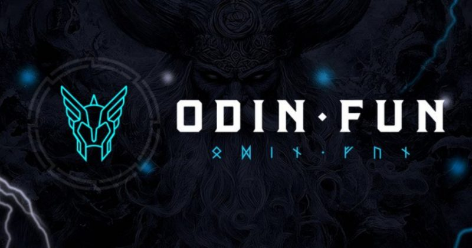
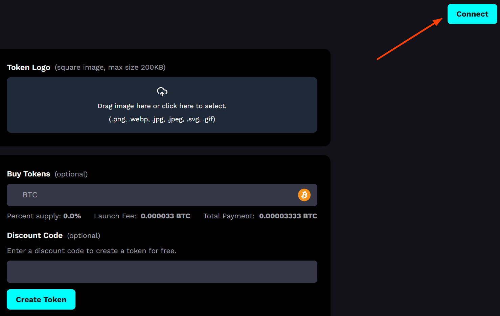
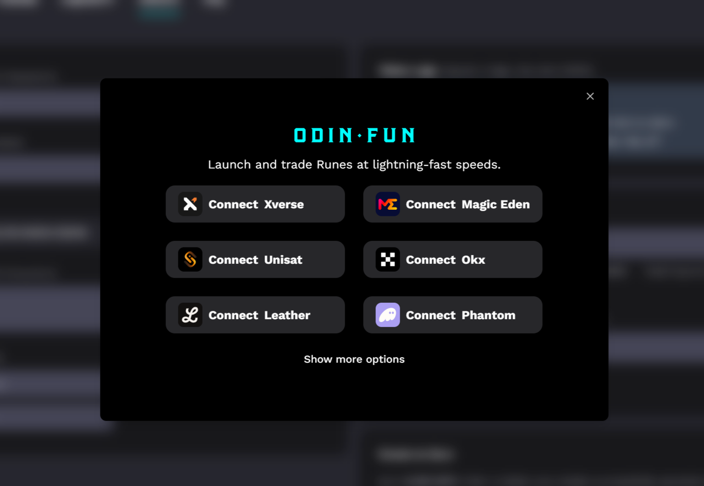
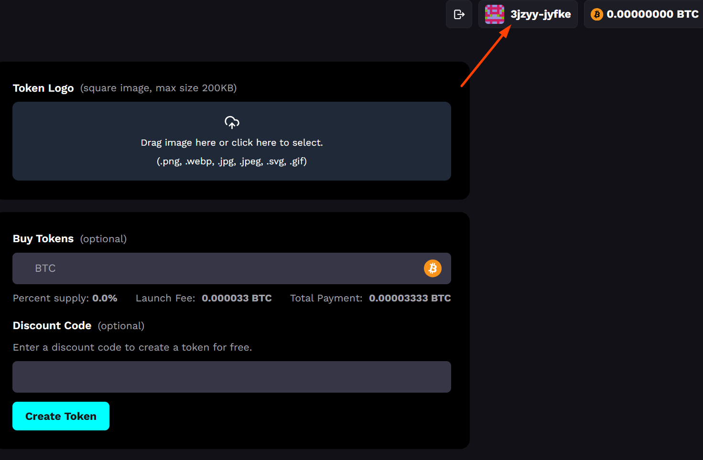

# Odin.fun创建代币教程

## 什么是 Odin.fun？

Odin.fun 是比特币生态中的一个创新平台，专注于符文代币的创建和交易。它借鉴了 Pump.fun 的“绑定曲线”（Bonding Curve）模型，用户可以低成本发行代币，并在代币市值达到 1 BTC 时自动过渡到自动化做市商（AMM）系统进行交易。平台的最大亮点在于交易速度快（2秒确认）、操作简单以及无需手动签名（通过会话密钥实现），非常适合想要快速实验或推出 meme 币的用户。

<figure><figcaption></figcaption></figure>

## Odin.fun 创建代币的步骤

### 1、访问创建页面并连接钱包

Odin.fun创建代币：[https://odin.fun/token/create](https://odin.fun/token/create)

通过上面链接，进入创建代币页面，在右上角，点击“Connect Wallet”（连接钱包）。

<figure><figcaption></figcaption></figure>

选择一个支持比特币的钱包，例如 Xverse、Leather、Unisat、OKX 或 Magic Eden，按照提示完成连接。确保钱包内有足够的 BTC 用于后续操作。

<figure><figcaption></figcaption></figure>

连接好钱包就会显示

<figure><figcaption></figcaption></figure>

### 2、填写代币信息

<figure><figcaption></figcaption></figure>

**代币名称（Name）：**&#x8F93;入你想创建的代币名称，例如“MYCOIN”或“ODINMEME”。名称需要简洁且具有吸引力，尤其是对于 meme 币来说。

**代币符号（Ticker）：**&#x8BBE;定代币的简称（类似股票代码），如“MYC”或“ODM”。长度建议控制在 3-6 个字符。

**描述（Description）：**&#x53EF;选字段，可以写一段简短的介绍，说明代币的创意或目标，比如“最搞笑的比特币 meme 币”。

**上传图片（Image）：**&#x70B9;击上传按钮，选择一张代表代币的图片。建议使用你拥有版权的原创图片，或者与代币主题相关的 meme 图（尺寸通常为正方形，如 500x500 像素）。

### 3、设置代币参数

Odin.fun 使用固定模板创建代币，总供应量通常为 10 亿枚（可参考其他成功案例如 ODINDOG）。

你无需手动设置绑定曲线参数，平台会自动应用默认模型：代币价格随购买量逐步上升，直到市值达到 1 BTC。

### 4、支付创建费用并提交

创建代币需要支付少量 BTC 费用（具体金额可能因网络状况而异，通常在 0.0001 BTC 左右，远低于传统区块链的发行成本）。

检查钱包余额是否充足，若不足，可通过“Deposit”（存款）选项向平台地址转账 BTC。

点击“Create Token”（创建代币），平台会生成一个会话密钥，交易将在几秒内完成，无需额外签名。

### 5、代币创建完成

创建成功后，你的代币会出现在 Odin.fun 的“TOKEN”页面，并进入绑定曲线交易阶段。

### 注意事项

**资金安全：**&#x4F;din.fun 要求将 BTC 存入平台钱包。虽然官方声称使用阈值签名（TSS）和多方计算（MPC）保护资产，但任何中心化托管都存在风险。建议仅投入你能承受损失的金额。

**图片版权：**&#x4E0A;传的图片应避免侵犯他人版权，否则可能导致代币被平台下架。

**市场竞争：**&#x4F;din.fun 上已有不少热门代币（如 ODINDOG），新代币需要独特创意或强大社区支持才能脱颖而出。

## 为什么选择 Odin.fun 创建代币？

**低门槛：**&#x65E0;需技术背景，几分钟即可完成代币创建。

**比特币生态：**&#x4F9D;托比特币的安全性和知名度，吸引更多关注。

**快速交易：**&#x32;秒确认时间和零 Gas 费，提供流畅体验。

总之，Odin.fun 为比特币生态带来了 meme 币的乐趣和可能性。你可以用极低的成本尝试创建自己的代币，甚至可能打造下一个爆款符文。准备好你的创意，开始行动吧！

如有不明白或者不清楚的地方，请加入官方电报群：[**https://t.me/gtokentool**](https://t.me/gtokentool)
