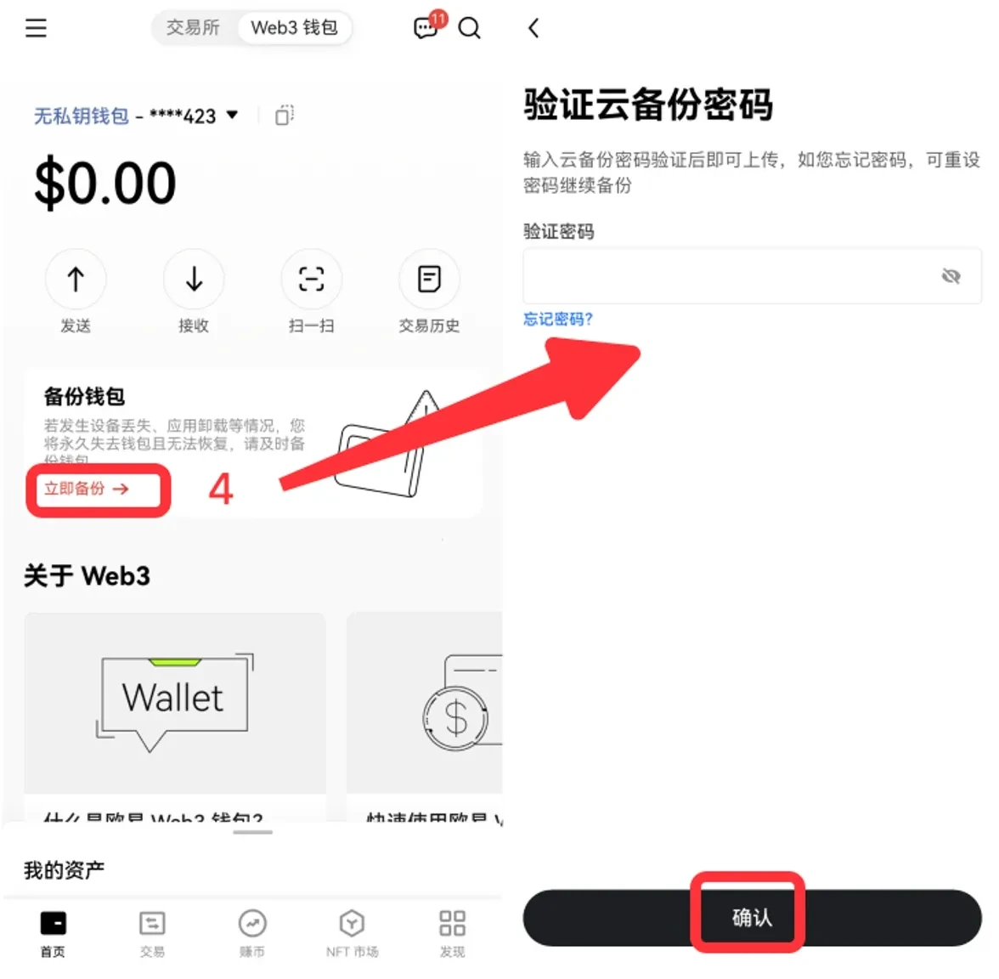
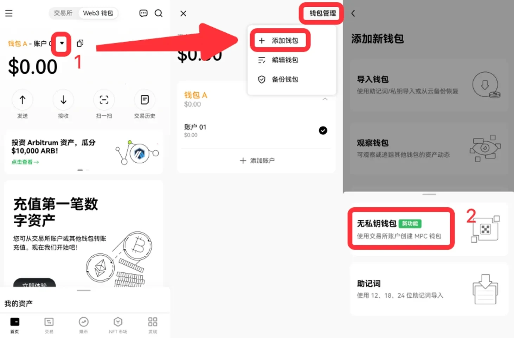
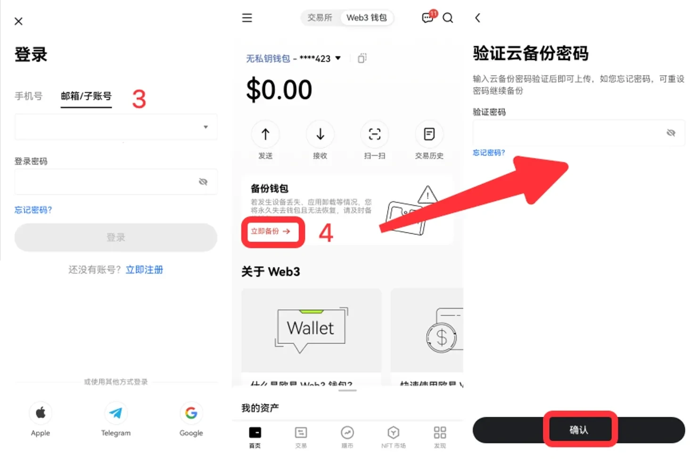
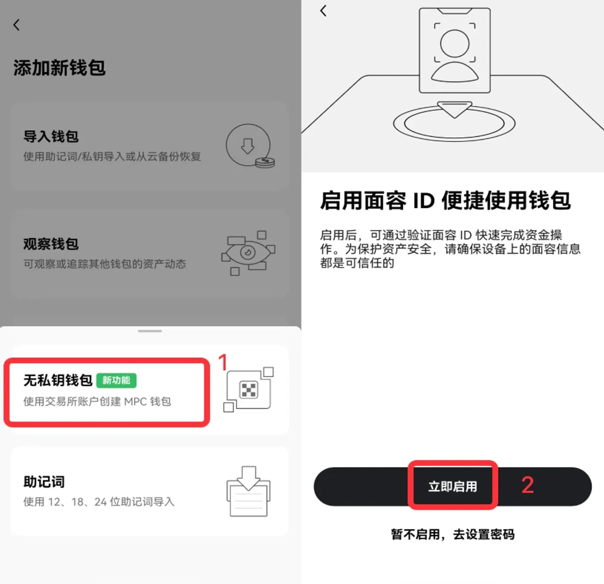
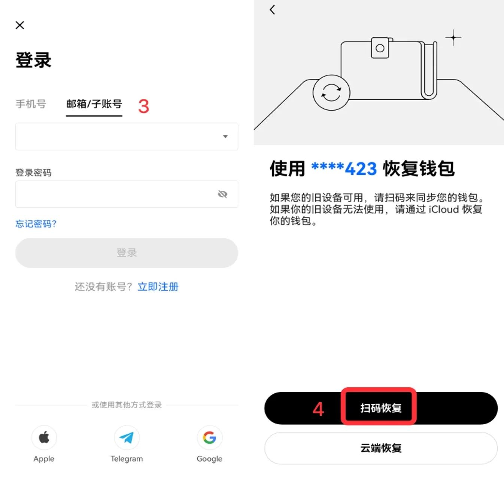
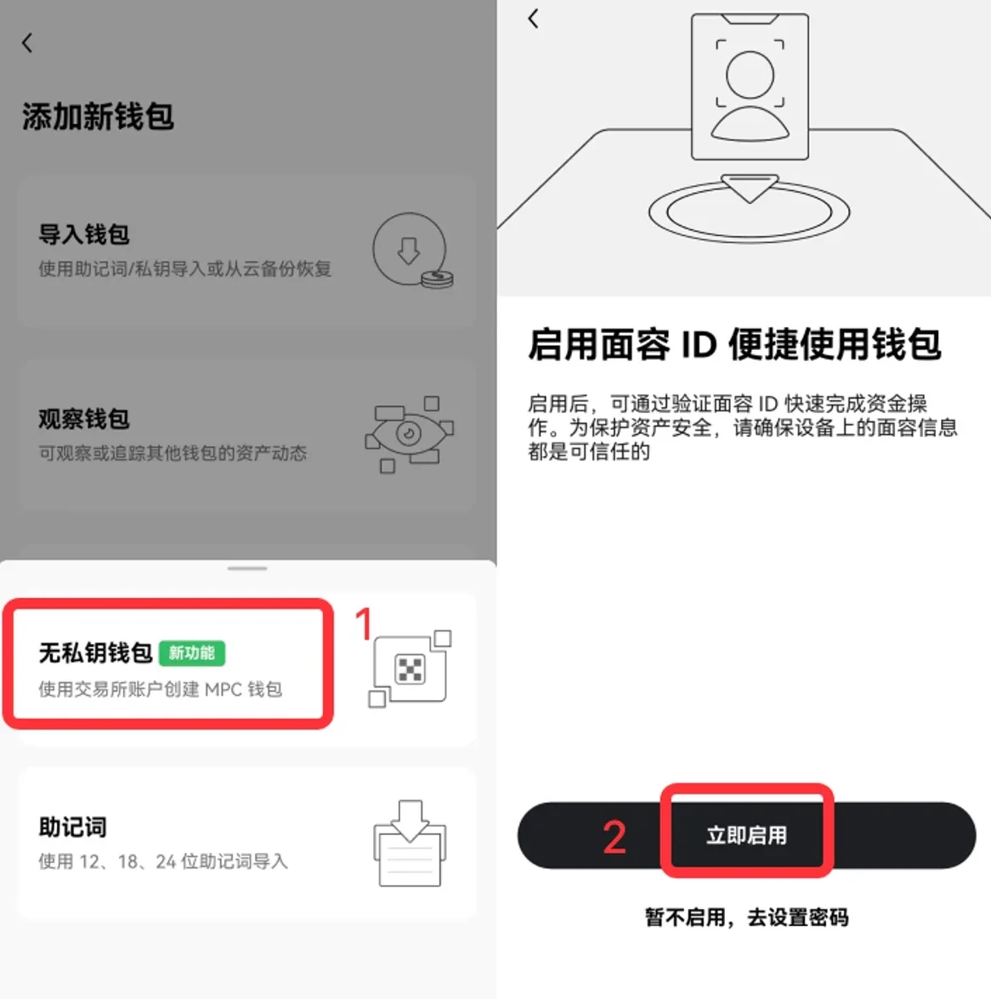
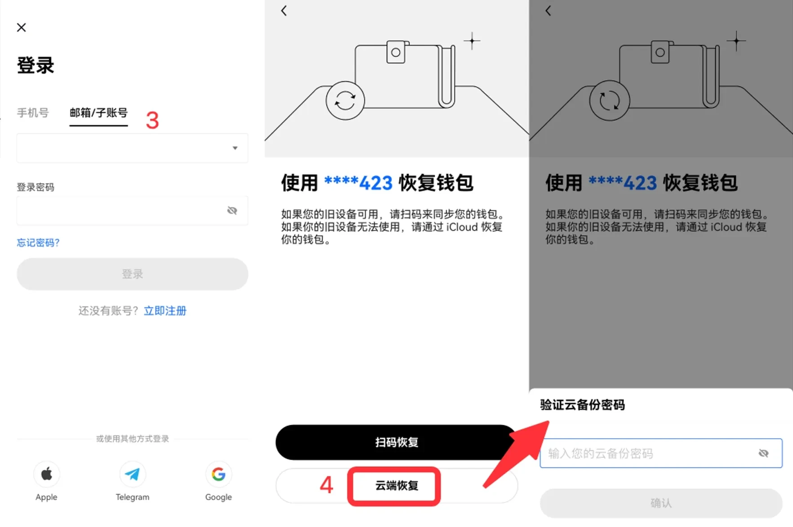

# OKX Web3.0钱包和账户的区别是什么？

OKX Web3.0钱包是一个基于Web3技术的先进加密货币钱包，其原理与常见的加密钱包相似，只是OKX Web3.0钱包是欧易交易平台所设计。OKX Web3.0钱包是一款为全球用户提供一站式资产管理、安全存储、转账等功能的非托管、去中心化多链钱包。但是用户在使用该钱包时，也会遇到一些人称呼其为钱包账户，一些人称呼钱包。那么OKX Web3.0钱包和账户的区别是什么？就资料分析来看，其区别就是功能和用途。下面GTokenTool为大家详细说说。

<figure><figcaption></figcaption></figure>

## OKX Web3.0钱包和账户的区别是什么？

OKX Web3.0钱包和账户在功能和用途上有一些关键区别，OKX Web3钱包是由OKX交易所推出的一款去中心化钱包。

下文是具体分析：

### 1、存储和控制权

OKX Web3.0钱包：通常是一个去中心化的钱包，允许用户完全控制他们的私钥和数字资产。用户可以通过自己的私钥来访问和管理资产，这意味着他们对资产拥有完全的所有权和控制权。

OKX Web3.0账户：在传统意义上，OKX账户是由平台管理的，用户注册后获得一个账户，可以存储和交易数字资产。在这种情况下，平台可能持有用户资产的私钥，用户的控制权相对较少。

### 2、使用场景

OKX Web3.0钱包：主要用于参与去中心化金融(DeFi)、非同质化代币(NFT)市场以及其他Web3应用。它允许用户直接与智能合约交互，无需通过中心化交易所。

OKX Web3.0账户：适用于进行交易、存款、提现等基本交易活动，主要集中在平台内的交易和管理功能。

### 3、安全性和隐私

OKX Web3.0钱包：因为用户持有私钥，所以安全性更高，用户的资产不容易被平台攻击或滥用，但用户需要对自己的私钥负责，若丢失则无法恢复。

OKX Web3.0账户：虽然用户在平台上进行交易可能会享有一定的安全保护，但如果平台受到攻击或出现问题，用户的资产可能会面临风险。

### 4、互动方式

OKX Web3.0钱包：用户可以直接与区块链交互，通过钱包连接到不同的去中心化应用，进行交易、签名和其他操作。

OKX Web3.0账户：用户通常需要通过平台的界面进行操作，所有的交易和管理功能都是通过中心化的接口来实现。

## OKX web3钱包跨链交易怎么操作？

钱包跨链交易还是比较复杂的，跨链交易是指在不同的区块链网络之间进行资产交换的过程。下文是具体操作教程：

1、打开OKX官网，切换至Web3钱包，点击连接钱包，输入密码并登录。目前支持OKX钱包、MetaMask等钱包直接连接，也支持通过WalletConnect连接。如果没有钱包，可以下载OKX插件钱包。然后查看币种，即点击交易，进入闪兑&跨链页面，点击页面右侧搜索框，展开行情模块，可关注热门榜、Layer2、DeFi等不同类型的币种交易价格、涨跌幅、交易量，点击某一币种即可交易。

<figure><figcaption></figcaption></figure>

2、查看价格走势，选择支付和接收币种，如ETH和USDC，就能在左侧看到相关代币的K线图和币种概况，默认展示支付代币/接收代币的兑换比例。点击∨，出现ETH/USDC、USDC/ETH、ETH、USDC。点击单个币种，如ETH，进入该币种详情页，会显示图表、交易、资金池和币种概况。

<figure><figcaption></figcaption></figure>

<figure><figcaption></figcaption></figure>

3、闪兑&跨链，点击交易，进入闪兑&跨链页面。闪兑指的是同一条公链上的币种转换，即支付和接收币种在同一网络，如将OKTC上的USDC和OKT进行兑换。输入想兑换的数量，点击兑换后，在钱包内确认，等待交易上链。

<figure><figcaption></figcaption></figure>

4、跨链兑换指的是不同公链之间的资产转换，即支付和接收币种所在网络不同，如将OKTC上的USDC和Optimism上的ETH进行兑换。输入想兑换的数量，点击兑换后，在钱包内确认，等待交易上链。

<figure><figcaption></figcaption></figure>

5、在跨链兑换中，用户还可以在不同跨链桥中自由选择路径

<figure><figcaption></figcaption></figure>

6、另外，OKXDEX上线了兑换Gas功能，可以将USDT、USDC、DAI、WETH等主流资产迅速兑换成Gas费，帮助你解决在实际交易中没有Gas费或Gas费不足的问题。

<figure><figcaption></figcaption></figure>

<figure><figcaption></figcaption></figure>

<figure><figcaption></figcaption></figure>

7、用户使用主网原生代币进行兑换时，在选择兑换数量时点击全部后会将会自动预留部分代币作为gas费以避免交易失败。

<figure><figcaption></figcaption></figure>

8、设置滑点限制

<figure><figcaption></figcaption></figure>

9、查看交易历史

<figure><figcaption></figcaption></figure>

## OKX无私钥钱包使用教程

如何使用 OKX 无私钥钱包？下载 OKX App

打开 OKX 官网，下载 OKX 客户端：[https://www.okx.com/download](https://www.okx.com/download)

**第一次使用 OKX Web3 钱包**

\[1] 打开 OKX App，切换至 Web3 钱包，选择我没有钱包 > 无私钥钱包；

\[2] 点击立即启用；

\[3] 输入 OKX 交易所的账号和密码，若已经登录则无需此步骤，再点击创建；

\[4] 点击备份钱包 > 输入密码完成备份

<figure><figcaption></figcaption></figure>

<figure><figcaption></figcaption></figure>

已有助记词或私钥钱包，想创建无私钥钱包

\[1] 打开 OKX Web3 钱包，点击 ▼ > 钱包管理 > 添加钱包；

\[2] 选择创建钱包 > 无私钥钱包

\[3] 输入 OKX 交易所的账号和密码，若已经登录则无需此步骤，再点击创建；

\[4] 点击备份钱包 > 输入密码完成备份

<figure><figcaption></figcaption></figure>

<figure><figcaption></figcaption></figure>

## 如何恢复无私钥钱包？

如果钱包重置、删除钱包、重装 App 或是更换设备，我们可以通过扫码恢复钱包。

\[1] 打开 OKX App，切换至 Web3 钱包，选择我已有钱包 > 恢复无私钥钱包；

\[2] 点击立即启用；

\[3] 输入 OKX 交易所的账号和密码，若已经登录则无需此步骤；

\[4] 点击扫码恢复，使用老设备扫描二维码，同步完成后钱包恢复成功。

<figure><figcaption></figcaption></figure>

<figure><figcaption></figcaption></figure>

如果老设备不可用，或是设备私钥碎片被泄露，则需要通过云端恢复，即登录 iCloud 或 Google Drive 把私钥碎片 3 下载下来，恢复无私钥钱包，此时 3 份私钥碎片会全部刷新成新的私钥碎片。

\[1] 打开 OKX App，切换至 Web3 钱包，选择我已有钱包 > 恢复无私钥钱包；

\[2] 点击立即启用；

\[3] 输入 OKX 交易所的账号和密码，若已经登录则无需此步骤；

\[4] 点击云端恢复，选择从 iCloud 或 Google Drive 恢复，并输入当初云备份时的密码；

<figure><figcaption></figcaption></figure>

<figure><figcaption></figcaption></figure>

## 常见问题我习惯了使用私钥，没有私钥还安全吗？

确实去掉私钥听起来似乎有些离经叛道，但无私钥钱包由于私钥不会完整地存储在单个设备上，这反而使它能够解决目前大多数钱包因私钥带来的风险。

能不能将 OKX 的无私钥钱包导入到另一个同样支持 MPC 的钱包 App 上？

不能。因为 MPC 算法尚未出现一个业界的统一标准，也没有得到机构级安全设备的原生支持，多数为定制产品，故 OKX 的无私钥钱包无法迁移到另一钱包 App上。

但由于用户存有 2 份私钥碎片，故可通过私钥碎片 2 和私钥碎片 3 恢复完整私钥，此过程不需要 OKX 参与，此时无私钥钱包将转为传统私钥控制的钱包，可以导入到其他钱包 App 中使用，为避免责任纠纷，OKX 的无私钥钱包也不再有效。

## OKX Web3.0钱包安全吗？

OKX Web3.0钱包安全，OKX交易所为OKX Web3钱包接入KYT天眼系统，收录高达两亿多条加密货币地址，在用户无意间要把资产转至恶 意或诈 骗地址前，系统将会弹出警告进行风险提示。

虽然OKX Web3钱包是整合在OKX交易所App当中，但在建立钱包时可以主动断开网路且不影响操作，将注记词/私钥外泄可能降至最低。OKX Web3钱包支援50+区块链网路，避免用户为了使用哪条区块链不得不下载一个又一个不同的钱包，例如MetaMask因为建立于以太坊上就只支援EVM兼容链，在你使用多种钱包同时无意间增加了使用风险，另外就是，一个钱包币圈走透透，很方便。

在用户与林林总总的链上协议与币种进行授权后，OKX Web3钱包为用户独立整理出授权管理页面，用户可以直接在该页面查看自己的钱包与哪些协议和币种授权过，并且可以在该页面直接取消授权，避免用户与恶意或存有漏洞的合约授权后只能弃用钱包或是在真正出事前即时进行处理取消授权。

上述全部内容就是对OKX Web3.0钱包和账户的区别是什么这一问题的解答，OKX Web3.0钱包为用户提供更高的控制权和参与去中心化生态的能力，而传统的账户则适合更常规的交易和资产管理。选择哪个取决于用户的需求和对控制权、安全性的偏好。需要提醒的是，无论选择那个，都应该保护自己信息的安全，不泄露信息给他人。如果遇到问题或者麻烦，建议立即联系客服平台，必要时可以选择报警进行解决。

如有不明白或者不清楚的地方，请加入官方电报群：[https://t.me/gtokentool](https://t.me/gtokentool)
