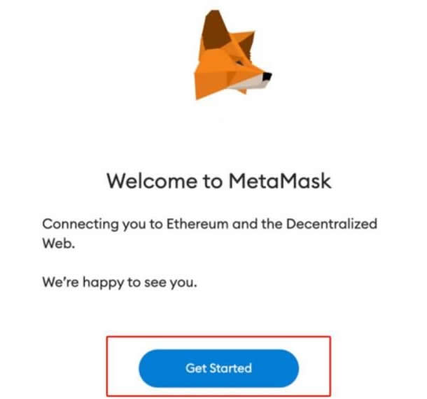

# OP链怎么添加到钱包？小狐狸钱包中添加OP链操作教程

OP链是一个旨在提高以太坊的可扩展性和降低交易费用的以太坊的二层扩展解决方案，主要用于处理以太坊交易的Layer2解决方案，通过将交易批量处理并在链上提交更少的数据，实现了更高的交易吞吐量和更低的成本。而为了更好的降低交易成本和提高交易速度，用户就会将其添加到钱包当中，但对于一些新手来说不知道OP链怎么添加到钱包里，其实添加步骤还是有一定门槛的，接下来[**GTokenTool**](https://www.gtokentool.com)为大家详细说一下钱包添加OP链简单教程。

## OP链怎么添加到钱包？

OP链添加到钱包还是比较简单的，下文是在小狐狸钱包中添加OP链的教程：

1. 打开小狐狸钱包，不同浏览器会有一些不一样。如果您使用Chrome请点击添加到Chrome然后添加扩展，然后点击开始。

<figure><figcaption></figcaption></figure>

2. 将OP Mainnet添加到MetaMask。为此，请单击以太坊主网，添加网路。

<figure><figcaption></figcaption></figure>

3. 点击Optimism行中的添加(Optimism过去也指OP主网)。

<figure><figcaption></figcaption></figure>

4. 点击批准，切换到Optimism，就完成添加并能够使用了。

<figure><figcaption></figcaption></figure>

## OP链是什么？

Optimism(OP)是以太坊的第2层扩展解决方案，它旨在减轻以太坊网路的负载，被设计为等效于以太坊虚拟机(EVM)的OptimismRollup链。

Optimism的主要特点是使以太坊应用程序上的交易变得非常便宜，通过将交易从区块链转移到另一个区块链，矿工费就大大降低了，吞吐量也增加了。同时，它为以太坊开发人员提供了无需进行更改就能使用以太坊上所有可用工具的机会。

Optimism采用optimisticRollups技术，可以将大量交易数据“汇总”成以太坊上的一批数据，从而只收取一笔交易费用。这样，交易的处理速度更快、成本更低，同时依赖于以太坊的安全性。

以上全部内容就是对OP链怎么添加这一问题的教程解答，将Open链添加到钱包中可以为用户提供更优化的交易体验，降低交易成本，并支持以太坊生态系统中正在兴起的Layer2解决方案，这有助于推动去中心化金融(DeFi)和其他去中心化应用的发展。需要注意的是，OP链添加到钱包中可以提供一些优势，但也伴随着一些潜在的风险和考虑事项，因此添加前应该进行充分的安全审查、测试，并确保用户教育和体验方面的问题得到妥善处理。

如有不明白或者不清楚的地方，请加入官方电报群：[https://t.me/gtokentool](https://t.me/gtokentool)
