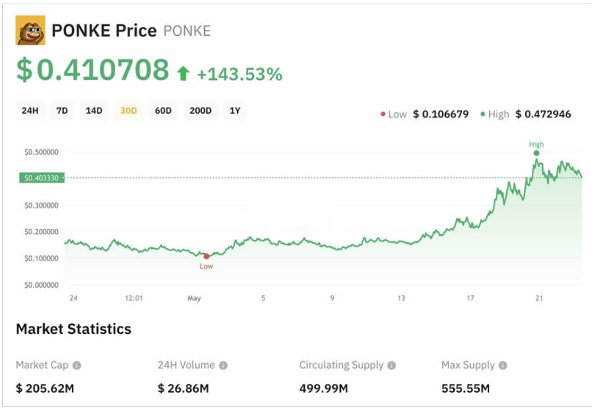

# 👏 PONKE是什么币种？PONKE币怎么样？

SOL区块链随着技术的发展，已经成为模因币的热点，PONKE币就是一个基于SOL区块链的模因币。该项目秉承了使用动物主题模因币的传统，发售之后就收获了市场的关注和认可，但一些新手还不知道PONKE是什么币种？更不了解PONKE币怎么样？据了解PONKE币是一种基于Solana的模因币，围绕猴子的形象，没有具体的实用价值。但该项目市场发展还比较不错，有一定的投资价值。接下来[**GTokenTool**](https://www.gtokentool.com)为大家详细说说。

<figure><figcaption></figcaption></figure>

## PONKE是什么币种

PONKE是一个在Solana区块链上创建的迷因币，代币发行方将其描述为“存在愤怒问题的堕落赌徒”。PONKE不仅仅是一种加密货币;它还体现了独特的个性和叙事。尽管Ponke是一种模因币，但由于其广泛的在线推广以及项目团队积极努力，其目标是在中心化(CEX)和去中心化(DEX)交易所上线代币。

这个由Solana驱动的代币为市场带来了独特的风味，以其冒险精神为特色。PONKE的用途超越了迷因文化和投机交易。它积极参与Solana生态系统中的多个项目，如游·戏赚·钱游戏、去中心化交易所(DEX)以及其他基于Solana的风险项目的启动平台。

PONKE社区以其高度参与度和对项目的热情而闻名。成员积极参与治理决策，并通过各种举措为项目的发展做出贡献。PONKE采用了通缩模型，其中包括内置的销毁机制。这一特性会随着时间的推移逐渐减少代币的总供应量，可能导致剩余代币价值的增加。

## PONKE币怎么样

PONKE币表现还不错，根据官方数据记载，目前PONKE币的价格为0.52美元，低于历史最高0.7087美元，但高于发行价0.005美元，其投资回报也非常乐观为+10370%，上线交易所19家。总的来看，该项目当前市场状况还不错。

PONKE最初是Solana区块链上的一项实验，现已迅速发展成为一种文化现象，吸引了全球数百万人的关注，他们希望在即将到来的牛市-模因币周期中获得丰厚的回报。凭借其标志性的品牌、忠诚的社区和对数字货币的哲学方法，PONKE正在超越其作为模因币的起源，在主流适应的边缘摇摇欲坠。

PONKE团队及其附属机构不只是追求短期收益，他们正在创造传奇。他们的愿景远远超出了目前对超人气meme币的炒作。PONKE正在打造一个经得起时间考验的全球品牌，在迎合主流的同时激励后代，投资者也注意到了这一点，风险投资家也盯上了蓬勃发展的加密货币市场。PONKE提供了一个独特的机会，可以进入具有无限潜力的文化现象。

## PONKE币在哪买

购买PONKE币主要就是在上线的交易所内购买，目前PONKE币上线交易所有Gate.io、Huobi、MEXC、KuCoin、Kraken等等19家，需要注意的是，币安上线PONKE币合约交易，但未上线现货。下文是部分交易所的具体介绍：

### 1、Gate.io

Gate.io芝麻开门交易平台的影响力在币圈算是大家有目共睹的，成立于2013年算是币圈资深品牌的交易所之一，Gate.io多次登上全球行业内权威机构的真实交易量、透明数字资产、高投资回报率等排行榜单前10，是全球最值得信赖的数字货币交易所之一，支持约200种数字货币超400个交易对的交易和投资服务。目前已经在中国、韩国、日本、加拿大、台湾等多个国家和地区设有独立的交易业务和运营中心，经营着全球的商务、技术、Wallet.io、GateChain、区块链研究所等业务。

### 2、Huobi

火币交易所原英文名Huobi现已更名为HTX，在2017年初次币圈牛市时候的火币可谓是火遍半边天，一度荣登全球交易量最大的加密货币交易平台，当时火币公司近200名成员具有长期的互联网和金融领域产品研发和运营经验，致力打造最安全可信赖的比特币交易平台。2016年12月22日，火币网第10次刷新平台比特币日交易额纪录，日成交量达501万枚比特币，单日交易额突破300亿人民币。截止2016年末，火币累计成交额达20000亿人民币。

### 3、MEXC

MEXC抹茶交易所是一间于2018年在新加坡所创立的中心化交易所，不仅提供加密货币现货、保证金、期货交易，也有提供杠杆ETF与指数ETF多种不同的交易产品，还提供了多元的交易币种，目前所提供的交易币种，已经超过1600种。

### 4、KuCoin

库币-KuCoin交易所是全球知名的数字货币交易平台，是最早开放“网格交易机器人”功能的虚拟货币交易所之一，也是最早开放放贷/借贷功能的虚拟货币交易所之一。支持多种数字资产交易，为全球207个国家和地区的500万用户提供币币、法币、合约、Pool-X、借贷等一站式服务。

### 5、Kraken

K网-Kraken交易所是美国最大的加密资产交易平台之一，于2011年创立于美国旧金山，是第一个在彭博终端上显示交易价格和交易量的比特币交易所，提供虚拟货币交易、场外柜台(OTC)交易、保证金交易和期货交易，服务超过700万用户，以优质的服务、低廉的费用、多样化的资产选择和严格的安全标准跻身美国最活跃的加密资产交易所阵营。

## Ponke社区与炒作

Ponke代币于2023年底上线，已获得包括Crypto Rover、Jake Gagain和传奇比特币投资者Davinci Jeremie在内的多位加密货币网红的认可。这些代币助推了对代币的强烈热议：尽管自推出以来已有近半年的短期本地化下跌，但它仍然是为数不多的长期上行趋势的模因币之一。此外，从5 月中旬开始，PONKE 的价格进一步飙升，在一周内突破近200% 的记录。

<figure><figcaption></figcaption></figure>

截至2024 年5 月23 日，PONKE 几个月来的价格上涨帮助该代币达到了超过2 亿美元的市值，使其成为市值排名第8 的Solana 模因币。

该代币的热情用户社区#PONKEARMY 也在稳步增长，上个月Ponke 表示，在推出后仅5 个月就有35，000 名持有者。

## PONKE币价格预测

截至2024 年5 月23 日，PONKE 的价格为$0.41，比2024 年5 月20 日创下的$0.476 的历史高点低约14%，比2024 年1月3 日创下的$0.00928 的历史低点高出4 ，300% 以上。

对PONKE 的长期预测普遍看涨，价格预测预计2025 年将达到平均$0.969，2030 年将升至$5.78，而DigitalCoinPrice预计到2025 年将超过$1，到2030 年将达到$2.99。

## PONKE币发行时间和发行价格是多少

根据官方数据披露，PONKE币发行时间为2023年12月28日，发行价为0.005美元。PONKE是建立在Solana网络上的迷因币，旨在实现快速、低成本的交易，并支持一个由社区驱动的生态系统，在游戏、NFT和去中心化金融中有多样化的应用。

以上全部内容就是对PONKE是什么币种以及PONKE币怎么样这两个问题的解答，PONKE在Solana网络中运作，利用其闪电般的交易速度和低廉的费用，这种与Solana的关联不仅确保了效率，还确保了充满机会的强大生态系统。需要注意的是，虽然PONKE币为寻求高风险、高回报投资的投资者提供了一个有趣的机会，但项目市场的波动性，还是为投资者的投资增添了比较高的风险性，投资者进行项目投资应该小心谨慎。

如有不明白或者不清楚的地方，请加入官方电报群：[https://t.me/gtokentool](https://t.me/gtokentool)
