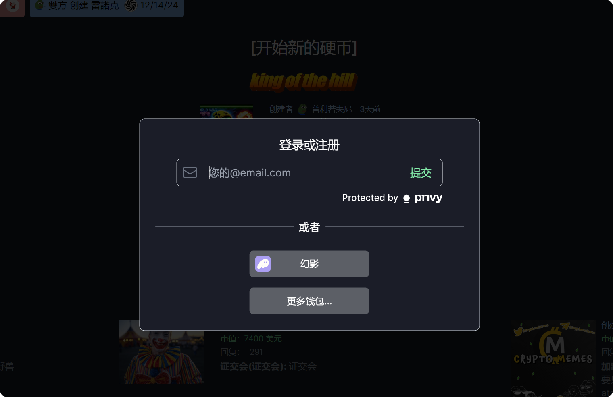
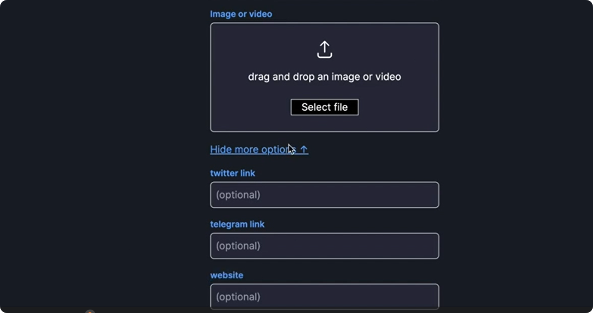
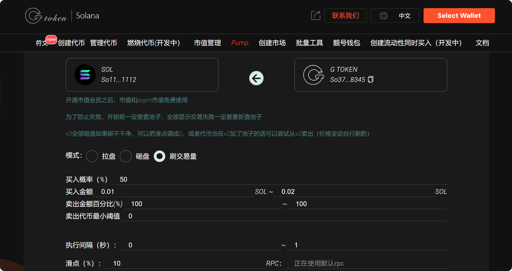

# 🔥 pump内盘如何购买，pump机器人如何使用？



## 一、什么是Pump.fun？

Pump.fun是一个基于Solana区块链的平台，用于创建、发现和交易代币，专注于迷因币。在这个应用出现之前，启动一个代币需要编码技能，并且需要为其增加流动性，以便在去中心化交易所（DEX）上交易。而现在，用户只需连接自己的Solana钱包，就能轻松创建代币。

## 二、什么是Pump内盘？

一句话总结，就是 pump.fun 将 Meme 团队要做的事情产品化，从代币名称、logo 到流动性和流动性销毁做到了一条龙服务。当成功在 pump.fun 上部署一枚 Meme 后，一旦代币市值达到 69,000 美元，会自动将 pump.fun 的流动性添加到 Raydium。

## 三、pump内盘如何购买步骤

1.访问网站并连接您的Solana钱包

<figure><figcaption></figcaption></figure>

2.在主页上点击“开始新代币”；

3.选择一个独特的名称和代号，为您的迷因币添加描述，并上传JPEG或视频文件；

<figure><figcaption></figcaption></figure>

<figure><figcaption></figcaption></figure>

4.可选：链接您的项目的X、Telegram或网站；

<figure><figcaption></figcaption></figure>

5.点击“创建代币”，完成发布。

## 四、刷Pump内盘交易量

虽然Pump有众多优势，但对于在上面发币做项目的同学来说，会遇到一个难题：不能刷量。Pump上有很多代币项目，只有交易频繁的代币，排名才会靠前。不能刷交易量，就意味着代币活跃度低，无法有效吸引新人进场。

GTokenTool支持PUMP内盘交易的机器人工具，可以提供自动化、批量化、定制化交易。

机器人使用：[https://sol.gtokentool.com/#/pump/pumpMarket](https://sol.gtokentool.com/#/pump/pumpMarket)

<figure><figcaption></figcaption></figure>

## 五、Pump的玩法

1. 创建代币：用户在GTokenTool平台链接钱包后，在发币页面填入代币的全称、简称、logo，即可发行一个MEME币
2. 选择买入金额：创建代币的人被称之为Dev，即开发者。Dev可以在创建代币时选择买入一笔任意金额的代币，从而为自己获得更多的筹码。
3. 交易代币：代币发行后可立即开始交易，无需添加流动性或等待提交审查
4. 上线发射：当pump的联合曲线池内聚集超过85个sol时，代币将被发射到Raydium上，添加Raydium流动性并销毁LP
5. 刷评论：当代币在PUMP交易时，任何支持的用户都可以在交易页面刷评论，表达对该代币的喜爱
6. 山丘之王：PUMP首页上方会有一个“King Of The Hill”的提示，这就是山丘之王。当代币市值达到约 3 万美元，就能推翻当前的王者地位。一旦代币成为“山丘之王”，它就会占据 Pump.fun 首页顶部的首位，供所有人查看，获得免费营销
7. 项目排序：在PUMP首页会滚动出现多个不同的MEME币，交易频繁的币会列在靠前的位置

## 六、Pump辅助工具

1、发币工具

用户创建代币可以在PUMP官方创建，也可以通过GTokenTool这样的第三方平台完成。和官方相比，GTokenTool这样的发币工具用起来更加方便快捷，简单易操作 →[教程](https://docs.gtokentool.com/solana/pump-kai-pan-he-kun-bang-mai-ru-jiao-cheng)

工具地址：[https://sol.gtokentool.com/#/pump/bundle](https://sol.gtokentool.com/#/pump/bundle)

2、捆绑工具

Pump现在市场上有很多机器人，会以较低的价格买入代币，以期待未来上涨。如果你想比机器人更快、更低的价格买入代币，GTokenTool的捆绑发射工具可以完成这个目标。

3、交易工具

如果你想获得山丘之王，就必须要完成很多笔交易才可以。如果你觉得自己一笔笔交易太麻烦，完全可以借助GTokenTool的市值工具来完成，全部自动化运行，解放双手。

4、批量工具

不管是刷交易还是干什么，都需要很多钱包吧。有了钱包之后，要转账吧？交易刷完之后，还能归集吧？GTokenTool的批量工具，可以完成钱包的批量生成、代币的批量转账与空投、以及批量归集等等。

以上就是关于pump内盘如何购买的全部内容，如有不明白或者不清楚的地方，请加入官方电报群：[https://t.me/gtokentool](https://t.me/gtokentool)
