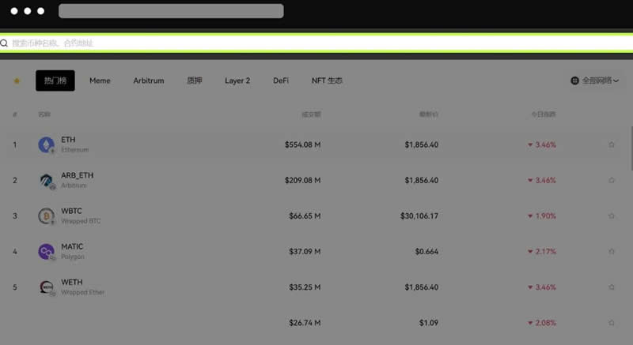

# 钱包跨链交易怎么操作？OKX web3钱包跨链交易操作教程

区块链是由多个链组成的，且不同的加密货币也有属于自己的区块链网络，在一定程度上就会影响投资者进行交易，但跨链交易的出现就有效解决这一问题，由于不同区块链之间的互操作性需求日益增加，跨链交易技术则允许用户在不同的区块链之间传输资产和执行交易。其中最平凡的就是钱包跨链交易，它是指在不同的区块链网络之间进行资产交换的过程，但还有很多新手不知道钱包跨链交易怎么操作？下面[**GTokenTool**](https://www.gtokentool.com)为大家详细说说。

## 钱包跨链交易怎么操作？

钱包跨链交易还是比较复杂的，跨链交易是指在不同的区块链网络之间进行资产交换的过程。下文是具体操作教程：

1、打开OKX官网，切换至Web3钱包，点击连接钱包，输入密码并登录。目前支持OKX钱包、MetaMask等钱包直接连接，也支持通过WalletConnect连接。如果没有钱包，可以下载OKX插件钱包。然后查看币种，即点击交易，进入闪兑&跨链页面，点击页面右侧搜索框，展开行情模块，可关注热门榜、Layer2、DeFi等不同类型的币种交易价格、涨跌幅、交易量，点击某一币种即可交易。

<figure><figcaption></figcaption></figure>

2、查看价格走势，选择支付和接收币种，如ETH和USDC，就能在左侧看到相关代币的K线图和币种概况，默认展示支付代币/接收代币的兑换比例。点击∨，出现ETH/USDC、USDC/ETH、ETH、USDC。点击单个币种，如ETH，进入该币种详情页，会显示图表、交易、资金池和币种概况。

<figure><figcaption></figcaption></figure>

<figure><figcaption></figcaption></figure>

3、闪兑&跨链，点击交易，进入闪兑&跨链页面。闪兑指的是同一条公链上的币种转换，即支付和接收币种在同一网络，如将OKTC上的USDC和OKT进行兑换。输入想兑换的数量，点击兑换后，在钱包内确认，等待交易上链。

<figure><figcaption></figcaption></figure>

4、跨链兑换指的是不同公链之间的资产转换，即支付和接收币种所在网络不同，如将OKTC上的USDC和Optimism上的ETH进行兑换。输入想兑换的数量，点击兑换后，在钱包内确认，等待交易上链。

<figure><figcaption></figcaption></figure>

5、在跨链兑换中，用户还可以在不同跨链桥中自由选择路径

<figure><figcaption></figcaption></figure>

6、另外，OKXDEX上线了兑换Gas功能，可以将USDT、USDC、DAI、WETH等主流资产迅速兑换成Gas费，帮助你解决在实际交易中没有Gas费或Gas费不足的问题。

<figure><figcaption></figcaption></figure>

<figure><figcaption></figcaption></figure>

<figure><figcaption></figcaption></figure>

7、用户使用主网原生代币进行兑换时，在选择兑换数量时点击全部后会将会自动预留部分代币作为gas费以避免交易失败。

<figure><figcaption></figcaption></figure>

8、设置滑点限制

<figure><figcaption></figcaption></figure>

9、查看交易历史

<figure><figcaption></figcaption></figure>

## 跨链钱包和多链钱包的区别是什么？

跨链钱包和多链钱包虽然听起来类似，但实际上有一些关键区别，跨链钱包侧重于实现不同区块链之间的跨链交易，而多链钱包更侧重于提供一个集中管理多个区块链资产的平台。

跨链钱包专注于实现不同区块链之间资产的跨链交易功能。它们通常提供跨链交易的能力，允许用户在不同区块链之间直接转移和交换资产，而无需使用中间人或交易所。这些钱包可能需要集成跨链协议或跨链桥等技术，以便将资产安全地从一个链转移到另一个链。

跨链钱包的重点在于提供跨越不同区块链的无缝体验，使用户能够更轻松地管理和交换各种资产。多链钱包更多地关注于为用户提供在同一钱包中管理多个不同区块链上的资产的能力。它们通常支持多个区块链，但不一定提供跨链交易功能。用户可以在一个界面中查看和管理他们在不同区块链上的资产，但在进行交易时可能需要依赖于外部交易所或服务。

多链钱包的目标是为用户提供一个集中管理他们多样化资产的平台，但并不一定提供跨链交易的完整功能。

以上全部内容就是对钱包跨链交易怎么操作这一问题的教程解答，不同的区块链网络上可能有不同的加密货币和代币，通过进行跨链交易，用户可以在不同的区块链之间转移资产，从而获得更多的投资多样性。需要注意的是，跨链交易通常会涉及到不同的区块链网络和协议，因此投资者在执行跨链交易时需要格外小心，时刻保持谨慎，并确保自己使用安全的钱包以及可靠的交易渠道，以避免资产丢失或被盗。

如有不明白或者不清楚的地方，请加入官方电报群：[https://t.me/gtokentool](https://t.me/gtokentool)
