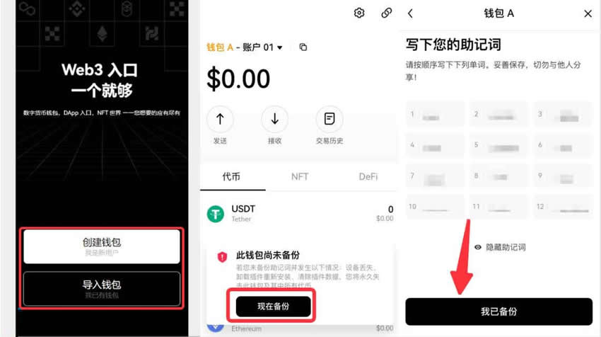

# 钱包NFT怎么交易？欧易交易所进行钱包NFT交易教程

钱包NFT通常是指支持存储、管理和交易非同质化代币的数字钱包。NFT是基于区块链技术的数字资产，每一个都是独一无二的，不可替代的。NFT可以代表数字艺术品、虚拟房地产、音乐、游戏道具等，它们通常是建立在以太坊区块链上的智能合约的标准之一，确保每个代币都有独特的属性和所有权。NFT的交易对于新手来说一直是一个比较麻烦的事情，在玩NFT就需要知道钱包NFT怎么交易？但过程还是比较简单的，下面[GTokenTool](https://www.gtokentool.com)为大家详细说说钱包交易NFT教程。

## 钱包NFT怎么交易？

钱包NFT交易还是比较简单的，下文是在欧易交易所进行钱包NFT交易的教程：

1. 打开欧易官网，切换至Web3钱包，点击连接钱包。如果你没有钱包，建议下载欧易Web3插件钱包。打开插件钱包，点击创建钱包，设置密码并备份钱包。如果您已拥有钱包，也可使用助记词或私钥直接导入。

<figure><figcaption></figcaption></figure>

2. 购买NFT，选择NFT市场>市场。你可以搜索或筛选心仪的NFT，欧易NFT支持出价拍卖和直接购买。

<figure><figcaption></figcaption></figure>

3. 对于部分区块链，如Ethereum、OKTC、BSC等，你也可以添加多个NFT至购物车，一键购买以节约网络费用。

<figure><figcaption></figcaption></figure>

4. 出售NFT，点击个人中心>NFT>我的藏品，选择想要出售的NFT，进入该NFT详情页，点击上架并按要求完成操作。

<figure><figcaption></figcaption></figure>

5. 如果是你自行创作的NFT上架需要审核，而在二级市场流通购买的NFT上架不需要审核。欧易NFT平台支持多平台挂单，选择你想上架的NFT市场，设置过期时间和NFT价格。你可以在不同的市场为同一NFT设置不同的价格，也可以点击相同价格，按统一价格出售。上架需支付Gas费、服务费和版税。服务费由对应的上架平台收取，欧易自有NFT市场的服务费为0。版税由创作者收取，合约创建者有权修改版税。确认无误后，点击上架。

<figure><figcaption></figcaption></figure>

## 钱包交易记录删了还能查到吗？

需要明确的是，在区块链技术中一旦一笔交易记录被写入区块链，就很难删除或修改。区块链是一个去中心化的、不可篡改的分布式账本，所有的交易都被记录在区块中，并通过密码学算法保护其完整性和安全性。

如果你使用的是去中心化的钱包，例如基于区块链技术的钱包，删除交易记录几乎是不可能的。这是因为这些交易记录已经被广播到整个网络，其他节点都已经存储了这个信息。

如果你使用的是集中化的交易所或钱包，其交易记录可能是存储在其服务器上的数据库中。在这种情况下，交易记录可能被删除或修改，但这需要根据具体的平台和服务提供商来判断。即便如此，这种做法也可能会违反平台的使用协议，并且平台可能仍然保留着交易历史的备份。

以上全部内容就是对钱包NFT怎么交易这一问题的教程解答，**GTokenTool**提醒大家，在进行钱包NFT交易是需要使用受信任和安全的数字钱包，并连接到知名的NFT市场，确保钱包和市场都采取了适当的安全措施来保护用户资产和数据。另外在交易前仔细审查NFT的详细信息，要明确了解所有相关费用，并确保有足够的加密货币用于支付。最重要的是对钱包私钥的保管，交易确保在安全环境下进行，减少私钥被盗的风险。

如有不明白或者不清楚的地方，请加入官方电报群：[https://t.me/gtokentool](https://t.me/gtokentool)
