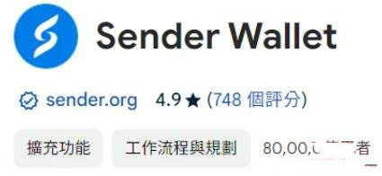

# Sender是什么钱包？Sender Wallet安装教程

Sender 是一款同时提供手机App 版与浏览器扩充版的NEAR 钱包，支持多链包含以太坊、BSC、雪崩、OP、Arbitrum 等,有很多投资想要知道如何安装Sender wallet，接下来[**GTokenTool**](https://www.gtokentool.com)给大家介绍一下Sender Wallet安装教程。

## Sender是什么钱包

Sender 是一款同时提供手机App 版与浏览器扩充版的NEAR 钱包，支持多链包含以太坊、BSC、雪崩、OP、Arbitrum等。

<figure><figcaption></figcaption></figure>

## 如何安装Sender Wallet

进入网站中可选择要安装浏览器扩充或是手机App 版本，以下教学扩充版，但基本流程都一样，安装扩充功能后点一下进入创建钱包流程。

<figure><figcaption></figcaption></figure>

第一步也是先设定密码：

<figure><figcaption></figcaption></figure>

第二步备份注记词：

<figure><figcaption></figcaption></figure>

第三步验证助记词：

<figure><figcaption></figcaption></figure>

就完成了，创建钱包就是这么简单，麻烦的部分就是设定密码& 备份注记词。

<figure><figcaption></figcaption></figure>

NEAR 钱包Sender Wallet 基本功能说明：

* **充值：**&#x5408;作的购币管道
* **发送：**&#x628A;钱包中的币发送到其他地址
* **收款：**&#x4ECE;别的地方转币到这钱包地址上
* **兑换：**&#x94B1;包提供的简易交易功能，能快速兑换几种支持的代币
* **质押：**&#x4E;EAR 是POS 公链，可质押(Staking) 赚取收益

## Sender Wallet 如何找到NEAR 收款地址

一开始没钱要转币进来，先找到收款地址，按下收款就会显示地址，复制即可。

## Sender Wallet 其他好用功能

Sender 是支持多链的加密货币钱包，不只是NEAR 链，上方按下可切换不同链：

<figure><figcaption></figcaption></figure>

常用的几条EVM 链都支持，有0x 地址，当NEAR 钱包使用的同时，也可做为备用的EVM 钱包。

Sender 也是能直接显示NFT 的钱包，主要操作介面中选择NFTs

<figure><figcaption></figcaption></figure>

兑换也是相当好用的功能，不需要前往去中心化交易所，主要代币的小额兑换能直接在钱包中操作。撰文当下Sender 只支持在NEAR 链上的兑换功能。

加密货币钱包是前往区块链世界的入口，想体验任何公链生态就先安装钱包，NEAR 的生态相对特别一点，不过加密货币钱包操作大同小异，若已有例如Metamask 等主流钱包操作经验，应该能很快上手。

如有不明白或者不清楚的地方，请加入官方电报群：[https://t.me/gtokentool](https://t.me/gtokentool)
