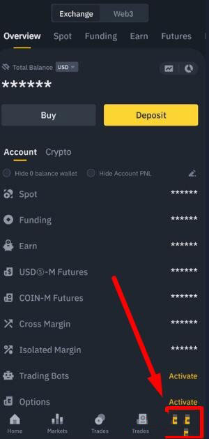

# 什么是币安Web3钱包？如何使用币安Web3钱包

币安Web3钱包是一款创新的数字资产钱包，集便利性、安全性和实用性于一体。这款钱包通过多方计算(MPC)技术增强安全性，通过访问币安桥和其他服务提供商，提供顺畅的用户体验，从而促进跨不同区块链网络的代币兑换。用户不仅能在去中心化金融(DeFi)和去中心化应用程序(DApp)世界中遨游，还能享获全天候专属客户服务。

## 什么是币安Web3钱包？

币安Web3钱包是币安App的重要组成部分，赋能去中心化金融(DeFi)领域的用户，是一款以用户为中心的加密货币钱包。

用户使用币安Web3钱包，即可轻松访问区块链和去中心化应用程序(DApp)。该钱包能安全高效地管理用户的数字资产，在各个区块链网络中执行代币兑换，赚取收益等。

## 该协议如何运作？

币安Web3钱包采用多方计算(MPC)技术。该技术属于增强型加密安全系统，可免除用户将私钥存储在单一位置的必要。该钱包利用MPC创建三个“密钥分片”，分别存储在用户的Web3钱包、云存储和设备当中。密钥分片还受恢复密码保护，该密码仅限用户本人知晓。

## 币安Web3钱包的主要特性

### 易于使用

在币安App中，轻松几秒即可创建币安Web3钱包。与其他加密货币钱包不同，币安Web3钱包设置无需操心助记词或私钥，使用非常便捷。

### 便捷

币安Web3钱包能与币安桥和其他服务提供商无缝连接，便于跨区块链网络轻松兑换代币，同时确保最优兑换率和价格。用户还可浏览DApp，只需轻点几下即可赚取收益。

### 证券型

币安Web3钱包还具备重要的安全功能，例如错误地址保护和潜在恶意智能合约识别等。进行交易时，代币或区块链如存在潜在安全风险，钱包将通知用户。此外，每笔交易都由多方计算(MPC)技术严格把关，从而能降低单点故障风险并保障资产安全。

### 自托管

Web3钱包由三个“密钥分片”和一个仅限用户知晓的恢复密码加密，因此资产由用户全权自主掌控。

### 客服

用户随享全天候客户服务，确保获得安全流畅的体验。

## 如何使用币安Web3钱包

1.在币安App登录个人账户，前往【资金】。

<figure><figcaption></figcaption></figure>

2.下一步，点击【Web3】和【创建钱包】即可开始使用。

<figure><figcaption></figcaption></figure>

3.请注意，使用币安Web3钱包之前，必须先进行备份并设置恢复密码。

<figure><figcaption></figcaption></figure>

## 如何备份币安Web3钱包

1.在Web3钱包初始页面上，点击【立即备份】。

<figure><figcaption></figcaption></figure>

2.币安App关联云存储账户（iCloud或Google Drive）。

3.设置备份密码并妥善保管。币安无法访问或重置该密码，请一定不要弄丢。

<figure><figcaption></figcaption></figure>

4.将密钥备份至个人云存储中。

5.备份完毕，钱包现可正常使用。

资金可从币安现货和资金账户直接轻松转至币安Web3钱包。

<figure><figcaption></figcaption></figure>

以上就是什么是币安Web3钱包？如有不明白或者不清楚的地方，请加入官方电报群：[https://t.me/gtokentool](https://t.me/gtokentool)
