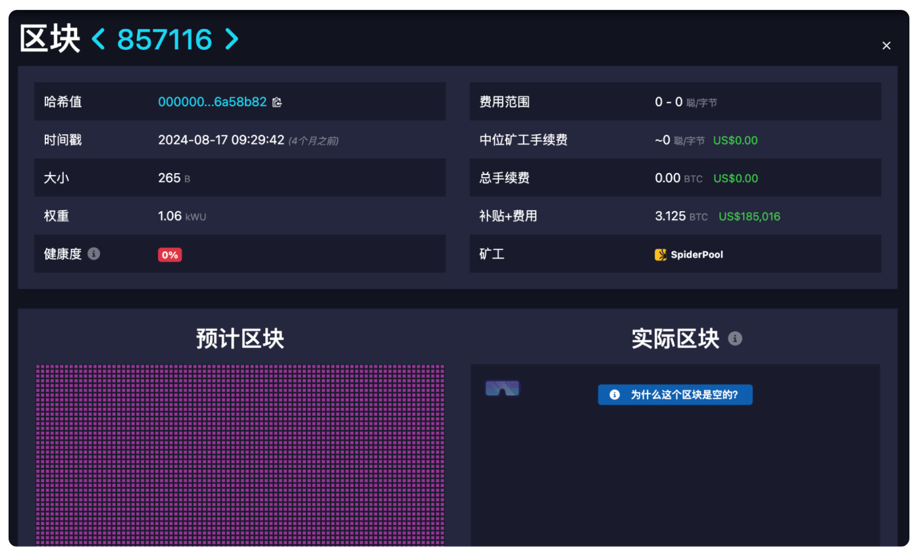

# 什么是比特币网路中的空区块，是威胁还是必然?

比特币网路中的「空区块」是一种仅包含矿工奖励（coinbase）的特殊区块，该区块并未纳入任何用户交易。这种现象虽然看似浪费资源，但背后是矿工在挖矿效率与收入稳定性之间的机会成本之选择。本篇文章将深入分析空区块的形成机制、对比特币网路的影响，以及如何透过技术与协议的改进，减少空区块对网路效率与用户体验的影响。

## 一、引言 

有时，你可能会注意到，一个新生成的比特币区块中只有一笔交易——那就是coinbase 交易（这里说的不是那家交易所），目前这笔交易会为矿工带来3.125 比特币的奖励。

（矿工收益会随着「比特币减半」有所减少）

但为什么这样的区块会出现？这是不是某种对比特币网路的攻击？

事实上，一个完全空的区块出现在比特币网路已经不是第一次（像是在区块高度 776,339 和 857116 都曾发生过）！这个区块虽然被成功上传到比特币区块链，但它并未包含任何用户交易。

「空区块」到底是什么？它是比特币网路的故障，还是某种必然现象？在本文中，我们将深入探讨空区块的形成原因、其对网路的影响，以及潜在的应对策略。

<figure><figcaption></figcaption></figure>

#### 矿工挖矿流程 

1. 新区块的传播与验证：

* 当有矿工成功发现新区块时，该区块会被广播到整个网络，并分发到所有矿池
* 其他矿工需对新区块进行验证，像是检查工作量证明（Proof of Work）是否正确以及区块中的交易是否有效

2. 更新记忆池（mempool）：

* 矿工会从记忆池中剔除已被确认的交易，留下未被确认的交易

3. 建立候选区块：

* 矿工根据记忆池中的未确认交易，建立一个候选区块，并引用前一区块的哈希值，添加剩余的交易
* 候选区块中必须包含一笔 coinbase 交易，作为矿工挖掘成功后的奖励来源

4. 构建区块头：

* 矿工为候选区块构建区块头（header），内容包含前一区块的哈希值、时间戳、目标难度和随机数（nonce）

5. 计算哈希值：

* 矿工消耗大量运算资源，以不断更新区块头中的随机数（nonce），计算区块头的哈希值，目的是找到一个小于当前网络目标值的哈希

6. 广播新区块：

* 一旦找到符合要求的哈希值，矿工立即将新区块广播至网络，供其他节点进行验证

7. 获得奖励：

* 如果新区块被网络接受，矿工将获得区块补贴（coinbase 奖励）和该区块中交易的手续费收入。

在某些情况下，为了降低网络延迟的影响，矿工可能会快速生成仅包含 coinbase 交易的空白候选区块，这种空区块能有效锁定奖励，但无法处理其他交易。&#x20;

## 二、空区块的形成

### 空区块的概念

在比特币区块链中，每个区块通常包含多笔交易，这些交易不仅为网路增加价值，还支持比特币作为支付处理系统的功能。然而，空区块（也被称为「单交易区块」）只包含矿工的 coinbase 奖励，并未纳入其他交易，因此也放弃了额外的交易手续费收入。

为了鼓励矿工尽快开采区块，矿池会在新区块被定位后立即向矿工提供一个空白的区块模板（以减少挖掘下一个区块所需的时间，从而最大限度地提高硬体的哈希效率。），让他们可以迅速开始下一轮挖矿（即使此时尚未收到新的交易数据）。在矿池给完区块模板和写入交易的过渡期间（通常只有一到两秒），矿工可能会「运气极好」，利用这个空模板成功挖出一个新区块，从而形成空区块。

值得注意的是，空区块并不会对比特币网路造成威胁。即使区块中没有用户交易，coinbase 奖励仍会被生成，这不仅激励矿工参与挖矿，还确保比特币的供应逐步接近其 2,100 万枚的上限。

### 空区块内的资讯 

空区块虽然没有包含用户交易，但仍然记录了一些资讯：

1. 区块头：

* 区块的基本资讯，例如版本号、前一区块的哈希值、时间戳

2. Coinbase 交易：

* 唯一包含的交易，即矿工的奖励交易
* 该交易为矿工分配挖掘区块的奖励

3. 默克尔树根（Merkle Root）：

* 即使区块中没有其他交易，coinbase 交易仍会生成一个默克尔树根，用于证明交易数据的完整性

4. 区块大小与重量：

* 虽然空区块的数据量较小，但仍有大小记录

5. 矿工地址（若有标记）：

* 某些矿工会在 coinbase 交易中嵌入自己的识别信息，例如矿池名称或地址

6. 区块高度：

* 区块链中该区块的位置（例如第 871732 区块）

7. Nonce 值：

* 矿工找到的随机数，用于解开工作量证明的数学难题

<figure><figcaption></figcaption></figure>

### 为什么矿工创建空区块? 

当矿工在上一个区块生成后没多久，矿池会在新区块被定位后立即向矿工提供一个空白的区块模板（通常时间落在几秒内）时。此时，矿工面临两种选择：要么立即生成一个空区块以获得有保证的区块补贴（例如3.125 比特币），要么花时间排序交易以增加手续费收入，但冒着在完成之前被其他矿工抢先挖出该区块的风险。

这是矿工对「机会成本」的考量，若矿工花过多时间处理交易，而其他矿工率先完成该区块，则不仅无法获得交易手续费，连基本的区块补贴也会损失。相较之下，若生成空区块，虽然放弃了额外的手续费收入，但可以稳定地锁定补贴。

上述段落中，我们有说明空区块并不会对比特币网路造成威胁。网路上有人认为空区块就像「垃圾邮件」一般会对网路造成干扰，但这种看法并不完全正确。空区块确实不会处理任何待处理交易，但它们也不会造成混乱。相反的，这些区块也要通过 Proof of Work 机制，并为下个区块增加工作量证明的强度，为之前的所有区块提供了更高的安全性，同时维持了网路的完整性。

注：虽然空区块并不会对网路造成威胁，但倘若有高频率的空块可能表示网路没有充分发挥其潜力

## 三、空区块的影响

### 正面碰撞 

提高网路安全性：

* 空区块虽然不含用户交易，但仍完成了工作量证明（Proof of Work），使下个区块的计算难度增加
* 且每个空区块的生成都会进一步巩固了之前所有区块的安全性，提升了抵御双重支付攻击的能力

稳定矿工收入：

* 纵使没有交易数据，矿工仍能获得稳定的区块补贴，这提升了矿工持续为此网路输出的动机

加速挖矿效率：

* 矿池在新区块被定位后立即向矿工提供一个空白的区块模板，可以减少挖掘下一个区块所需的时间

维持区块链的连续性：

* 即使没有交易数据，空区块也能确保区块链的「连续性」，防止网路中断

### 负面影响 

降低交易处理效率：

* 空区块内没有交易数据，无法处理待确认的交易，导致记忆池（mempool）中的交易累积
* 倘若遇到交易量高峰时，空区块会进一步加剧网路拥堵，影响整体交易体验。

降低区块链吞吐量：

* 每秒交易数量（TPS）因空区块而下降，降低了比特币作为支付系统的可能性

用户体验与信任问题：

* 承上所述，空区块可能导致交易等待时间增加，给用户带来不便
* 用户对比特币网路的期望与矿工优化利润的行为之间可能产生矛盾情结，进一步损害用户对网路的信任（矿工可以「选择」采取这种方式来增加收入，但这种行为可能忽视了网路整体效能的需求，进一步强化了对利润驱动的批评）

能源消耗与资源效率问题：

* 空区块使用的能源几乎与包含完整交易的区块相同，这会引发对能源利用效率的质疑

## 四、减少空区块的策略

减少空区块的策略可从「技术面」、「协议面」谈起：

### 技术层面的解决方案

1. 采用 Compact Block协议，以减少区块传播时的数据量，使矿工能更快接收到完整的交易数据（详情可参阅：A. Kim、J. Kim、M. Essaid、S. Park 和 H. Ju，“比特币网络中紧凑块传播延迟的分析”， 2021年第22届亚太网络运营与管理研讨会（APNOMS），台湾台南，2021 年，第 17 页。 313-318，doi：10.23919/APNOMS52696.2021.9562656。）
2. 采用Erlay协议，以提升交易的传播效率，缩短交易从记忆池广播到矿工接收的时间。
3. 开发更高效的默克尔树计算算法，缩短处理交易的时间，或让矿工在挖掘新区块时能快速生成含交易的默克尔树，而不是仅使用空模板。

### 协议层面的改进 

1. 规定每个区块至少需要包含一定数量或手续费总额的交易，否则矿工无法获得完整区块补贴。
2. 提高手续费在总奖励中的占比，激励矿工处理更多交易而非挖掘空区块。

## 五、结论

空区块的产生主要由矿工为了追求效率和稳定收益而产生。在区块定位后，矿池会立即向矿工提供空白的区块模板，即使交易数据尚未完全传播至矿工手中。空区块的生成并非网路故障或恶意行为，而是矿工在考量机会成本后做出的选择。

然而，空区块对比特币网路也带来了一定的挑战，包括降低交易处理效率、减少每秒交易数量（TPS）和增加能源消耗等问题。这可能导致用户等待时间加长。为了减少空区块的负面影响，技术层面可以采用如 Compact Block 和 Erlay 协议来提升交易传播效率，而协议层面则可通过设定最低交易要求或调整手续费比例来激励矿工优先处理交易。空区块的存在并非网路设计的缺陷，而动态平衡的一部分，通过持续优化，比特币网路的效率和稳定性仍有进一步提升的空间。

如有不明白或者不清楚的地方，请加入官方电报群：[https://t.me/gtokentool](https://t.me/gtokentool)
