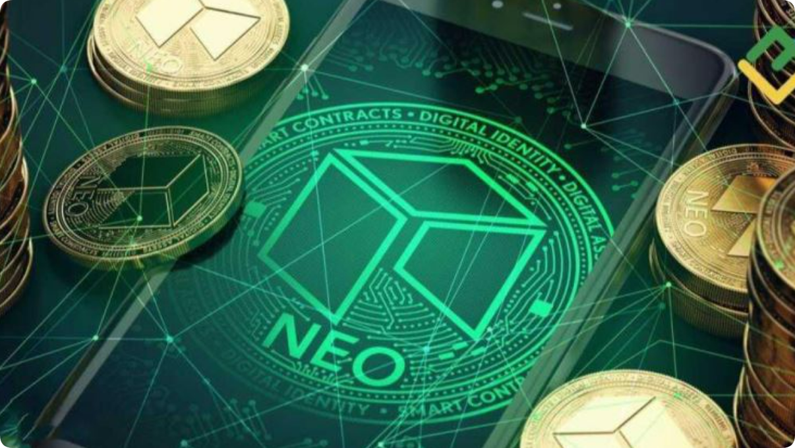

# 什么是NEO币？NEO币买入交易流程

NEO币最早于2014年在中国由达鸿飞和张铮文创立，最初名为“Antshares”（小蚁股），后来于2017年更名为“NEO”，以更加全球化的形象走向国际市场。NEO项目的目标是创建一个分布式的智能经济网络，将数字资产、数字身份和智能合约结合起来，以实现无信任的经济交易。NEO被称为“中国的以太坊”，这是因为它也专注于智能合约和去中心化应用（DApps）的开发，与以太坊类似，但NEO在技术架构和设计理念上有所不同。

NEO项目致力于打造一个“智能经济”生态系统，智能经济的核心是通过区块链技术对传统经济进行数字化、智能化转型。在NEO的世界里，数字资产可以通过区块链进行验证和转移，而数字身份则为所有参与者提供合法性和可追溯性。NEO通过智能合约实现了自动化交易和流程，无需依赖第三方中介，从而降低了交易成本和风险。这种全新的经济模式引发了市场的巨大兴趣。

<figure><figcaption></figcaption></figure>

## NEO币的技术优势

NEO币与其他主流加密货币的不同之处在于它独特的技术架构。NEO采用了一种被称为“DelegatedByzantineFaultTolerance”（dBFT，委托拜占庭容错）的共识机制，这种机制被认为比比特币的工作量证明（PoW）和以太坊的权益证明（PoS）更加高效和环保。dBFT允许网络参与者通过投票选出一些共识节点来验证交易和生成区块，这种方法不仅能实现更高的交易处理速度，还能保证网络的安全性和去中心化。

在区块链技术的扩展性方面，NEO也表现出色。与以太坊相比，NEO支持多种编程语言，如C#、Java、Python等，这使得更多开发者能够参与到NEO生态的建设中，极大地提高了DApp的开发效率。NEO还具有“不可分割”的特性，即NEO代币本身无法被分割，这在一定程度上提高了交易的简便性。

NEO的另一个技术亮点是它的双代币系统。除了NEO主币外，NEO生态中还有一种名为GAS的代币。GAS主要用于支付网络上的交易费用和智能合约执行费用。用户持有NEO可以生成GAS，这使得持币者不仅能享受NEO的增值，还能通过持币获得长期收益，这一点深受投资者喜爱。

## NEO币的应用场景与市场潜力

NEO不仅在技术上具有创新性，其广泛的应用场景也是其吸引力的重要来源。NEO的智能合约系统允许企业和开发者在其区块链上构建去中心化应用，涵盖金融、保险、供应链管理等多个领域。例如，NEO在金融领域的应用可以实现无中介的跨境支付和资产交易，而在供应链管理中，NEO的区块链技术可以确保产品溯源的透明性和可追溯性。

NEO还积极推动与全球企业的合作，以进一步扩展其生态系统。例如，NEO与多家大型科技公司和金融机构建立了合作关系，共同探索区块链在商业场景中的应用。这不仅提升了NEO的知名度，也为其未来的市场增长奠定了基础。

近年来，随着全球对区块链技术的兴趣日益浓厚，NEO币作为智能经济的代表，逐渐成为投资者关注的焦点。尤其在亚洲市场，NEO的应用和推广尤为迅速。NEO团队积极参与全球区块链会议和项目合作，进一步扩大其国际影响力。可以预见，随着智能经济的不断发展，NEO币的市场潜力将会进一步释放，成为未来数字资产生态中的重要一环。

## NEO与竞争对手的比较

在区块链领域，NEO币不可避免地与其他主流加密货币如比特币和以太坊进行比较。虽然比特币作为“数字黄金”具有很高的市场认知度，以太坊也凭借其领先的智能合约平台获得了广泛的应用，但NEO币凭借其独特的技术架构、强大的社区支持和政府的政策扶持，正在迅速赶超。

NEO的dBFT共识机制在交易速度和能源消耗上比比特币的PoW有明显优势。比特币的交易确认速度较慢，且能源消耗巨大，容易引发环保问题。相比之下，NEO的dBFT机制更加高效，能够在较短时间内处理大量交易，这对未来大规模商用至关重要。NEO的多语言编程支持使其对开发者更具吸引力，而以太坊仅支持Solidity，这在一定程度上限制了开发者的选择。

NEO双代币系统带来的经济激励模式也是其优势之一。持有NEO的用户可以自动生成GAS，这使得持币者不仅仅是投资数字货币的升值，还可以享受长期收益。相较之下，比特币和以太坊的单币模式则没有这样的机制。NEO的政府背景和政策支持也是其与其他加密货币相比的独特优势之一。NEO背后有中国政府对区块链技术的支持，在推动区块链产业发展的NEO币的技术和应用也得到了政策上的保障。尤其是在中国大力推进数字经济的背景下，NEO作为国内领先的区块链项目，未来可能获得更多的政策红利。

## NEO币还有希望吗？

NEO币还有希望，根据官方数据显示，NEO币当前价格为20.6美元，虽然低于历史最高价196.85美元，但远高于发行价0.159美元，且投资回报也非常可观为+12858%，市值为14.53亿美元，总体来看，NEO币未来有一定的发展潜力。

NEO代币是NEO内存块链平台的治理代币，拥有者可以透过参与投票来协助营运与维护内存块链。代币持有者必须质押NEO来参与NEO委员会投票，质押的NEO越多其权重也就越大。NEO委员会包含管理者和共识节点，负责维护内存块链运行和调整网络参数。委员会可以收到额外的GAS作为奖励。

NEO币是一种智能合约渠道，类似于以太坊，它允许开发者在区块链上构建和布置智能合约。这意味着NEO币有着广泛的使用场景，能够支持各种去中心化使用的开发。NEO币具有快速的买卖承认和高并发处理才能。这使得NEO币能够处理大量的买卖并保证买卖的快速承认，满意了实践使用中的高效性需求。

NEO币还具有可持续开展的潜力。作为我国的一家区块链公司发行的数字货币，NEO币在我国的商场上具有共同的优势。我国具有巨大的人口基数和巨大的潜力商场，这将为NEO币的开展供给支持。

## NEO币上线了哪些交易所？

根据官方数据显示，NEO币上线交易所有欧易、币安、火币、抹茶等32家交易所，下文是交易所的详细介绍：

### 1、欧易

OKX欧易（点击注册）是全球著名的数字资产交易平台之一，主要面向全球用户提供比特币、莱特币、以太币等数字资产的币币和衍生品交易服务，其丰富的数字资产种类、全球化的交易服务以及多种交易方式使其在市场上具备较强的竞争力，作为2017年就成立的老牌交易所在币圈占有不可撼动的地位。

### 2、币安

币安-Binance交易所（点此注册）是全球加密货币交易量最大的平台之一，致力于提供安全、公平、开放、高效的区块链数字资产交易环境。拥有多个司法管辖区的牌照、注册和批准，向全球提供广泛的数字货币交易、币种信息、区块链资产发行、区块链项目孵化、区块链公益慈善等服务。

### 3、火币

火币交易所原英文名Huobi现已更名为HTX，在2017年初次币圈牛市时候的火币可谓是火遍半边天，一度荣登全球交易量最大的加密货币交易平台，当时火币公司近200名成员具有长期的互联网和金融领域产品研发和运营经验，致力打造最安全可信赖的比特币交易平台。2016年12月22日，火币网第10次刷新平台比特币日交易额纪录，日成交量达501万枚比特币，单日交易额突破300亿人民币。截止2016年末，火币累计成交额达20000亿人民币。

### 4、抹茶

MEXC抹茶交易所是一间于2018年在新加坡所创立的中心化交易所，不仅提供加密货币现货、保证金、期货交易，也有提供杠杆ETF 与指数ETF多种不同的交易产品，还提供了多元的交易币种，目前所提供的交易币种，已经超过1600种。

## NEO币买入交易流程？

获得NEO币主要就是在上线的欧易、币安、火币等32家交易所内进行，下文就是在欧易交易所获得NEO币的教程：

1、点击此处即可打开欧易OKX交易所官网，在首页输入邮箱，点击“注册”

<figure><figcaption></figcaption></figure>

2、向右滑动滑块，完成拼图进行验证，然后输入邮箱收到的验证码，验证码有效时间为10分钟

<figure><figcaption></figcaption></figure>

3、而后输入手机号，点击“立即验证”

<figure><figcaption></figcaption></figure>

4、输入手机收到的六位数字验证码，有效时间同样为10分钟

<figure><figcaption></figcaption></figure>

5、选择居住国家/地区，勾选服务条款、《风险与合规披露》及隐私政策与声明

<figure><figcaption></figcaption></figure>

6、创建密码需要符合长度为 8-32 个字符、1 个小写字母、1 个大写字母、1 个数字、1 个符号，如：!@ # $ %等条件

<figure><figcaption></figcaption></figure>

7、登录账号后，找到首页的“用户中心”图标，进入身份认证页面

<figure><figcaption></figcaption></figure>

8、可根据不同需求进行不同等级认证(注意：视频认证需在APP上进行操作)

<figure><figcaption></figcaption></figure>

9、进行交易前需要拥有USDT，可在C2C买币进行交易，根据需求选择合适商家，点击“购买”，而后根据提示进行付款、等待商家放币(若是长时间没有收到币种，可联系客服进行处理)

<figure><figcaption></figcaption></figure>

10、点击首页的“交易”——“币币”进入交易页面

<figure><figcaption></figcaption></figure>

11、在搜索框输入NEO，选择NEO/USDT交易对，可以看到NEO实时行情

<figure><figcaption></figcaption></figure>

12、输入买入NEO数量，点击买入NEO就可以了

<figure><figcaption></figcaption></figure>

NEO币作为智能经济时代的重要推动力，凭借其独特的技术优势、广泛的应用场景和强大的社区支持，正在迅速成为区块链行业的领军项目之一。无论是对开发者、企业，还是对普通投资者来说，NEO币都提供了一个进入未来数字经济的机会。未来，随着全球智能经济的蓬勃发展，NEO币的潜力将得到进一步释放，其在区块链行业中的地位也将愈加稳固。

如有不明白或者不清楚的地方，请加入官方电报群：[https://t.me/gtokentool](https://t.me/gtokentool)
