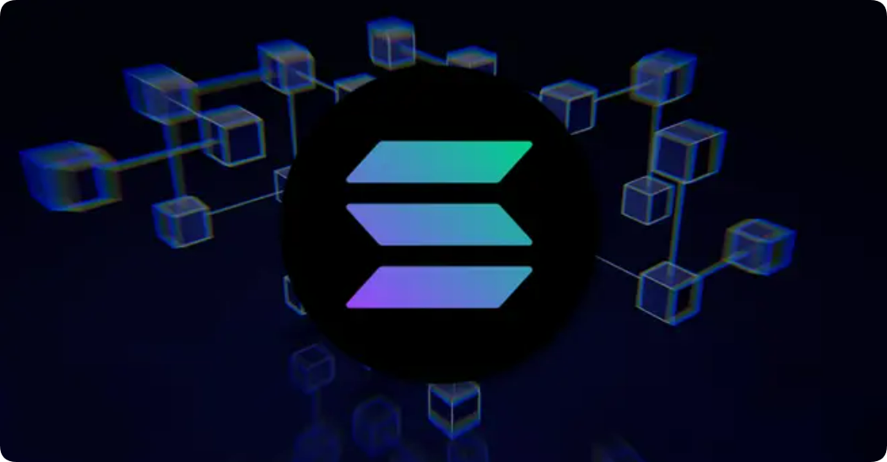

# 什么是 Solana (SOL)？ Solana 和 SOL 代币指南

Solana 成立于 2017 年，与以太坊和 Avalanche 相比，每秒可以以相对较低的成本处理多达 65,000 笔交易。

该区块链基于权益证明模型，被称为竞争对手中最环保的区块链之一。

<figure><figcaption></figcaption></figure>

## 什么是 Solana (SOL)？ 

Solana 是一个开源公共区块链，托管各种去中心化应用程序。该网络由曾在高通工作的阿纳托利·雅科文科（Anatoly Yakovenko）创建。

Solana 采用历史证明 (PoH) 和权益证明 (PoS) 共识机制的独特组合，主要是为了解决以太坊的可扩展性问题而创建的。

## Solana共识 

Solana 的 PoH 共识利用时间戳来定义其链中的下一个区块。时间戳有助于 Solana 的快速处理速度。

该网络的权益证明共识允许验证者抵押固定数量的 SOL 作为抵押品来验证链上的区块。

由于 Solana 创新的混合共识模型，区块链被机构交易者大量使用。

区块链的混合协议允许交易和智能合约“减少验证时间”。这使得 Solana 在速度和可扩展性方面与其他区块链不同。

如上所述，Solana 在事务处理方面极其高效，每秒能够处理近 65,000 个事务。

区块链现已发展成为一个整体生态系统，为用户提供各种服务。

## SOL 代币 

索拉纳的故乡加密货币，SOL，可用于在 Solana 去中心化应用程序上购买其他数字商品和服务。

区块链还可以用于创建和部署NFT并提供创建无需许可的支付应用程序的设施。

## Solana 区块链关键问题与误解解析

1. 机器人不断利用滑点对用户进行抢跑。

这个问题影响所有链，除了像以太坊的 Base/Arbitrum 或 Cardano 的 L2 这样的中心化链，在这些链上，排序器可以捕获费用，减少质押者的奖励。

这是中心化 L2 的一个权衡，并不是值得炫耀的事情。

2. 如果没有足够的滑点，交易会失败，但用户仍需为失败的尝试付费。

如果交换不满足用户的需求，你仍然需要支付，因为网络按照指示处理了它。

失败的交易会计入 TPS 指标，就像在以太坊上一样。

3. FTX 正在抛售 75 亿美元的 SOL，其中一次重大解锁将在 2025 年 3 月，并将持续每月解锁至 2028 年。

FTX 已经有新的买家排队，他们会像任何资产一样出售。

机构投资者的持仓能力比典型的加密交易者更强，而机构兴趣并不总是坏事。

4. 区块链迄今为止经历了至少 12 次重大宕机。

尽管 Solana 经历了多次宕机，但改进正在发生，如 Firedancer 和类似以太坊的多客户端设置。

它在 meme 热潮和矿石开采期间保持了运行，显示出进步，而中心化的 L2 经常失败。

5. RPC 提供商可以抢跑你的交易。

任何 RPC 节点都可以滥用你的数据，所以一定要选择可信的节点。

这也适用于以太坊。

事实是，只要人们在交易，就会有订单排序的存在，并总会有通过重新排序来提取价值的方法。

6. 他们的 TPS 被误导性地宣传为 3000，但它包括了投票和失败的交易。实际 TPS 大约是 600。

TPS 指标很复杂，由第三方区块浏览器追踪，并包括投票交易，这符合 Solana 的共识模型。

Solana 处理 800+ 非投票 TPS，并计划通过 Firedancer 等更新达到 50k-200k。

7. 最近通过的一项投票，将所有高优先级交易的收益 100% 分配给验证者（富人）。

Solana 最近的变更移除了与小费相关的燃烧机制，以防止与验证者的交易，从而改善奖励和网络健康。

人们为了避免燃烧而在网络外小费，损害了 Solana 的激励机制。

8. 成为验证者需要大量财富。

尽管 Solana 验证者成本更高，但他们因更好的性能获得奖励，帮助 Solana 满足需求，而 Cardano 没有这个问题，以太坊则将此问题外包给了 L2。

9. Solana 已经处于测试阶段 4.5 年。

称某物为 "测试版" 看起来没什么问题，有些奇怪被指出？或许 Cardano 也可以用这个来解释其低采用率。

10. Solana 的流通供应量去年增长了 5909 万，实际上是印出了 85 亿美元。

Solana 的流通供应量增长是由于早期投资解锁和通胀，但解锁正在逐渐减少。

通胀率约为 3.5%，每年递减，直至达到 1.5%。

如有不明白或者不清楚的地方，请加入官方电报群：[https://t.me/gtokentool](https://t.me/gtokentool)
