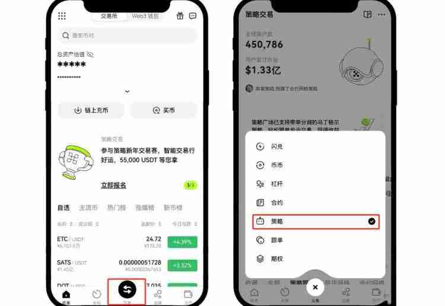

# 时间加权委托是什么意思？通俗讲解欧易时间加权委托的方法

在币圈进行大额交易相对来说是比较麻烦的，严重时可能会对市场造成影响，为此交易所推行了时间加权委托。这个时间加权委托是一种交易策略，它是指用于在特定时间段内以平均价格买入或卖出加密货币。通常这种策略特别适用于处理大额订单，以避免因单次大规模交易而对市场价格产生过大影响。简单介绍了时间加权委托是什么意思？可能还有人不清楚。下面[GTokenTool](https://www.gtokentool.com)为大家通俗讲解欧易时间加权委托。

## 时间加权委托是什么意思？

时间加权是一种大额订单拆分后分时吃单的策略。这个策略会按照用户设置的间隔时间来触发委托，委托时根据当前的最新买一/卖一价和用户设置的价格距离来计算委托价格，然后委托小单来吃单交易。通常适用于用户在进行大额交易时，为避免对市场造成过大冲击，需要将大单委托自动拆为多笔委托。

时间加权委托策略的目标是通过在指定的时间段内分散交易来实现接近市场平均价格的交易，这有助于减少因为市场价格波动带来的交易成本。另外时间加权委托策略可以设定一个时间窗口，在这个时间窗口内按照预定的时间间隔执行小订单。

时间加权委托通过分散订单执行，时间加权委托策略能够减少对市场价格的直接冲击，防止价格因单笔大单的执行而剧烈波动。滑点是指实际成交价格与预期价格之间的差距。通过在较长的时间内执行小订单，时间加权委托策略有助于减少滑点。时间加权委托策略可以帮助在市场波动时平滑交易价格，避免因市场瞬时波动而导致的极端价格。

## 时间加权委托怎么创建？

创建时间加权委托还是比较简单的，目前欧易等交易所都能支持这一策略，下文是在欧易交易所设置时间加权委托的教程：

1、以BTC/USDT为例：在欧易APP(点击注册)首页点击【交易】-【策略】

<figure><figcaption></figcaption></figure>

2、进入策略广场，选择【大单拆分】-【时间加权委托】

<figure><figcaption></figcaption></figure>

3、选择【买入】或者【卖出】，按要求设置相关数据，点击【买入BTC】或者【卖出BTC】。

<figure><figcaption></figcaption></figure>

4、点击【策略】—【时间加权委托】—选择要停止的时间加权策略，点击【停止策略】。

<figure><figcaption></figcaption></figure>

5、您也可以点击【策略详情】，查看相关数据等内容。

<figure><figcaption></figcaption></figure>

如有不明白或者不清楚的地方，请加入官方电报群：[**https://t.me/gtokentool**](https://t.me/gtokentool)
