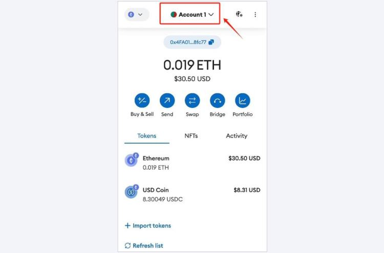

# 私钥怎么导入钱包？私钥导入钱包详细教程

数字资产储存以及管理一直是投资作者最为关心的问题，储存前首先就要将私钥导入钱包，这是一种将加密货币资产添加到特定钱包地址的方法，会让投资者更方便管理自己的资产即多钱包管理，也是一种备份和恢复资产的方式，但对于很多投资者来说，并不了解如何将私钥怎么导入钱包？其实只需要找到一款支持私钥导入的钱包，然后根据下文的操作步骤就可以，接下来[**GTokenTool**](https://www.gtokentool.com)为大家说说详细教程。

## 私钥怎么导入钱包？

私钥导入钱包并不是很复杂，操作相对来说比较简单，下面是将私钥导入小狐狸钱包的教程：

1、点击钱包顶部的账户选择器。

<figure><figcaption></figcaption></figure>

2、选择列表底部的“添加帐户或硬件钱包”。

<figure><figcaption></figcaption></figure>

3、在下一个菜单上，选择“导入帐户”。

<figure><figcaption></figcaption></figure>

4、您将被定向到“导入”页面。粘贴您的私钥，然后单击“导入”。

<figure><figcaption></figcaption></figure>

## 私钥导入钱包安全吗？

私钥导入钱包并不是一定安全，其中也会涉及一些安全风险，需要小心谨慎。私钥是一种用于访问加密货币资产的关键信息，任何拥有私钥的人都有权访问关联的资产。以下是一些相关的安全注意事项：

1、**安全环境：**&#x5728;导入私钥时，请确保你使用的计算机或设备是安全的，没有受到恶意软件或病毒的感染。避免在公共计算机或不受信任的设备上操作。

2、**离线操作：**&#x5C3D;量在离线环境中导入私钥，以减少受到网络攻击的风险。如果你必须在在线环境中进行操作，确保你的网络连接是安全的，使用加密连接和更新的防病毒软件。

3、**保护私钥：**&#x79C1;钥是极其敏感的信息，任何人获得它都可以控制关联的资产。在导入私钥后，请立即采取措施确保私钥的安全，比如将其存储在离线设备上，并使用硬件钱包等更安全的存储方式。

4、**谨慎使用在线服务：**&#x907F;免使用不信任的在线服务来导入私钥。确保你选择的钱包或服务是经过验证且信誉良好的。

5、**仅在必要时使用：**&#x5C3D;量避免频繁地导入私钥。只在必要时进行操作，以降低私钥泄露的风险。

导入私钥具有方便的用途，比如备份和恢复、多钱包管理、访问空投和分叉币以及交易和转移资产等，但也需要非常小心，私钥是加密货币安全的核心，任何人获得你的私钥都可以控制关联的资产。因此在执行此类操作时，请确保采取适当的安全措施，避免在不安全的环境中操作，并在可能的情况下使用更安全的存储方式，如硬件钱包。

如有不明白或者不清楚的地方，请加入官方电报群：[**https://t.me/gtokentool**](https://t.me/gtokentool)
