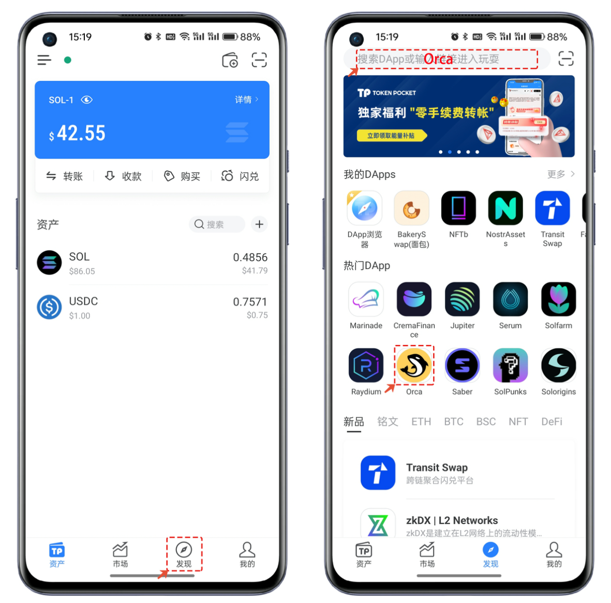

# TokenPocket钱包Orca使用教程

## Orca使用教程

1、打开TokenPocket，点击【发现】，可以通过【热门DApp】或顶部地址栏中搜索【Orca】并打开DApp。

<figure><figcaption></figcaption></figure>

2、首次使用Orca需要点击【Connect Wallet】并选择TokenPocket连接钱包。

<figure><figcaption></figcaption></figure>

3、钱包连接成功后默认进入代币交易界面，点击【Buy】可以切换【Sell】控制买入和卖出的功能，其他的操作和日常的Swap功能类似，选择需要兑换的代币和数量，最后点击【Buy或Sell】进行链上操作。

<figure><figcaption></figcaption></figure>

4、如果需要查看交易的操作记录，可以点击【HISTORT】查询详情。左上角的菜单栏中可以展示Orca的完整功能，底部的语言切换可以选择其他支持的语言。

<figure><figcaption></figcaption></figure>

5、菜单中选择【Liquidity】，首次访问依然需要【Connect Wallet】，选择TokenPocket并链接后在列表中选择自己需要存入代币的组合，例如我这里选择jitoSOL/SOL，点击【Deposit】存入。

<figure><figcaption></figcaption></figure>

6、操作过程中可以根据自己的情况来选择观看官方的操作教程视频，当勾选操作须知后，点击【Get started】菜单进行跳转，在打开界面中设置存入的数量最后点击【Preview】进行上链签名操作。

<figure><figcaption></figcaption></figure>

如有不明白或者不清楚的地方，请加入官方电报群：[**https://t.me/gtokentool**](https://t.me/gtokentool)
