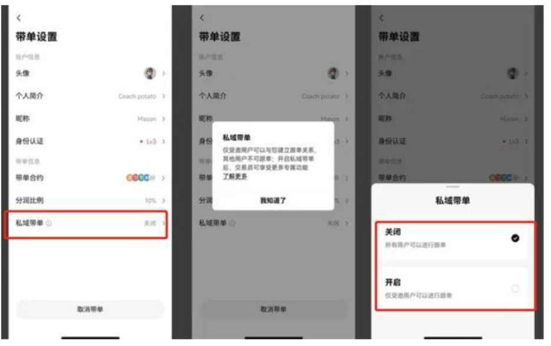

# 通俗讲解私域带单是什么意思？

带单是币圈常见的一个交易，通常是指某个所谓的专家或老师指导他人进行交易。私域带单就是带单交易的一种类型，这是指仅限指定的跟单员进行跟单，可以分享邀请码或邀请链接进行邀请。这种做法通常在加密货币市场中非常活跃，尤其是在没有受到严格监管的环境下。简单介绍了私域带单是什么意思？可能还有用户表示不理解。接下来[**GTokenTool**](https://docs.gtokentool.com/)小编为大家详细介绍一下私域带单的相关概念。

## 私域带单是什么意思？

私域带单交易员仅受邀用户可以建立跟单关系，其他用户不可跟单(已跟单用户不受影响)。私域交易员拥有管理跟单用户的权限。私域带单交易员将不会在跟单广场、牛人榜、搜索结果中被展示。下文是开启私域带单的具体教程：

1、如您已是合约跟单交易员，开启/关闭路径：“跟单广场-我的带单-带单设置”，点击“私域带单”并选择
\
“开启”

<figure><figcaption></figcaption></figure>

2、点击“确认”按钮后，即可开启私域带单

<figure><figcaption></figcaption></figure>

## 如何邀请跟单用户？

点击“创建链接”按钮即可生成新的邀请链接，您可以自定义链接以下内容：
\
链接名称：设置独特邀请链接名称
\
邀请人数：该链接的可邀请的最大人数。若邀请人数超过上限，用户将无法通过该邀请链接进行跟单。
\
邀请范围：可以使用该链接进行跟单的用户范围
\
直接好友：指交易员节点计划下直接关联的好友
\
所有好友：指交易员节点计划下直接关联的好友及其下级好友
\
所有用户：所有跟单用户，包括未通过节点计划邀请的用户 配置了以上信息后，点击“确认”按钮即可生成邀请
链接，并进行分享

<figure><figcaption></figcaption></figure>

以上全部内容就是对私域带单是什么意思这一问题的解答，币圈私域带单是一种在私人圈子中传播的交易建议或指导行为，虽然可能为某些投资者提供了市场洞察，但也伴随着高风险，特别是在无监管的环境中容易成为骗局的温床。参与者应保持警惕，独立判断，仅使用你能够承受亏损的资金进行交易，避免因盲目跟风而遭受经济损失。需要注意的是，有些带单群会收取高额的会员费或其他隐藏费用，在加入前要明确了解费用结构。

如有不明白或者不清楚的地方，请加入官方电报群：[**https://t.me/gtokentool**](https://t.me/gtokentool)
