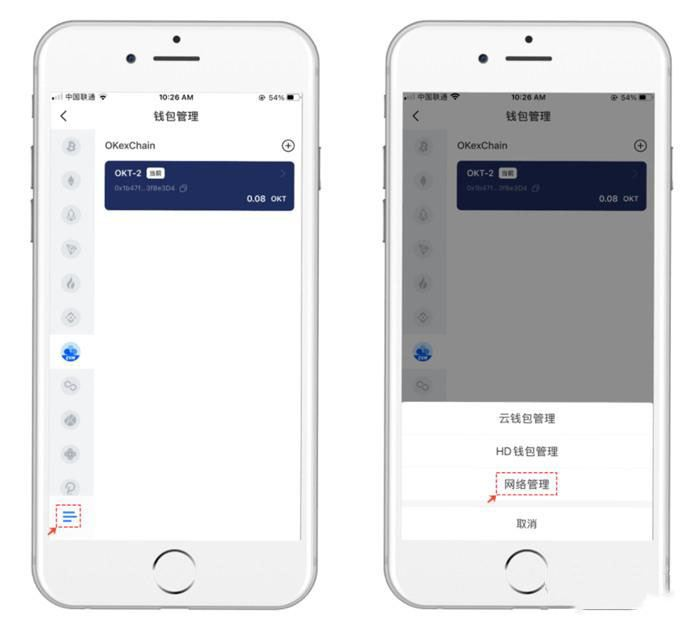

# TP钱包支持什么网络？TP钱包网络设置教程

TP钱包即TokenPocket，它可以说是全球领先的多链自托管钱包，该钱包可以支持多种主流公链，其钱包私钥储存在用户的设备中，不会上传到服务器中，所以该钱包的安全性还是非常不错的。众所周知，随着公链的不断发展，就连交易所也在推出自己的公链，随之而来的就是跨链的需求不断增加，所以不同公链上会出现同一种资产，但是他们之间并不是完全一致。很多人在使用TP钱包时都搞不清楚TP钱包支持什么网络？下面就让GTokenTool为大家带来TP钱包网络设置教程。

<figure><figcaption></figcaption></figure>

## TP钱包支持什么网络？

TP钱包是全球领先的多链自托管钱包，支持BTC、ETH、BSC、Polygon、Solana、HECO、Klaytn、Avalanche、Tron、OEC、HSC、Fantom、Polkadot、Kusama、EOS等主流公链。

除此之外TP钱包还支持添加自定义网络，自定义网络是指用户通过TokenPocket钱包，配置相关参数，直接将一条链添加到钱包，以达到钱包原生支持的体验，包括但不仅限于DApp访问，代币添加，交易记录等。

## TP钱包网络设置教程

### ·如何添加自定义网络

1、打开TokenPocket App，点击右上角「钱包」图案，进网络管理页面，拉到最底部，点击【添加自定义网络】，此处以Moonriver网络为例；

<figure><figcaption></figcaption></figure>

2、点击【便捷入口】，搜索「Moonriver」，系统将会自动显示Moonriver网络，选择该网络；

<figure><figcaption></figcaption></figure>

3、进入「自定义网络」设置页面，点击【确认】，至此，你已成功添加Moonriver网络，可在资产页面选择【添加钱包】，进行创建/导入/同步钱包等操作。

<figure><figcaption></figcaption></figure>

### 如何删除自定义网络

新增自定义网络后，会在网络选择列表中多出自定义网络的名称，当我们想去掉这个自定义网络的时候应该怎么操作呢？

1、打开TokenPocket钱包，点击左上角自定义钱包名称的位置，打开【钱包列表】，点击左上角钱包图形的位置打开菜单；

<figure><figcaption></figcaption></figure>

2、在钱包管理界面，点击左下角底部的按钮，弹出界面中选择【网络管理】菜单；

<figure><figcaption></figcaption></figure>

3、选择我们需要删除的自定义网络，向左滑动需要删除的自定义网络，点击【删除】；

<figure><figcaption></figcaption></figure>

4、在这里需要注意的是，我们日常操作删除自定义网络一般会有两种状态的提示信息。

1\)下图中左侧的提示，说明我们导入的自定义网络中没有添加或创建钱包，所以点击【确认】即可删除自定义网络；

2\)下图中右侧的提示说明我们在添加的自定义网络中已经创建或导入过钱包，所以为了您的资产的安全，需要您在删除钱包的前提下才可以删除(请务必备份和检查好自己的私钥、助记词后删除钱包)。

<figure><figcaption></figcaption></figure>

以及对于TP钱包网络设置教程的介绍。很多投资者在刚进群提问题的时候，会碰到很多用户名为“TokenPocket助手”，“TokenPocket客服”等的“热心”假客服主动私聊，这个时候，这些假客服会发送假钱包下载链接，假二维码，或者一步一步跟你聊天，让你填写表单，企图盗取私钥或者助记词。我们一定要谨防这种诈骗手段，注意辨别真假管理员，不管是谁我们都不能提供自己的私钥以及助记词，真客服也不会要求提供。

以上就是TP钱包支持什么网络？TP钱包网络设置教程的详细内容。

如有不明白或者不清楚的地方，请加入官方电报群：[https://t.me/gtokentool](https://t.me/gtokentool)
