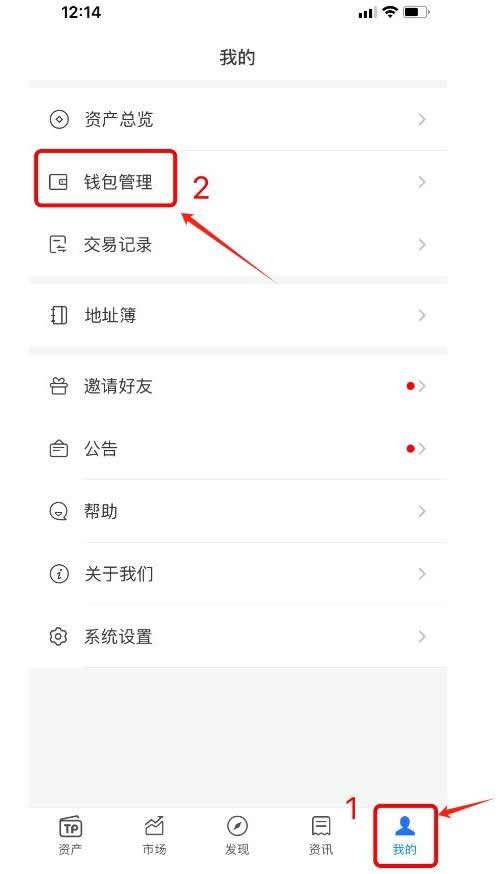

# TP钱包助记词在哪里查看？TP钱包助记词查看步骤教程

TP钱包是全球最大的数字货币钱包之一，因其安全性高、可供网络多等等特点受到投资者的喜爱。而要真正确保钱包的安全性，必然就要保管好TP钱包的助记词。助记词可以视为数字资产的故障保险，如果投资者的钱包软件不小心被删除了，或者设备丢失或被盗，助记词可以恢复软件中的加密货币。而要保管首先就是要知道TP钱包助记词在哪里查看？才能进行备份，通常可以在钱包管理中查看。下面[**GTokenTool**](https://www.gtokentool.com)为大家详细说说。

## TP钱包助记词在哪里查看？

TP钱包助记词查看就是在钱包管理中选择查看，需要注意的是，导出助记词时需输入钱包密码。下文是具体查看TP钱包助记词的教程：

1、打开TokenPocket后，点击右下角【我的】-选择【钱包管理】

<figure><figcaption></figcaption></figure>

2、选择要查看的钱包并点击

<figure><figcaption></figcaption></figure>

3、进入页面后，点击导出助记词就可以查看。注：“导出助记词”需输入钱包密码

<figure><figcaption></figcaption></figure>

## TP钱包助记词单词是大写还是小写？

TP钱包助记词通常是小写的英文字母。在大多数加密货币钱包中，助记词都是小写的，这样可以确保用户能够准确地复制和恢复助记词，因为大写字母和小写字母在输入时可能会有区分。

助记词也称为恢复短语或种子短语，是存储恢复加密货币钱包所需的全部信息的单词列表。它是加密货币安全性的重要组成部分，可被视为钱包的"万·能·钥·匙"。

助记词通常由12、15、18、21或24个单词组成，这些单词是从一个包含2048个单词的预定列表中生成的。助记词的单词数量与安全级别相对应更多的单词意味着更多的可能组合，因此安全性更高。

助记词与加密货币钱包中使用的私钥直接相关。私钥允许你访问区块链钱包中的加密货币并授权交易。助记词是一种备份，如果你丢失了加密货币钱包的访问权限，它可以让你重新获得私钥。

以上全部内容就是对TP钱包助记词在哪里查看这一问题的教程解答，助记词是加密货币钱包安全的支柱，强化了加密货币的去中心化原则，让用户对其数字资产拥有绝对的控制权和所有权，而无需依赖外部方进行恢复。然而，这种自我保管也伴随着风险，如果用户的助记词丢失或曝露，那么就有可能会永久失去对钱包的访问权限。因此，以最高的安全性存储和处理助记词至关重要，建议以物理的方式(而非数字化的方式)去存储它们，避免共享。

如有不明白或者不清楚的地方，请加入官方电报群：[**https://t.me/gtokentool**](https://t.me/gtokentool)
