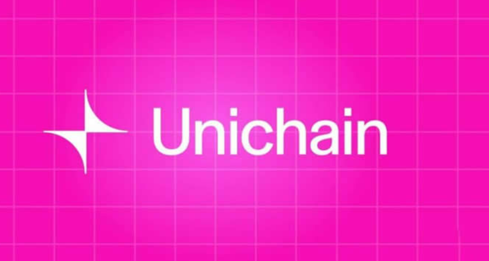

# Unichain是什么链？Unichain链运行原理？

去中心化的头部交易平台Uniswap于10月10日推出L2解决方案Unichain，该方案一经推出就引起了市场的关注，除了知晓Unichain是一个公链，具体的Unichain是什么链？还是有很多人不了解。根据已有资料显示，Unichain是一种高性能的区块链项目，通过独特的技术设计提供了快速、可扩展的解决方案，并且确保安全性和去中心化特性，该项目主要用于构建去中心化应用(DApps)和智能合约。接下来[GTokenTool](https://www.gtokentool.com)为大家全面介绍公链Unichain。

<figure><figcaption></figcaption></figure>

## Unichain是什么链？

Unichain是基于OPStack的以太坊optimistic rollup，是Uniswap推出的新型L2网络，专为DeFi设计，旨在提供流畅、快速、高效的跨链交易体验。Unichain的目标成为全链DeFi流动性中心枢纽，一个超级应用正在构建应用链来回收协议本身所创造价值。

Unichain侧重于高吞吐量和低延迟，支持高频交易和快速确认。这种设计特别适合去中心化金融(DeFi)、去中心化应用程序(DApps)和其他对性能要求高的场景。和以太坊类似，Unichain也支持智能合约，开发者可以使用该平台构建各种去中心化应用，涵盖金融、游戏、社交网络等领域。

Unichain的架构设计注重可扩展性，允许更多的节点加入并保持较高的交易处理速度。这使其成为适合构建大规模应用的平台。与以太坊等平台相比，Unichain可能提供较低的交易费用，使得小额交易和微支付应用更具成本效益。另外，Unichain通过去中心化的共识机制，确保网络安全性和抗攻击性，避免单点故障问题。

## Unichain链运行原理？

Unichain的可验证区块构建过程依赖于与Flashbots合作开发的Rollup-Boost，主要解决减少MEV风险、提高交易速度以及提供交易回滚保护(降低用户因交易失败而支付高额费用的风险)这三个问题。

Unichain将区块构建与排序器的角色进行分离，由Verifiable Block Builder来负责区块构建。该构建器运行在可信执行环境TEE中(一个安全硬件环境，能够在不暴露内部数据的情况下执行程序，并生成可验证的执行证明)，使得外部用户可以验证区块构建是否遵循指定的规则。

Flashblocks区块预确认机制，相当于提前确认即将包含在区块中的交易集合。每个区块被分为多个 Flashblocks，这使得区块时间可以压缩到200-250毫秒，远低于当前大多数Rollup的区块时间。另外，在TEE环境中将强制执行每个Flashblock内的交易排序规则，这意味着用户和应用程序能够透明地知道交易的执行顺序，进而减少MEV带来的不公平性。

TEE提供了无信任回退保护(Trustless Revert Protection)，通过在区块构建过程中模拟交易，检测并移除任何可能失败的交易。这可以避免用户因交易失败而支付不必要的费用。

上述全部内容就是对Unichain是什么链这一问题的解答，Unichain已经展现了其强大的产品市场契合度，随着技术的持续发展，它向基于以太坊的应用程序专用L2的转变非常令人期待，尤其是在它寻求扩大其生态系统的情况下。然而，由于流动性碎片化仍然是一个挑战，关键在于Unichain团队如何在以太坊L1和UnichainL2之间提供无缝的跨链交易体验。对于投资者来说，依旧可以继续关注Unichain的发展，但也要注意市场的变化。

如有不明白或者不清楚的地方，请加入官方电报群：[https://t.me/gtokentool](https://t.me/gtokentool)
