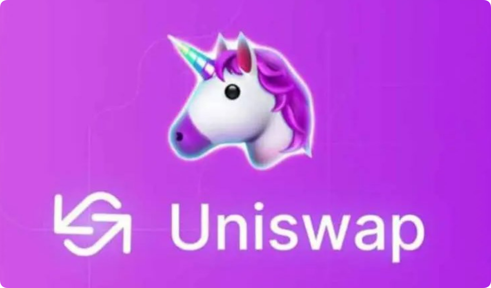

# uniswap是什么交易所？uniswap是一级市场吗？

<figure><figcaption></figcaption></figure>

## Uniswap：去中心化加密货币交易所

Uniswap 是一种去中心化的加密货币交易所，它允许用户在无需中介的情况下直接相互交易资产。与传统交易所不同，Uniswap 由智能合约驱动，而不是中央管理机构。

### 运作机制

Uniswap 使用称为自动做市商 (AMM) 的模型。AMM 由称为流动性资金池的预先资助的智能合约组成，其中包含要交易的两项资产。当用户进行交易时，AMM 根据资产在资金池中的相对比例自动调整价格。

这种模型消除了对传统交易所上中介的需求，从而允许用户完全控制自己的交易，并避免滑点和市场操纵。

### 主要特点

* **去中心化：**&#x55;niswap 没有中心化的管理机构控制，用户完全拥有自己的资金和交易。
* **无缝交易：**&#x7528;户可以快速、轻松地在流动性资金池内交易资产，而无需等待匹配订单。
* **流动性强：**&#x5927;量的流动性资金池确保了资产的即时流动性，减少了滑点和价格波动。
* **低交易费用：**&#x55;niswap 的交易费用通常比传统交易所低，因为没有中间商或市场运营费用。

### 用例

Uniswap 可用于广泛的加密货币交易用例，包括：

* **代币兑换：**&#x5728;不同的加密货币之间转换资产。
* **DEX 交易：**&#x53C2;与去中心化金融 (DeFi) 应用和协议。
* **流动性提供：**&#x901A;过将资产存入流动性资金池来赚取交易费用。
* **新代币发行：**&#x901A;过 Uniswap 的流动性矿池筹集资金并分发新发行的代币。

## uniswap是一级市场吗？

uniswap 是一个二级市场，允许用户以去中心化的方式买卖加密货币，例如以太坊、比特币和各种代币，它使用流动性池和自动做市商模型来撮合买卖订单。

### Uniswap 是二级市场

Uniswap 是一种去中心化的加密货币交易所，它不是一级市场。

### 一级市场

* 一级市场是公司首次发行股票或债券的地方。
* 投资者直接向发行公司购买证券。
* 一级市场通常仅限于合格投资者。

### 二级市场

* 二级市场是既存证券进行交易的地方。
* 投资者在二级市场上相互买卖证券。
* 二级市场通常对所有投资者开放。

### Uniswap 在二级市场的作用

Uniswap 为用户提供一个以去中心化方式买卖加密货币的平台。用户可以使用 Uniswap 交易各种加密货币，包括以太坊、比特币和各种代币。 Uniswap 根据自动做市商 (AMM) 模型运作，它使用流动性池来撮合买卖订单。

总之，Uniswap 是一个二级市场，用户可以在其中买卖加密货币。

如有不明白或者不清楚的地方，请加入官方电报群：[**https://t.me/gtokentool**](https://t.me/gtokentool)
